<div class="zcover">
  <div class="zcover-text">
    <p class="eyebrow">Zure · One-day platform workshop</p>
    <h1>Do we need<br />Kubernetes?</h1>
    <p class="zcover-sub">Choosing between <strong>Azure Container Apps</strong> and <strong>AKS Automatic</strong>.<br />Built for platform, architecture, DevOps and operations engineers. You do not need to know Kubernetes to start.</p>
    <p class="zcover-meta">One-day workshop, 09:00–17:00. Eight lessons using one application on both platforms.</p>
  </div>
  <div class="zcover-art">
    
  </div>
</div>

<!--
Opening: the day is not a product feature tour. Same OCI image on both
platforms; everything that differs is the contract you sign with the platform.
-->

---
nofooter: true
layout: none
class: zsection
---

<div class="zdark zdark-center">
  <p class="eyebrow">The question we return to in every lesson</p>
  <p class="zbig">What requirement makes the Kubernetes&nbsp;API valuable enough that&nbsp;we should own&nbsp;it?</p>
  <p class="zdark-note">This is not a question about which platform is better, or newer. Either you can name the requirement that needs the Kubernetes API, or the answer is Azure Container Apps.</p>
</div>

<!--
State this once, loudly, and refer back to it at the end of every lesson.
The burden of proof sits with AKS, not with ACA.
-->

---
part: Roadmap
---

# Build the image. Learn Kubernetes. Compare the platforms. Make the call.

<div class="exhibit exhibit-wide">
<div>

| Time | Lesson | Format |
| --- | --- | --- |
| 09:00 | **01** Framing and the decision model | Discussion |
| 09:15 | **02** Containers, images, and ACR | Concepts + demo |
| 10:00 | **03** Kubernetes application model | Hands-on labs |
| 12:00 | **04** AKS Automatic and ACA | Side-by-side |
| 13:05 | **05** Private networking and security | Bicep review |
| 14:10 | **06** Event-driven scaling | Live load demo |
| 15:15 | **07** Operations and troubleshooting | Guided failure |
| 16:10 | **08** Platform decision exercise | Guided decision review |

</div>
<div>

<p class="col-label">Why this order</p>

<v-clicks>

- Lessons **02–03** are platform-neutral. You cannot compare deployment models before you can read either one.
- Lessons **04–07** test both platforms against placement, networking, scaling and operations.
- Lesson **08** converts the day into a reusable checklist.

</v-clicks>

<div class="note mt-4" v-click>
AKS <strong>Standard</strong> is not taught as a separate platform. It appears only when a concrete requirement is blocked by AKS Automatic.
</div>

</div>
</div>

<!--
Two minutes here, no more. The point of showing the whole day is that people
stop wondering when you'll get to "their" topic.

Say out loud: the morning is deliberately not about Azure. If you compare two
platform contracts before people can read a Deployment or a revision, they'll
just pick the one whose marketing they remember.

Flag the AKS Standard note. Someone in the room is already thinking "but we run
Standard", tell them now that it appears only as a named exception, so they
stop waiting for it.
-->

---
part: Workshop setup
class: dense
---

# Select the workshop resources once

<div class="exhibit exhibit-wide transcript">
<div>

<p class="col-label">Select the workshop resources</p>

~~~bash
export SUBSCRIPTION_ID='ede0939c-80c4-4dfe-bf3d-84521f3f6d1f'
export ACA_RG='rg-aca-workshop-swc'
export AKS_RG='rg-aks-automatic-workshop-swc'
export AKS_NAME='aksworkshop-demo-aks-auto-net'
export WORKSHOP_NAMESPACE='workshop'
export ACA_API='workshop-api'
export ACA_WORKER='workshop-worker'
export AKS_API='workshop-api'
export AKS_WORKER='workshop-worker'
export AKS_GATEWAY='workshop'

az account set --subscription "$SUBSCRIPTION_ID"
az aks get-credentials --resource-group "$AKS_RG" --name "$AKS_NAME" \
  --overwrite-existing
~~~

</div>
<div>

<p class="col-label">Confirm the two control planes</p>

~~~bash
az account show --query '{subscription:name,user:user.name}' -o table
kubectl config current-context
kubectl get namespace "$WORKSHOP_NAMESPACE"
az containerapp show --resource-group "$ACA_RG" --name "$ACA_API" \
  --query '{name:name,state:properties.runningStatus}' -o table
~~~

<div class="note mt-3">
Run this in the same Ghostty shell that will launch Zellij. Every pane inherits these values.
</div>

</div>
</div>

<!--
Run this once before the first live command. These are the workshop deployment
defaults; change only this slide if a different environment is used. Confirm
that both control planes respond, then continue.
-->

---
part: Workshop setup
class: dense
---

# Discover both platforms' live demo targets

<div class="exhibit exhibit-wide transcript">
<div>

<p class="col-label">Endpoints and immutable image</p>

~~~bash
export ACA_URL="https://$(az containerapp show -g "$ACA_RG" -n "$ACA_API" \
  --query properties.configuration.ingress.fqdn -o tsv)"
export AKS_IP="$(kubectl get gateway "$AKS_GATEWAY" -n "$WORKSHOP_NAMESPACE" \
  -o jsonpath='{.status.addresses[0].value}')"
export AKS_URL="http://${AKS_IP}"
export API_IMAGE="$(kubectl get deployment "$AKS_API" -n "$WORKSHOP_NAMESPACE" \
  -o jsonpath='{.spec.template.spec.containers[0].image}')"
export ACR_LOGIN_SERVER="${API_IMAGE%%/*}"
export ACR_NAME="${ACR_LOGIN_SERVER%%.*}"
export API_REPOSITORY_TAG="${API_IMAGE#*/}"
export API_REPOSITORY="${API_REPOSITORY_TAG%:*}"
export IMAGE_TAG="${API_REPOSITORY_TAG##*:}"
~~~

</div>

<div class="note mt-3">
If <code>AKS_URL</code> is empty, wait for the Gateway address and rerun this slide.
</div>

</div>

<!--
These values prove that both endpoints and the immutable image are ready before
any live demo begins. If the Gateway address is pending, do not continue into a
demo and improvise a target URL.
-->

---
part: Workshop setup
class: dense
---

# Discover each platform's queue and telemetry workspace

<div class="exhibit exhibit-wide transcript">
<div>

<p class="col-label">Azure Container Apps</p>

~~~bash
export ACA_SERVICE_BUS_NAMESPACE="$(az servicebus namespace list --resource-group "$ACA_RG" \
  --query "[?contains(name, 'messaging')].name | [0]" -o tsv)"
export ACA_SERVICE_BUS_QUEUE="$(az servicebus queue list --resource-group "$ACA_RG" \
  --namespace-name "$ACA_SERVICE_BUS_NAMESPACE" --query '[0].name' -o tsv)"
export ACA_LOG_ANALYTICS_WORKSPACE_ID="$(az monitor log-analytics workspace list --resource-group "$ACA_RG" \
  --query '[0].customerId' -o tsv)"
~~~

</div>
<div>

<p class="col-label">AKS Automatic</p>

~~~bash
export AKS_SERVICE_BUS_NAMESPACE="$(az servicebus namespace list --resource-group "$AKS_RG" \
  --query "[?contains(name, 'messaging')].name | [0]" -o tsv)"
export AKS_SERVICE_BUS_QUEUE="$(az servicebus queue list --resource-group "$AKS_RG" \
  --namespace-name "$AKS_SERVICE_BUS_NAMESPACE" --query '[0].name' -o tsv)"
export AKS_LOG_ANALYTICS_WORKSPACE_ID="$(az monitor log-analytics workspace list --resource-group "$AKS_RG" \
  --query '[0].customerId' -o tsv)"

# Aliases for AKS-only examples
export SERVICE_BUS_NAMESPACE="$AKS_SERVICE_BUS_NAMESPACE"
export SERVICE_BUS_QUEUE="$AKS_SERVICE_BUS_QUEUE"
export LOG_ANALYTICS_WORKSPACE_ID="$AKS_LOG_ANALYTICS_WORKSPACE_ID"
~~~

</div>
</div>

<!--
The deployments deliberately use separate Service Bus namespaces and telemetry
resources. The paired scenes need both sets of values; the aliases preserve the
older AKS-only command examples elsewhere in the deck.
-->

---
nofooter: true
layout: none
class: zsection
---

<div class="zsplit">
  <div class="zsection-body">
    <p class="eyebrow">Part 01 · 09:00–09:15</p>
    <h1>Framing and the decision model</h1>
    <p class="zsection-sub">We will establish {{ $slidev.configs.customerName }}’s workload profile, then build the evidence needed for a defensible platform decision.</p>
  </div>
  <div class="zsplit-art">
    
  </div>
</div>

<!--
Fifteen minutes, and it is mostly discussion. The goal is a shared workload
picture and a clear decision lens—not a platform choice before the evidence.
-->

---
part: 01 Framing
---

# Three platform positions, not three maturity levels

| Platform | Customer-facing contract | Starting hypothesis |
| --- | --- | --- |
| <span class="aca">Azure Container Apps</span> | Azure application resources | Conventional Linux APIs, web apps, workers, jobs, event-driven services |
| <span class="aks">AKS Automatic</span> | Kubernetes API with managed infrastructure defaults | Workloads that need Kubernetes APIs or the Kubernetes ecosystem |
| AKS Standard, or another platform | An explicit, documented exception | A named requirement is blocked by both ACA and AKS Automatic |

<div class="sowhat mt-5" v-click>
ACA is not a stepping stone to AKS, and AKS Automatic is not "ACA with <code>kubectl</code>". They expose different APIs, and you inherit different operational work from each.
</div>

<p class="cite">Microsoft Learn: <a href="https://learn.microsoft.com/azure/container-apps/compare-options">Comparing container options in Azure</a> · <a href="https://learn.microsoft.com/azure/aks/intro-aks-automatic">Introduction to AKS Automatic</a></p>

<!--
The single most important reframe of the day. Spend time here.

The trap is that people hear "ACA, AKS Automatic, AKS Standard" as beginner /
intermediate / advanced. Kill that immediately. They are three different APIs
you agree to operate, not three rungs.

Ask the room: "who here assumed ACA was the training-wheels option?" Usually a
few honest hands. That's the moment the reframe lands.

Do not get pulled into feature comparison yet, you have all afternoon.
-->

---
part: 01 Framing
---

# {{ $slidev.configs.customerName }}'s workload profile

<div class="exhibit">
<div>

<p class="col-label">What we are building for</p>


- New supporting applications are **Linux APIs, web apps, workers and jobs**.
- **Azure Service Bus** drives event-driven processing.
- Databases and durable state stay on **managed Azure PaaS**.
- Demand peaks in business hours, with occasional background bursts.
- **VNet integration and private connectivity** are normal expectations.
- Operations needs practical troubleshooting visibility.


</div>
<div>

<p class="col-label">The one hard constraint</p>

Existing **.NET Framework 4.8** applications need Windows.

- ACA ordinary apps require Linux containers.
- AKS Automatic does not support Windows node pools.

<div class="sowhat mt-4" v-click>
These workloads are excluded from <em>both</em> platforms before the comparison starts. They are a modernization question, not a placement question.
</div>

</div>
</div>

<p class="cite">Microsoft Learn: <a href="https://learn.microsoft.com/azure/container-apps/containers">Containers in Azure Container Apps</a> · <a href="https://learn.microsoft.com/azure/aks/automatic/quick-automatic-managed-network#limitations">AKS Automatic limitations</a></p>

<!--
This is the slide that makes the day concrete rather than generic.

Walk the left column and check it against the room, ask if anything is wrong or
missing. If they correct you, even better; the workshop is now about their
estate, not a generic one.

Then land the right column hard. .NET Framework 4.8 is out of scope for both
platforms before any comparison starts. People often expect the day to solve
that, so being blunt now prevents disappointment at 16:00.
-->

---
part: 01 Framing
class: decision-learning slide-fill
---

# What we need to learn before choosing a platform

<div class="decision-learning-head">
  <p class="col-label">The decision lens</p>
  <p class="col-label">How the day earns the answer</p>
</div>

<div class="decision-learning-rows">
  <div class="decision-learning-row">
    <div><b>1</b><span>Does the workload or vendor require the <strong>Kubernetes API</strong>, Helm, operators or CRDs?</span></div>
    <p v-click="1">Parts <strong>02–03</strong> establish the shared container and Kubernetes model.</p>
  </div>
  <div class="decision-learning-row">
    <div><b>2</b><span>Can the platform meet {{ $slidev.configs.customerName }}'s <strong>runtime, networking and security</strong> constraints?</span></div>
    <p v-click="2">Part <strong>04</strong> introduces a working recommendation for each workload shape.</p>
  </div>
  <div class="decision-learning-row">
    <div><b>3</b><span>Who will own the resulting <strong>operational contract</strong>?</span></div>
    <p v-click="3">Parts <strong>05–07</strong> test network, scale, identity and operational evidence.</p>
  </div>
</div>

<div class="sowhat decision-learning-outcome" v-click="4">
The outcome is a decision record based on requirements and evidence—not a platform preference.
</div>

<!--
This slide establishes the learning contract without asking participants to make
a premature choice. Read the three questions once, then tell the audience that
the rest of the day is structured to earn the answer.
-->

---
nofooter: true
layout: none
class: zsection
---

<div class="zsplit">
  <div class="zsection-body">
    <p class="eyebrow">Part 02 · 09:15–09:50</p>
    <h1>Containers, images, and Azure Container Registry</h1>
    <p class="zsection-sub">What you actually deploy, where it is stored, and who is allowed to pull it.</p>
  </div>
  <div class="zsplit-art">
    
  </div>
</div>

<!--
The core path fits the scheduled thirty-five minutes: container model, image
artifact, workshop Dockerfile, ACR vocabulary, one portal trace, digest pinning,
identity and registry boundaries.

When the slot can stretch to forty-five or fifty minutes, use the image-anatomy
discussion in full and run the two-repository evidence checkpoint. If the room
already builds images, compress the Dockerfile and anatomy slides rather than
cutting the ACR vocabulary or the tag-versus-digest conclusion.
-->

---
part: 02 Containers and ACR
class: container-basics
---

# A container is an isolated process, not a miniature VM

<div class="exhibit">
<div>

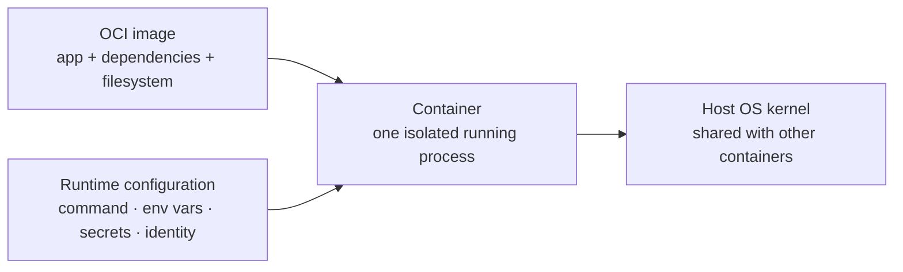

<MermaidSteps :steps="[
  { at: 1, nodes: ['I', 'C'], focusNodes: ['C'], edges: ['I->C'] },
  { at: 2, nodes: ['R'], edges: ['R->C'] },
  { at: 3, focusNodes: ['C'] },
  { at: 4, nodes: ['K'], edges: ['C->K'] },
]" />

</div>
<div>

<p class="col-label">Why use containers</p>

<v-clicks>

- Package the application and its dependencies as **one deployable unit**.
- Run the same unit in development, CI and production, without relying on host-installed dependencies.
- Start, stop, replicate and replace it predictably; platforms can scale the process, not your server.
- Treat it as **replaceable**, not a durable state store; process isolation is **not a security boundary**.

</v-clicks>

</div>
</div>

<p class="cite">Docker Docs: <a href="https://docs.docker.com/get-started/docker-concepts/the-basics/what-is-a-container/">What is a container?</a> · Open Container Initiative: <a href="https://specs.opencontainers.org/runtime-spec/">Runtime Specification</a> · Kubernetes: <a href="https://kubernetes.io/docs/concepts/security/multi-tenancy/">Multi-tenancy</a></p>

<!--
New foundation slide: say "a container is an isolated running process" before
introducing images. The image supplies the filesystem and dependencies; runtime
configuration supplies the deployment-specific values; the host kernel is
shared. That is why this is not a miniature VM.

Keep this practical. Do not teach namespaces or cgroups in detail. The desired
mental model is the payoff on the right: one repeatable deployable unit that a
platform can start, replace and replicate, with durable state elsewhere.

Do not let "isolated process" become "security boundary." Containers provide
useful OS-level isolation, but it is weaker than a VM boundary and is only one
layer of a workload-security design. In Kubernetes, pair it with image and
runtime hardening, least privilege, workload identity, and network controls.
-->

---
part: 02 Containers and ACR
---

# The deployable artifact is an immutable image, not your source tree

<div class="exhibit">
<div>

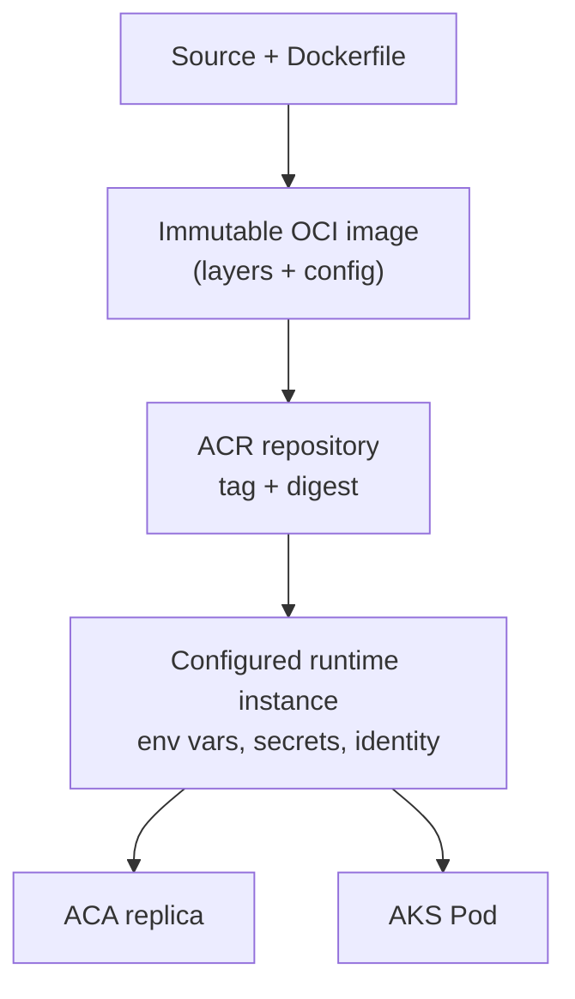

<MermaidSteps :steps="[
  { at: 1, nodes: ['A', 'B'], focusNodes: ['B'], edges: ['A->B'] },
  { at: 2, nodes: ['C'], edges: ['B->C'] },
  { at: 3, nodes: ['D'], edges: ['C->D'] },
  { at: 4, nodes: ['E', 'F'], edges: ['D->E', 'D->F'] },
]" />

</div>
<div>

<p class="col-label">The four rules</p>

<v-clicks>

- The image holds **binaries and runtime dependencies**, not environment configuration.
- A **tag is a movable name**; a **digest** identifies immutable content.
- The container filesystem is **not** where durable business state lives.
- **Health probes and graceful shutdown** are part of the application contract, not the platform's job.

</v-clicks>

</div>
</div>

<p class="cite">OCI Image Specification · Podman: <a href="https://docs.podman.io/en/latest/markdown/podman-history.1.html">history</a> · Microsoft Learn: <a href="https://learn.microsoft.com/azure/container-registry/container-registry-concepts">ACR concepts: registries, repositories, artifacts</a></p>

<!--
Foundation slide for anyone who has never built a container.

Walk the diagram top to bottom, then make the fork at the bottom explicit: the
same digest goes to an ACA replica and an AKS Pod. That fork is the entire
workshop in one picture, point at it again in Lesson 04.

The four rules on the right are the ones people violate in practice. The third
one, durable state, is worth a war story if you have one.
-->

part: 02 Containers and ACR
---

# The workshop builds two images once and pushes them under one prefix

<div class="exhibit">
<div>

```docker {4-13|1-2,15-20,23-24|25-27|21-27}{maxHeight:'418px'}
ARG VERSION=0.1.0
ARG COMMIT_SHA=unknown

FROM mcr.microsoft.com/dotnet/sdk:10.0 AS build
ARG BUILD_CONFIGURATION=Release
ARG VERSION
WORKDIR /src
COPY . .
RUN dotnet restore Workshop.Api/Workshop.Api.csproj
RUN dotnet publish Workshop.Api/Workshop.Api.csproj \
    --configuration ${BUILD_CONFIGURATION} \
    --no-restore --output /app/publish \
    /p:Version=${VERSION} /p:UseAppHost=false

FROM mcr.microsoft.com/dotnet/aspnet:10.0 AS runtime
ARG VERSION
ARG COMMIT_SHA
LABEL org.opencontainers.image.title="Workshop.Api" \
      org.opencontainers.image.version="${VERSION}" \
      org.opencontainers.image.revision="${COMMIT_SHA}"
WORKDIR /app
COPY --from=build /app/publish .
ENV ASPNETCORE_HTTP_PORTS=8080 \
    SERVICE_VERSION=${VERSION}
EXPOSE 8080
# Use the .NET runtime's numeric non-root user so AKS Automatic and ACA
# do not need to resolve a user name from the image.
USER 1654
ENTRYPOINT ["dotnet", "Workshop.Api.dll"]
```

</div>
<div>

<p class="col-label">What to notice</p>

<ul>
  <li><strong>Multi-stage</strong>: the SDK never ships to production.</li>
  <li v-click="1"><code>SERVICE_VERSION</code> lets <code>GET /info</code> report its version; version and commit also become OCI labels.</li>
  <li v-click="2"><code>USER 1654</code> runs the process as a numeric <strong>non-root</strong> user on both platforms.</li>
  <li v-click="3"><code>COPY</code> adds bytes; <code>ENV</code>, <code>EXPOSE</code>, <code>USER</code> and <code>ENTRYPOINT</code> are config only (<code>0B</code>).</li>
</ul>

<p class="col-label mt-3">Inspect image</p>

```bash
podman image inspect "$API_IMAGE" --format '{{json .Config.Labels}}' | jq
```

</div>
</div>

<p class="cite">Repository source: <code>src/Workshop.Api/Dockerfile</code> · Podman: <a href="https://docs.podman.io/en/latest/markdown/podman-history.1.html">history</a></p>

<!--
This is the app you will see for the rest of the day, so introduce it properly.

Click through the four highlight steps; each matching explanation appears at
the same time and the code block scrolls itself. Multi-stage, then build args
becoming OCI labels, then the numeric non-root user, then image history.

`app` is a valid user in the .NET runtime image, but specifying its UID avoids
platform-side user-name resolution. AKS Automatic and ACA can both enforce the
non-root policy directly against `1654`.

Use the last visible bullet to connect this Dockerfile to the live
`podman history` command. Read history newest first: each row represents either
a filesystem layer or a configuration-only instruction from the image history.
`COPY` and filesystem-changing `RUN` steps have a size. `ENV`, `EXPOSE`,
`USER`, `ENTRYPOINT`, `LABEL`, and `WORKDIR` usually show `0B` because they
change image configuration rather than its filesystem. `<missing>` for an
inherited base-image entry is normal; it does not mean a layer is broken.

`/info` is the workshop API's own HTTP endpoint, for example,
`curl -sS "$ACA_URL/info" | jq`, not the `podman info` command. It returns
the application's service version, environment, instance ID, and readiness
state. The app gets the version from `SERVICE_VERSION`; it does not read the
OCI revision label. Use `podman image inspect` or the release evidence to read
the version and commit labels from the image.
-->

---
part: 02 Containers and ACR
class: image-build-demo slide-fill
---

# Podman builds an image from source; containers start from that image

<div class="image-build-layout">
  <div class="image-build-sequence">
    <p class="col-label">What the build produces</p>
    <div v-click="1"><b>1</b><span><strong>Send the build context</strong><small>Source files plus <code>.dockerignore</code></small></span></div>
    <div v-click="2"><b>2</b><span><strong>Execute the Dockerfile</strong><small>Each instruction creates or reuses filesystem layers and image configuration</small></span></div>
    <div v-click="3"><b>3</b><span><strong>Tag the local image</strong><small>A readable name points to the built image ID</small></span></div>
    <div v-click="4"><b>4</b><span><strong>Start a container</strong><small>The runtime adds process, network and environment configuration</small></span></div>
  </div>

  <div class="image-build-terminal">
    <p class="col-label">Demo · build, inspect, run</p>

```bash {1-5|7-9|11-15|all}{maxHeight:'388px'}
cd src
export LOCAL_IMAGE='localhost/workshop/api:dev'

podman build --file Workshop.Api/Dockerfile \
  --tag "$LOCAL_IMAGE" .

podman image inspect "$LOCAL_IMAGE" \
  --format 'id={{.Id}} size={{.Size}}'
podman history "$LOCAL_IMAGE"

podman run --detach --rm --name workshop-api \
  --publish 8080:8080 "$LOCAL_IMAGE"
curl -sS http://localhost:8080/info | jq
podman logs workshop-api
podman stop workshop-api
```
  </div>
</div>

<div class="sowhat image-build-takeaway" v-click="5">
Build once, then start as many replaceable containers as needed from the same image. A rebuild creates a new artifact; restarting a container does not.
</div>

<p class="cite">Podman documentation: <a href="https://docs.podman.io/en/latest/markdown/podman-build.1.html">build</a> · <a href="https://docs.podman.io/en/latest/markdown/podman-run.1.html">run</a> · Repository source: <code>src/Workshop.Api/Dockerfile</code></p>

<!--
Run this as a short live build after showing the Dockerfile. The first command
sends `src` as the build context; the Dockerfile selects what is copied and
`.dockerignore` removes unneeded inputs before the build begins.

On the second click, connect Dockerfile instructions to cached filesystem
layers and image configuration. The tag is a local pointer, not the immutable
identity; the later ACR slides introduce the registry digest.

On the final click, make the direction explicit: Podman does not convert a
running container into the normal deployment artifact. It builds the image,
then the runtime starts an isolated process from that image. The detached run
keeps the terminal available for the HTTP check and cleanup.
-->

---
part: 02 Containers and ACR
class: image-anatomy-slide slide-fill
---

# The final image contains runtime layers and configuration—not the SDK

<div class="image-anatomy-layout">
  <div class="image-not-shipped">
    <p class="col-label">Build stage · discarded</p>
    <div><strong>.NET SDK</strong><span>restore and publish tooling</span></div>
    <div><strong>Source tree</strong><span>inputs used to produce published output</span></div>
    <div><strong>Build cache</strong><span>useful during compilation, not at runtime</span></div>
  </div>

  <b class="image-stage-arrow">→</b>

  <div class="image-final-artifact">
    <p class="col-label">Final OCI image</p>
    <div class="image-layer-stack">
      <div><span>Filesystem layer</span><strong>Published Workshop.Api files</strong></div>
      <div><span>Filesystem layers</span><strong>.NET ASP.NET runtime base</strong></div>
      <div class="image-config-layer"><span>Image configuration</span><strong>USER 1654 · port 8080 · entrypoint · labels</strong></div>
    </div>
  </div>

  <div class="image-inspection-panel">
    <p class="col-label">Two inspection questions</p>
    <div><strong><code>podman history</code></strong><span>Which instructions added filesystem bytes?</span></div>
    <div><strong><code>podman image inspect</code></strong><span>Which runtime defaults and OCI labels ship with the artifact?</span></div>
  </div>
</div>

<div class="sowhat image-anatomy-takeaway" v-click>
Multi-stage builds reduce what ships. They do not make an image trustworthy by themselves—inspect the final artifact, run it as non-root, and record exactly which digest you approved.
</div>

<p class="cite">OCI Image Specification · Repository source: <code>src/Workshop.Api/Dockerfile</code> · Podman: <a href="https://docs.podman.io/en/latest/markdown/podman-history.1.html">history</a> and <a href="https://docs.podman.io/en/latest/markdown/podman-image-inspect.1.html">image inspect</a></p>

<!--
Five-minute visual checkpoint after the Dockerfile. Ask the room to classify the
instructions they just saw: which ones create filesystem content, and which
ones only update image configuration?

The build stage is intentionally shown outside the final artifact. The SDK,
source tree and build cache are inputs to publish, not production dependencies.
Inside the final image, distinguish filesystem layers from config metadata such
as USER, ENTRYPOINT, exposed ports and OCI labels.

Use this slide to slow down if the room is new to images. If they already know
multi-stage builds, ask the two inspection questions and move on in two minutes.
-->

---
part: 02 Containers and ACR
class: acr-value-slide
---

# ACR turns image storage into an Azure-native supply boundary

<div class="acr-value-flow">
  <div class="acr-value-input">
    <p class="acr-value-kicker">You provide</p>
    <strong>OCI artifacts + release intent</strong>
    <div class="acr-value-input-list">
      <span>Repository names</span>
      <span>Release tags</span>
      <span>Producer identities</span>
      <span>Consumer identities</span>
    </div>
  </div>

  <div class="acr-value-arrow">→</div>

  <div class="acr-value-platform">
    <div class="acr-value-header">
      
      <div>
        <strong>Azure Container Registry</strong>
        <span>Managed OCI distribution service</span>
      </div>
      <b>Registry</b>
    </div>

<div class="acr-value-capabilities">
  <div class="acr-value-card" v-click="1">
    <span>Store it</span>
    <strong>Private repositories for images and OCI artifacts</strong>
    <small>Azure operates the registry service and stores manifests, configuration and layers</small>
  </div>
  <div class="acr-value-card" v-click="2">
    <span>Address it</span>
    <strong>Readable tags plus immutable manifest digests</strong>
    <small>Use tags for release navigation and digests for approval and deployment evidence</small>
  </div>
  <div class="acr-value-card" v-click="3">
    <span>Govern it</span>
    <strong>Azure-native identity and repository permissions</strong>
    <small>Separate push and pull identities; scope access with RBAC and repository-level ABAC</small>
  </div>
  <div class="acr-value-card" v-click="4">
    <span>Deliver it</span>
    <strong>One approved artifact for every OCI-compatible runtime</strong>
    <small>ACA and AKS can pull the same digest without rebuilding the application</small>
  </div>
</div>
  </div>
</div>

<div class="sowhat acr-value-takeaway" v-click="5">
The selling point is the boundary: Azure operates the registry service; you define artifact identity, access, lifecycle and network exposure.
</div>

<p class="cite">Microsoft Learn: <a href="https://learn.microsoft.com/azure/container-registry/container-registry-intro">Introduction to Azure Container Registry</a> · <a href="https://learn.microsoft.com/azure/container-registry/container-registry-rbac-abac-repository-permissions">Repository permissions with ABAC</a></p>

<!--
This is the positive case for ACR before introducing its object vocabulary or
opening the portal. Mirror the ACA selling-points slide: begin with what the
team supplies, then reveal the managed capabilities one at a time.

Store it: ACR is a managed private registry for OCI images and artifacts. Do not
say it is merely a Docker image folder; it stores manifests, configuration and
content-addressed layers behind an OCI-compatible endpoint.

Address it: repository names and tags make releases navigable, while the digest
is the immutable identity used for approval and later platform comparison.

Govern it: build pipelines need write permission; runtimes need pull permission.
Keep those identities separate and scope repository access where the registry's
RBAC + ABAC permissions mode is used.

Deliver it: the registry is independent of the runtime. The same approved digest
can be consumed by ACA, AKS and other OCI clients without rebuilding it.

Land the responsibility boundary. Azure runs the registry service. The customer
still owns artifact provenance, naming, permissions, retention and exposure.
-->

---
part: 02 Containers and ACR
class: acr-concept-slide slide-fill
---

# ACR gives immutable image content a governed address

<div class="acr-concept-flow">
  <div class="acr-producer">
    <span>Build pipeline</span>
    <strong>Builds and pushes two OCI images</strong>
    <code>podman push</code>
  </div>

  <b class="acr-flow-arrow">→</b>

  <div class="acr-registry-model">
    <div class="acr-registry-head">
      <div class="acr-registry-title">
        
        <span>Azure Container Registry</span>
      </div>
      <strong>&lt;registry&gt;.azurecr.io</strong>
    </div>
    <div class="acr-repository-row">
      <strong>workshop/api</strong>
      <span class="acr-tag">tag · 0.1.0</span>
      <span class="acr-digest">digest · sha256:8ab…</span>
    </div>
    <div class="acr-repository-row">
      <strong>workshop/worker</strong>
      <span class="acr-tag">tag · 0.1.0</span>
      <span class="acr-digest">digest · sha256:42f…</span>
    </div>
  </div>

  <b class="acr-flow-arrow">→</b>

  <div class="acr-consumers">
    <div><span>ACA</span><strong>Replica</strong></div>
    <div><span>AKS</span><strong>Pod</strong></div>
    <p>Both platforms pull the same manifest and layers.</p>
  </div>
</div>

<div class="acr-vocabulary">
  <div><strong>Registry</strong><span>Azure service and policy boundary</span></div>
  <div><strong>Repository</strong><span>Named collection such as <code>workshop/api</code></span></div>
  <div><strong>Tag</strong><span>Human-readable alias that can move</span></div>
  <div><strong>Digest</strong><span>Immutable identity of one manifest</span></div>
</div>

<div class="sowhat acr-concept-takeaway" v-click>
ACR is not the image. It is the governed distribution point that stores image manifests and layers and controls who may push or pull them.
</div>

<p class="cite">Microsoft Learn: <a href="https://learn.microsoft.com/azure/container-registry/container-registry-concepts">About registries, repositories, images, and artifacts</a></p>

<!--
Introduce the nouns from outside in. The registry is the Azure resource and
policy boundary. A repository groups versions of one named artifact. A tag is a
convenient alias; the manifest digest is the immutable content identity.

Then point right: ACA and AKS do not receive source code or a Dockerfile. They
pull the manifest and layers selected by the image reference. This is why the
same digest is the portable fact we verify later.

Keep security at one sentence here: identities receive push or pull permission
at the appropriate registry or repository scope. The detailed identity and
registry-boundary discussion follows after the portal walkthrough.
-->

---
part: 02 Containers and ACR
class: acr-portal-demo slide-fill
---

# Portal demo · Follow one image from repository to immutable digest

<div class="acr-portal-layout">
  <div class="acr-portal-steps">
    <p class="col-label">Navigate in the Azure portal</p>
    <div><b>1</b><span><strong>Open the workshop container registry.</strong><em>On Overview, name the registry and point out its login server, region and SKU.</em></span></div>
    <div><b>2</b><span><strong>Open Services → Repositories.</strong><em>Show <code>workshop/api</code> and <code>workshop/worker</code> as two repositories inside one registry.</em></span></div>
    <div><b>3</b><span><strong>Open <code>workshop/api</code>.</strong><em>Select the release tag used by the workshop and compare the tag with the digest shown beside it.</em></span></div>
    <div><b>4</b><span><strong>Open the artifact details.</strong><em>Read the manifest digest and image metadata; this digest is what we can later compare with ACA and AKS.</em></span></div>
  </div>

  <div class="acr-portal-observations">
    <p class="col-label">Make participants say it</p>
    <div><strong>Repository</strong><span>groups versions of one named artifact.</span></div>
    <div><strong>Tag</strong><span>is the readable release label—and can be reassigned.</span></div>
    <div><strong>Digest</strong><span>is the immutable deployment evidence.</span></div>
<div class="note acr-portal-guardrail"><strong>Observe only.</strong> Do not delete tags or manifests, enable the admin account, or change networking and access settings during this walkthrough.</div>
  </div>
</div>

<p class="cite">Microsoft Learn: <a href="https://learn.microsoft.com/azure/container-registry/container-registry-repositories">View container registry repositories in the Azure portal</a> · <a href="https://learn.microsoft.com/azure/container-registry/container-registry-get-started-portal">Create and inspect a registry in the portal</a></p>

<!--
Seven-minute portal walkthrough. Keep one browser tab on the registry and do not
open the deployment platforms yet.

Start on Overview only long enough to identify the login server and SKU. Then
spend the time under Services → Repositories. The key interaction is opening
workshop/api, selecting its release tag, and exposing the manifest digest.
Repeat only the repository-list view for workshop/worker; do not inspect every
artifact.

Ask the room which value should be copied into release evidence. The answer is
the digest, not the tag or portal timestamp. Tell them the next slide performs
the same check from the command line and constructs a digest-pinned reference.

If the portal blade has moved, use its search box to find Repositories. The demo
contract is the object path—registry → repository → tag → manifest digest—not a
particular menu position.
-->

---
part: 02 Containers and ACR
class: acr-evidence-exercise slide-fill
---

# Checkpoint · Capture the immutable evidence for both workshop images

<p class="eyebrow acr-exercise-time">6–8 minutes · optional extension when the section has a 45–50 minute slot</p>

<div class="acr-evidence-layout">
  <div class="acr-evidence-tasks">
    <p class="col-label">In the portal</p>
    <div><b>1</b><span>Open <code>workshop/api</code> and select the workshop release tag.</span></div>
    <div><b>2</b><span>Copy the tag and the first 12 characters of its manifest digest.</span></div>
    <div><b>3</b><span>Repeat for <code>workshop/worker</code>.</span></div>
    <div><b>4</b><span>Decide which value belongs in release evidence and which is only a convenient label.</span></div>
  </div>

  <div class="acr-evidence-record">
    <p class="col-label">Record this evidence</p>
    <table>
      <thead><tr><th>Repository</th><th>Capture</th><th>Later comparison</th></tr></thead>
      <tbody>
        <tr><td><code>workshop/api</code></td><td>release tag + manifest digest</td><td>ACA API ↔ AKS API</td></tr>
        <tr><td><code>workshop/worker</code></td><td>release tag + manifest digest</td><td>ACA worker ↔ AKS worker</td></tr>
      </tbody>
    </table>
<div class="sowhat acr-evidence-answer" v-click>The API and worker digests should differ from <em>each other</em>. The portability test is that each image keeps the same digest across its ACA and AKS deployments.</div>
  </div>
</div>

<p class="cite">Microsoft Learn: <a href="https://learn.microsoft.com/azure/container-registry/container-registry-repositories">View repositories in the Azure portal</a> · <a href="https://learn.microsoft.com/azure/container-registry/container-registry-image-tag-version">Tagging and versioning recommendations</a></p>

<!--
This is the elastic part of Lesson 02. Run it when the section has 45–50 minutes;
for the 35-minute schedule, perform only the API row during the portal demo and
skip directly to the command-line digest slide.

Pair participants if they have portal access. Their output is two short evidence
rows, not screenshots. Ask one pair to explain why API and worker should not
share a digest, then ask why the API digest must match between ACA and AKS.

Do not wait for exact digest strings to be read aloud. The learning objective is
to distinguish the movable tag from the immutable manifest identity and to set
up the later same-digest comparison.
-->

---
part: 02 Containers and ACR
---

# Pin the digest, because a tag can be moved after you approved it

```bash
# Authenticate Podman to the same ACR and pull the image AKS is running.
az acr login --name "$ACR_NAME" --expose-token --query accessToken -o tsv |
  podman login "$ACR_LOGIN_SERVER" \
    --username 00000000-0000-0000-0000-000000000000 --password-stdin
podman pull "$API_IMAGE"

# Inspect the image, then turn the current tag resolution into an immutable reference.
podman image inspect "$API_IMAGE" --format '{{json .Config.Labels}}' | jq .
podman history "$API_IMAGE"
export API_DIGEST="$(podman image inspect "$API_IMAGE" --format '{{.Digest}}')"
export API_PINNED_IMAGE="${API_IMAGE%:*}@${API_DIGEST}"
printf '%s\n' "$API_PINNED_IMAGE"
```

<div class="exhibit mt-4">
<div>

<p class="col-label">What to notice</p>

<p>The tag names a version; <code>API_PINNED_IMAGE</code> names the exact bytes pulled from ACR.</p>

</div>
<div>

<div class="sowhat" v-click>
"the same image runs on both platforms" is only verifiable if both deployments reference the <strong>same digest</strong>. We check exactly that in Lesson 04.
</div>

</div>
</div>

<p class="cite">Microsoft Learn: <a href="https://learn.microsoft.com/azure/container-registry/container-registry-image-tag-version">Recommendations for tagging and versioning container images</a></p>

<!--
Short demo, five minutes. Run the commands live if the registry is reachable,
otherwise use the recorded output.

The single thing to land: a tag is a mutable pointer. "We approved 1.0.0 in
staging" means nothing if someone re-pushed 1.0.0.

Demo objective: make the artifact tangible. This is not a local container
workflow tutorial, and one optional Trivy scan is not a vulnerability-management
process. The one-time workshop shell setup above provides API_IMAGE and the ACR
variables, so this block can be copied and run as shown.

Do not turn the optional Trivy scan into a security lecture. It exists to make
the artifact feel real, not to start a vulnerability-management conversation.
-->

---
part: 02 Containers and ACR
class: identity-basics
---

# Identity says who the workload is; authorization says what Azure permits

<div class="exhibit">
<div>

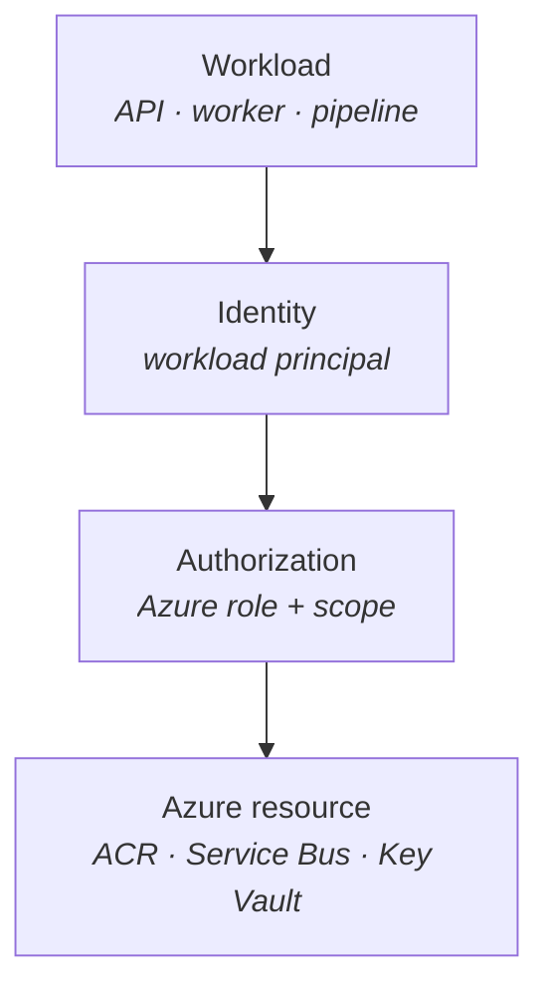

<MermaidSteps :steps="[
  { at: 1, nodes: ['W', 'I'], focusNodes: ['I'], edges: ['W->I'] },
  { at: 2, nodes: ['A'], edges: ['I->A'] },
  { at: 3, nodes: ['R'], edges: ['A->R'] },
  { at: 4, focusNodes: ['W', 'I'] },
]" />

</div>
<div>

<p class="col-label">Keep the questions separate</p>

<v-clicks>

- A **managed identity** or federated workload identity answers a simple question: "Who is this workload in Azure?"
- An **Azure role assignment** defines what that identity may do and where.
- Give runtime pulls, queue access and secret reads only the permissions each workload needs.
- CI/CD is a different identity with a different job: write and deploy, not runtime access.

</v-clicks>

</div>
</div>

<p class="cite">Microsoft Learn: <a href="https://learn.microsoft.com/entra/identity/managed-identities-azure-resources/overview">Managed identities</a> · <a href="https://learn.microsoft.com/azure/role-based-access-control/overview">Azure RBAC</a> · <a href="https://learn.microsoft.com/azure/aks/workload-identity-overview">AKS Workload Identity</a></p>

<!--
Introduce this distinction before ACR, Service Bus, Key Vault, or workload
identity details appear. Identity is the workload principal; authorization is
the Azure permission at a specific scope. They solve different problems.

For ACA the workload normally receives a managed identity directly. On AKS,
the Kubernetes ServiceAccount is federated to an Azure managed identity. That
implementation comparison comes later. At this point only land the two
questions and the least-privilege rule.
-->

---
part: 02 Containers and ACR
class: acr-access-slide slide-fill
---

# ACR added ABAC when registry-wide roles became too broad for shared registries

<div class="acr-access-background">
  <div><span>Original model</span><strong><code>AcrPull</code> and <code>AcrPush</code> covered the registry</strong></div>
  <b v-click="1">→</b>
  <div v-click="1"><span>Scaling pressure</span><strong>More teams meant broad access or more registries</strong></div>
  <b v-click="2">→</b>
  <div v-click="2"><span>Added capability</span><strong>Repository attributes became assignment conditions</strong></div>
</div>

<div class="acr-access-equation" v-click="3">
  <div><span>Who</span><strong>Managed identity</strong></div>
  <b>+</b>
  <div><span>What</span><strong>RBAC role</strong></div>
  <b>+</b>
  <div><span>Which</span><strong>ABAC condition</strong></div>
  <b>=</b>
  <div class="acr-access-result"><span>Effective access</span><strong>Pull <code>workshop/api</code></strong></div>
</div>

<div class="acr-access-compare">
  <section v-click="4">
    <header><span>RBAC Registry Permissions</span><strong>Role + registry scope</strong></header>
    <div class="acr-access-role"><code>AcrPull</code><span>pull from the registry</span></div>
    <div class="acr-access-repositories">
      <div><b>✓</b><code>workshop/api</code></div>
      <div><b>✓</b><code>workshop/worker</code></div>
      <div><b>✓</b><code>other-team/app</code></div>
    </div>
    <p>Simple, but the data-plane permission covers every repository in the registry.</p>
  </section>

  <section class="acr-access-abac" v-click="5">
    <header><span>RBAC Registry + ABAC Repository Permissions</span><strong>Role + registry scope + condition</strong></header>
    <div class="acr-access-role"><code>Container Registry Repository Reader</code><span>pull and read metadata</span></div>
    <div class="acr-access-condition"><span>Condition</span><code>repository == "workshop/api"</code></div>
    <div class="acr-access-repositories">
      <div><b>✓</b><code>workshop/api</code></div>
      <div class="denied"><b>×</b><code>workshop/worker</code></div>
      <div class="denied"><b>×</b><code>other-team/app</code></div>
    </div>
  </section>
</div>

<div class="sowhat acr-access-takeaway" v-click="6">
ACR did not replace RBAC. The combined mode keeps roles for <strong>what</strong> is allowed and adds conditions for <strong>which repositories</strong>. Without a condition, the repository role is registry-wide.
</div>

<p class="cite">Microsoft Learn: <a href="https://learn.microsoft.com/azure/container-registry/container-registry-rbac-abac-repository-permissions">ACR repository permissions with ABAC</a> · <a href="https://learn.microsoft.com/azure/container-registry/container-registry-rbac-built-in-roles-overview">ACR roles and permissions modes</a></p>

<!--
Start with the history strip. The original registry-wide roles were simple, but
a shared enterprise registry could contain images owned by many applications,
teams and pipelines. The practical choice became over-broad access or registry
sprawl. Repository attributes made a shared registry compatible with narrower
data-plane access. ACR still supports both modes; this was an added opt-in mode,
not a universal migration from RBAC.

Then use the equation. The identity answers who; the RBAC role answers which
actions; the ABAC condition answers which repositories. ABAC is a condition on
an Azure role assignment, not a competing authorization system.

Contrast the two registry permission modes. In RBAC Registry Permissions mode,
the familiar AcrPull and AcrPush roles grant data-plane access across the
registry. In RBAC Registry + ABAC Repository Permissions mode, use Repository
Reader, Writer or Contributor and optionally constrain the assignment by exact
repository name or prefix.

Two caveats matter. AcrPull, AcrPush and AcrDelete are not honored after the
registry switches to the ABAC-enabled mode. Also, an ABAC-capable repository
role without a condition still applies registry-wide. Catalog listing is a
separate unconditioned role; grant it only when the identity must enumerate all
repositories.
-->

---
part: 02 Containers and ACR
class: acr-topology
---

# Registry boundaries follow isolation needs, not application count

<div class="exhibit exhibit-wide">
<div>

| Topology | Consequence |
| --- | --- |
| One ACR **per application** | Operational and cost sprawl; many identities, many private endpoints |
| One global ACR with **ABAC-scoped repositories** | Operationally simple; enforce per-app, team and pipeline repository access |
| One ACR per **environment, geography, tenant or security boundary** | Use when the boundary needs isolation beyond repository permissions |

</div>
<div>

<p class="col-label">Controls that matter</p>

<v-clicks>

- Runtime pull uses **managed identity**; CI/CD gets a separate writer identity.
- Use repository conditions for **team, application or pipeline prefixes** inside a shared registry.
- Grant **Repository Catalog Lister** only to identities that must enumerate repositories.
- Split registries when network, residency, tenant or compliance boundaries need a separate blast radius.
- Keep admin disabled; combine immutable release tags and retention with explicit network exposure.

</v-clicks>

</div>
</div>

<p class="cite">Microsoft Learn: <a href="https://learn.microsoft.com/azure/container-registry/container-registry-rbac-abac-repository-permissions">ACR repository permissions with ABAC</a> · <a href="https://learn.microsoft.com/azure/container-registry/container-registry-authentication">ACR authentication options</a></p>

<!--
Discussion slide. Ask before you present: "how many registries do you have
today, and why that number?"

ABAC removes "every consumer sees every repository" as an inherent consequence
of a shared global registry. It is not automatic, though: the registry must use
the RBAC + ABAC repository-permissions mode and assignments need conditions.

The decision is not global versus per-app. Split registries only where an
environment, tenant, residency, network or stronger security boundary needs
isolation beyond repository permissions.

The last bullet is the hook into Lesson 05. Private endpoint and public access
are two settings. Plant it now so it's a recall, not a revelation, after lunch.
-->

---
nofooter: true
layout: none
class: zsection
---

<div class="zsplit">
  <div class="zbreak">
    <p class="zbreak-label">Break</p>
    <p class="zbreak-time">10:00</p>
    <p class="zbreak-note">Back at 10:00. Next up is the Kubernetes hour, so bring a laptop that can open a browser lab.</p>
  </div>
  <div class="zsplit-art">
    
  </div>
</div>

---
nofooter: true
layout: none
class: zsection
---

<div class="zsplit">
  <div class="zsection-body">
    <p class="eyebrow">Part 03 · 10:00–11:00</p>
    <h1>The Kubernetes application model</h1>
    <p class="zsection-sub">No Azure in this hour. Just the objects, and forty minutes in a browser lab.</p>
  </div>
  <div class="zsplit-art">
    
  </div>
</div>

<!--
Ten minutes. Next hour is the browser lab, so use this time to confirm everyone can sign in to KodeKloud, sort access problems now, not at 10:05.
-->

<!--
The most important hour for a room that does not know Kubernetes. Stay platform-neutral throughout, no Azure, no ACA, no AKS.
-->

---
part: 03 Kubernetes model
class: kube-foundations foundation-map-slide slide-fill
---

# Four Kubernetes nouns to know before we touch YAML

<div class="exhibit">
<div>

<div class="foundation-map">
  <div class="foundation-row">
    <div class="foundation-node" v-click="3"><strong>Manifest</strong><span>desired-state YAML</span></div>
    <b class="foundation-arrow" v-click="3">→</b>
    <div class="foundation-node foundation-focus" v-click="1"><strong>Kubernetes API</strong><span>the control surface</span></div>
    <b class="foundation-arrow" v-click="2">→</b>
    <div class="foundation-node" v-click="2"><strong>Namespace</strong><span>names, access, quotas</span></div>
  </div>
  <div class="foundation-drop" v-click="4">↓</div>
  <div class="foundation-row">
    <div class="foundation-node" v-click="4"><strong>Workload</strong><span>declares application state</span></div>
    <b class="foundation-arrow" v-click="4">→</b>
    <div class="foundation-node" v-click="4"><strong>Pod</strong><span>replaceable runtime unit</span></div>
    <b class="foundation-arrow" v-click="4">→</b>
    <div class="foundation-node foundation-focus" v-click="1"><strong>Node</strong><span>machine capacity</span></div>
  </div>
</div>

</div>
<div>

<p class="col-label">Scope, declaration, placement</p>

<v-clicks>

- A **cluster** is the Kubernetes environment: one API plus the capacity that runs workloads.
- A **namespace** scopes names, access policies and quotas inside that cluster. It is not a security boundary by itself.
- A **manifest** is desired-state YAML or JSON submitted to the Kubernetes API.
- A **node** is a machine that provides compute capacity; Kubernetes schedules Pods onto nodes.

</v-clicks>

</div>
</div>

<p class="cite">Kubernetes documentation: <a href="https://kubernetes.io/docs/concepts/overview/components/">Components</a> · <a href="https://kubernetes.io/docs/concepts/overview/working-with-objects/namespaces/">Namespaces</a> · <a href="https://kubernetes.io/docs/concepts/architecture/nodes/">Nodes</a></p>

<!--
This is vocabulary, not a deep architecture slide. Give the room a location for
the things that follow. A cluster is the environment they target with kubectl;
a namespace is the named scope in that cluster. The workshop uses the
"workshop" namespace, which is why every later command includes
--namespace "$WORKSHOP_NAMESPACE".

Say explicitly that a namespace is useful for scoping names, RBAC and quotas,
but it is not a complete isolation or security boundary on its own. Stronger
separation may need distinct clusters, network policies, identities, or Azure
resource boundaries depending on the requirement.

A manifest is only a declaration of desired state. Kubernetes controllers make
that declaration real later; the next slide explains that reconciliation loop.
Nodes are the machines supplying capacity. Do not describe Pods yet beyond
"they run on nodes": the controller slide defines their lifecycle next.
-->

---
part: 03 Kubernetes model
---

# Kubernetes controllers maintain application state

<div class="exhibit">
<div>

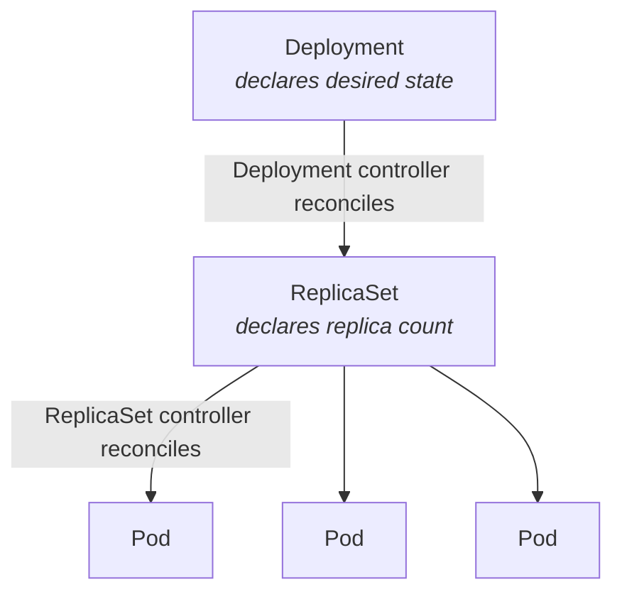

<MermaidSteps :steps="[
  { at: 1, nodes: ['D', 'R'], edges: ['D->R'] },
  { at: 2, nodes: ['P1', 'P2', 'P3'], edges: ['R->P1', 'R->P2', 'R->P3'] },
  { at: 3, focusNodes: ['R'] },
  { at: 4, focusNodes: ['D'] },
]" />

</div>
<div>

<p class="col-label">The controller loop</p>

<v-clicks>

- A **controller** watches actual state, compares it with declared desired state, and acts to close the gap.
- A **Pod** is a replaceable runtime unit, never a durable server identity.
- The **ReplicaSet controller** reconciles the declared replica count by creating or deleting Pods.
- The **Deployment controller** reconciles Deployment objects by creating and updating ReplicaSets for rollout and replacement.

</v-clicks>

<div class="sowhat mt-4" v-click>
You almost never create application Pods directly. If you delete a controller-managed Pod, the controller creates a replacement.
</div>

</div>
</div>

<p class="cite">Kubernetes documentation: <a href="https://kubernetes.io/docs/concepts/architecture/controller/">Controllers</a> · <a href="https://kubernetes.io/docs/concepts/workloads/controllers/deployment/">Deployments</a> · <a href="https://kubernetes.io/docs/concepts/workloads/pods/">Pods</a></p>

<!--
For a room that does not know Kubernetes, this is the single concept that has
to survive the day. Go slowly. Define a controller as a reconciliation control
loop: it watches Kubernetes objects, compares the observed state to the desired
state in their specification, then takes an idempotent action to reduce the
difference. "Reconciliation" does not mean an instant, one-off repair; it is
continuous convergence while the controller is running.

The diagram shows API objects connected by the controllers that reconcile them.
The Deployment controller owns rollout intent. It creates and updates ReplicaSets.
The ReplicaSet controller owns the replica count and creates replacement Pods
when the observed count falls short.
The scheduler is another controller-like actor: it chooses a Node for an
unscheduled Pod, but it does not keep the Pod healthy after placement.

The framing that works: a Pod is cattle with a very short life expectancy. You
never name one, you never nurse one back to health.

Do not mention AKS Automatic or ACA in this hour. Every time you do, people stop
learning the model and start comparing products.
-->

---
part: 03 Kubernetes model
class: vendor-delivery
---

# How vendors can deliver an operational product

<div class="exhibit">
<div>

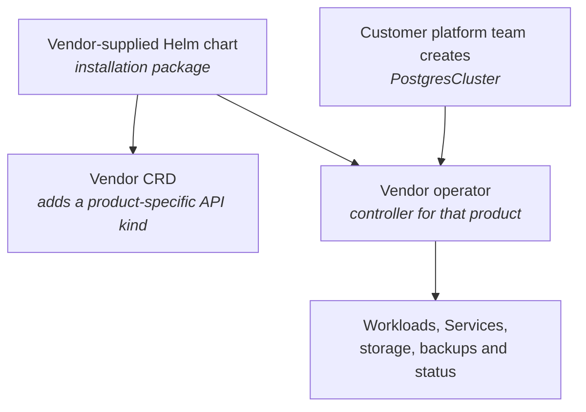

<MermaidSteps :steps="[
  { at: 1, nodes: ['H'], focusNodes: ['H'] },
  { at: 2, nodes: ['C'], edges: ['H->C'] },
  { at: 3, nodes: ['O'], edges: ['H->O'] },
  { at: 4, nodes: ['U', 'R'], focusNodes: ['U', 'O'], edges: ['U->O', 'O->R'] },
]" />

</div>
<div>

<p class="col-label">A common Kubernetes vendor model</p>

<v-clicks>

- The **vendor team** packages the Helm chart, CRD, operator and runbook.
- A **Custom Resource Definition (CRD)** adds an object type such as `PostgresCluster`.
- The vendor's **operator** watches that object and reconciles the product into a working state.
- {{ $slidev.configs.customerName }}'s **cluster-owning platform team** creates the custom object and operates the product through its status and the vendor's runbook.

</v-clicks>

<div class="sowhat mt-4" v-click>
The vendor is delivering a Kubernetes API and controller—not only a container image.
</div>

</div>
</div>

<p class="cite">Kubernetes: <a href="https://kubernetes.io/docs/concepts/extend-kubernetes/api-extension/custom-resources/">Custom resources</a> · <a href="https://kubernetes.io/docs/concepts/architecture/controller/">Controllers</a> · <a href="https://helm.sh/docs/">Helm</a></p>

<!--
Build directly on the controller slide: an operator is another reconciliation
loop, not magic and not an Azure product. The CRD gives the vendor's product its
own Kubernetes object type and API.

Use PostgresCluster only as an intuitive example. The customer's cluster-owning
platform team declares the database it wants; the vendor-supplied operator
reconciles the workloads, services, storage, backups and status needed to
converge on that state.

Do not teach installation commands or operator internals here. The purpose is to
make the later platform criterion concrete: when a vendor requires Helm, CRDs,
an operator, or ongoing management of custom objects, it is requiring a
Kubernetes API surface.
-->

---
part: 03 Kubernetes model
class: traffic-glossary
---

# Four Kubernetes traffic nouns, in request order

<div class="traffic-flow-diagram">

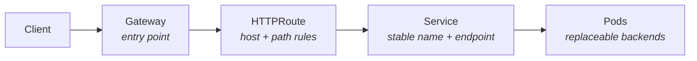

<MermaidSteps :steps="[
  { nodes: ['C', 'G'], focusNodes: ['G'], edges: ['C->G'] },
  { nodes: ['R'], edges: ['G->R'] },
  { nodes: ['S'], edges: ['R->S'] },
  { nodes: ['P'], edges: ['S->P'] },
]" />

</div>

<div class="traffic-flow-copy">
  <div>
    <p class="traffic-flow-label">Gateway</p>
    <p>Shared entry point and listeners that accept traffic.</p>
  </div>
  <div>
    <p class="traffic-flow-label">HTTPRoute</p>
    <p>Matches hosts, paths or headers and selects a backend Service.</p>
  </div>
  <div>
    <p class="traffic-flow-label">Service</p>
    <p>Gives changing Pods one stable DNS name and network endpoint.</p>
  </div>
  <div v-click="1">
    <p class="traffic-flow-label">Pods</p>
    <p>Replaceable backends selected by the Service, not the client address.</p>
  </div>
</div>

<p class="cite">Kubernetes: <a href="https://kubernetes.io/docs/concepts/services-networking/service/">Services</a> · Gateway API: <a href="https://gateway-api.sigs.k8s.io/docs/introduction/">Gateway</a> · <a href="https://gateway-api.sigs.k8s.io/reference/api-types/httproute/">HTTPRoute</a></p>

<!--
Put this in the room before showing a Service selector in the next slide.

Click through the request path from left to right. Each named object and
connecting edge appears with its matching explanation below. A Gateway is the
configured point of entry; a Gateway controller supplies the actual
implementation. HTTPRoute is the routing policy attached to the Gateway:
hostname, path, header and backend selection. A Service is not a Pod, a process,
or necessarily a cloud load balancer. It is the stable network identity in
front of replaceable backends.

The Service normally uses its selector to create endpoint records for matching
Pods. Explain that application code targets the Service DNS name; the actual
Pod IPs can change after rollout, scale, or failure without changing that
address. The next slide deliberately shows the independent selectors used by a
Deployment and a Service.
-->

---
part: 03 Kubernetes model
---

# Labels and selectors are the only thing connecting these objects

<div class="exhibit">
<div>

```yaml {1-5|7-9|10-13|15-21}{maxHeight:'418px'}
kind: Deployment
metadata:
  name: workshop-api
  labels:
    app.kubernetes.io/name: workshop-api
spec:
  selector:
    matchLabels:
      app.kubernetes.io/name: workshop-api   # controller → Pods
  template:
    metadata:
      labels:
        app.kubernetes.io/name: workshop-api
---
kind: Service
metadata:
  name: workshop-api
spec:
  selector:
    app.kubernetes.io/name: workshop-api     # Service → Pods
  ports:
  - name: http
    port: 80
    targetPort: http
```

</div>
<div>

<p class="col-label">Two independent links</p>

- The **controller** finds its Pods by selector.
- The **Service** finds its endpoints by selector, completely independently.

<div class="sowhat mt-4" v-click>
a typo in one selector produces a healthy Deployment with an empty Service. Nothing errors; traffic simply goes nowhere. This is the most common "it deployed but does not work" cause.
</div>

</div>
</div>

<p class="cite">Repository source: <code>src/deploy/aks/workshop.yaml</code></p>

<!--
The failure mode on this slide is the most common real-world Kubernetes bug, so
make it memorable.

Click through: controller finds Pods by selector, Service finds endpoints by
selector, and the two are completely independent.

Then the payoff, a typo produces a green Deployment and a Service with no
endpoints. Nothing errors. Nothing goes red. Traffic just disappears.

Ask: "where would you look first?" The answer is `kubectl get endpoints`, and it
is worth writing on the board.
-->

---
part: 03 Kubernetes model
---

# Gateway API is the workshop standard. Keep Ingress only for existing implementations.

<div class="exhibit">
<div>

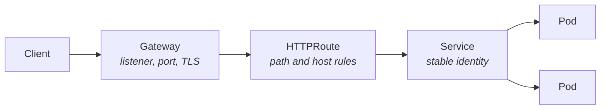

<MermaidSteps :steps="[
  { at: 1, nodes: ['C', 'G', 'H'], focusNodes: ['G', 'H'], edges: ['C->G', 'G->H'] },
  { at: 2, nodes: ['S', 'P1', 'P2'], focusNodes: ['G', 'H'], edges: ['H->S', 'S->P1', 'S->P2'] },
  { at: 3, focusNodes: ['G', 'H'] },
]" />

</div>
<div>

<p class="col-label">Why the change</p>

<v-clicks>

- **Ingress** merged routing, TLS and vendor behaviour into annotations.
- **Gateway API** splits the infrastructure concern (`Gateway`, owned by the platform team) from the routing concern (`HTTPRoute`, owned by the app team).
- Upstream **Ingress NGINX** maintenance ended in **March 2026**; AKS application routing NGINX has documented critical support until **November 2026**.

</v-clicks>

<p class="mt-3">You will still see Ingress in older material. Recognise it; do not start with it.</p>

</div>
</div>

<p class="cite">Kubernetes: <a href="https://gateway-api.sigs.k8s.io/">Gateway API</a> · Microsoft Learn: <a href="https://learn.microsoft.com/azure/aks/app-routing-gateway-api">Gateway API with the AKS application routing add-on</a></p>

<!--
Keep this to three minutes; it is orientation, not a routing masterclass.

The reason Gateway API exists is organisational, not technical: Ingress made the
platform team and the app team edit the same annotated object. Gateway splits
that ownership cleanly.

Mention the NGINX dates briefly. Someone will have Ingress in production and
needs to know there is a clock on it, but do not let it derail the hour.
-->

---
part: 03 Kubernetes model
class: dense
---

# A load balancer reaches the cluster; a route selects the Service

<div class="exhibit">
<div>

<p class="col-label">Three exposure patterns</p>

<table>
<thead>
<tr><th>Pattern</th><th>What it does</th></tr>
</thead>
<tbody>
<tr v-click="1"><td><code>ClusterIP</code> Service</td><td>Stable address reachable inside the cluster</td></tr>
<tr v-click="2"><td><code>LoadBalancer</code> Service</td><td>Requests an external or internal L4 endpoint for one Service</td></tr>
<tr v-click="3"><td><code>Gateway</code> + <code>HTTPRoute</code></td><td>Shares an L7 entry point and routes hosts or paths to several Services</td></tr>
</tbody>
</table>

<p class="mt-3" v-click="4"><strong>Ingress</strong> is the older L7 API. It also needs a controller and usually a cloud load balancer underneath it.</p>

<div class="note mt-3" v-click="5">
<strong>WebSockets do not force AKS.</strong> ACA supports them through HTTP ingress. On AKS, validate the selected Gateway or Ingress implementation and reconnect behaviour during rollouts.
</div>

</div>
<div>

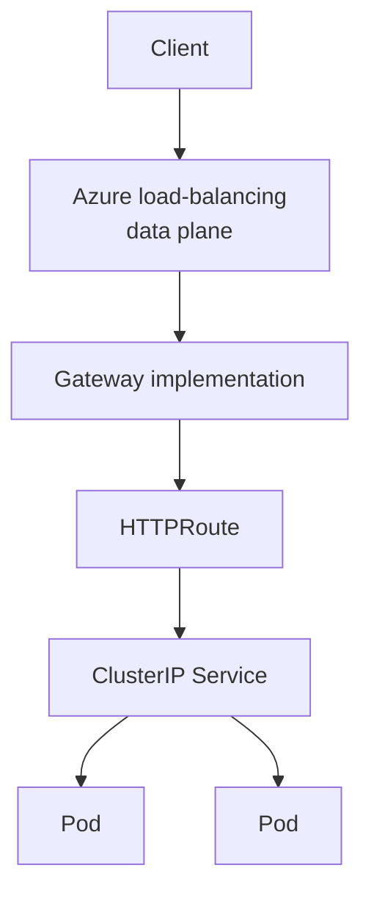

</div>
</div>

<p class="cite">Kubernetes: <a href="https://kubernetes.io/docs/concepts/services-networking/service/#loadbalancer">Service type LoadBalancer</a> · Microsoft Learn: <a href="https://learn.microsoft.com/azure/aks/concepts-network-ingress">AKS ingress concepts</a> · <a href="https://learn.microsoft.com/azure/container-apps/ingress-overview">ACA ingress</a></p>

<!--
This is the terminology bridge the room asked for. Do not turn it into a survey
of Azure load-balancing products.

Advance through the three rows. Start with ClusterIP: it is the normal stable
in-cluster Service address. A Service of type LoadBalancer asks the cloud
integration to expose one Service at layer 4. Gateway and HTTPRoute instead
create a shared layer-7 entry point that can route several hostnames and paths
to several ClusterIP Services. The Gateway implementation still needs a data
plane underneath it.

On click four, place Ingress historically: it is another routing API, not the load
balancer itself. Existing estates and vendor charts will contain it, so
participants must recognise it even though this workshop authors new examples
with Gateway API.

On click five, answer the LemonOnline question explicitly. ACA supports WebSockets through its
HTTP ingress, so WebSockets alone are not an AKS requirement. On AKS the
selected Gateway or Ingress implementation owns the detailed behaviour. On
both platforms, long-lived clients must reconnect when replicas drain or
terminate during a rollout; test that application behaviour rather than merely
checking a feature-support table.
-->

---
part: 03 Kubernetes model
---

# Startup protects boot; readiness controls traffic; liveness restarts

<div class="exhibit">
<div>

```yaml {1-4|5-8|9-12|13-19}{maxHeight:'418px'}
startupProbe:                   # "have I finished starting?"
  httpGet: { path: /health, port: http }
  periodSeconds: 2
  failureThreshold: 30          # 60 s startup budget
readinessProbe:                 # "should I receive traffic?"
  httpGet: { path: /ready, port: http }
  periodSeconds: 3
  failureThreshold: 2
livenessProbe:                  # "should I be killed and replaced?"
  httpGet: { path: /health, port: http }
  periodSeconds: 10
  failureThreshold: 3
resources:
  requests:                     # input to scheduling and to capacity
    cpu: 100m
    memory: 128Mi
  limits:                       # ceiling, throttle and OOM boundary
    cpu: 500m
    memory: 384Mi
```

</div>
<div>

<p class="col-label">Each probe owns one decision</p>

<ul>
  <li><strong>Startup:</strong> did initialization finish within its budget?</li>
  <li v-click="1"><strong>Readiness:</strong> should traffic or work reach this replica now?</li>
  <li v-click="2"><strong>Liveness:</strong> would restarting this process help?</li>
  <li v-click="3"><strong>Requests</strong> decide where the Pod fits; <strong>limits</strong> cap usage.</li>
</ul>

</div>
</div>

<p class="cite">Kubernetes: <a href="https://kubernetes.io/docs/tasks/configure-pod-container/configure-liveness-readiness-startup-probes/">Configure liveness, readiness and startup probes</a> · Repository source: <code>src/deploy/aks/workshop.yaml</code></p>

<!--
This is where you earn your fee with an experienced ops audience.

Click through the four steps with the matching explanation beside each block.
Startup is not a third periodically running health signal: it creates a bounded
initialization window, and readiness and liveness begin only after it succeeds.
The two anti-patterns are the whole point:
readiness that checks a dependency turns one slow database into a total outage,
and liveness pointing at the same path turns back-pressure into a restart storm.

The resources block is a deliberate setup for Lesson 06. Say explicitly: "these
two numbers come back after the break, and there they decide what you pay."
-->

---
part: 03 Kubernetes model
class: probe-failure-loop
---

# A startup probe needs a budget, not a dependency checklist

<div class="exhibit">
<div>

<p class="col-label">Probe lifecycle</p>

<div class="probe-contracts">
  <div v-click="1">
    <code>Start</code>
    <span>Only the startup probe runs.</span>
  </div>
  <div v-click="2">
    <code>Success</code>
    <span>Startup stops; readiness and liveness begin.</span>
  </div>
  <div v-click="2">
    <code>Still failing</code>
    <span>Retry while the configured budget remains.</span>
  </div>
  <div v-click="3">
    <code>Budget spent</code>
    <span>Restart the container.</span>
  </div>
</div>

<p class="sowhat mt-4"><code>30 attempts × 2 seconds = 60-second startup budget</code></p>

</div>
<div>

<p class="col-label">Four startup footguns</p>

<ul>
  <li v-click="4"><strong>Too short:</strong> a healthy but slow starter enters a restart loop.</li>
  <li v-click="5"><strong>Too long:</strong> a stuck revision delays failure detection and rollout recovery.</li>
  <li v-click="6"><strong>Dependency-bound:</strong> a database outage prevents every replica from starting.</li>
  <li v-click="7"><strong>Wrong expectation:</strong> startup succeeds once; it does not monitor later failures.</li>
</ul>

<p class="mt-3" v-click="7"><strong>ACA detail:</strong> default TCP probes on an ingress-enabled app only prove its target port is open. The worker has no ingress, so both workloads declare explicit HTTP health probes; only the API declares readiness because only it receives traffic.</p>

</div>
</div>

<p class="cite">Kubernetes: <a href="https://kubernetes.io/docs/concepts/workloads/pods/probes/">Liveness, readiness and startup probes</a> · Microsoft Learn: <a href="https://learn.microsoft.com/azure/container-apps/health-probes">Container Apps health probes</a></p>

<!--
The startup budget is failureThreshold multiplied by periodSeconds: thirty
attempts every two seconds gives this application roughly one minute.

Use the first four reveal states only for the lifecycle. Then discuss the four
footguns separately; do not imply that one footgun belongs to one lifecycle
state. Keep the endpoint local and narrow: the process has completed startup
and can answer probes. Dependency availability belongs in readiness only when no
useful work is possible without it, and in monitoring for richer diagnosis.

Explain the ACA detail precisely. An ingress-enabled Container App with no
custom probes can receive default TCP probes. A TCP probe only proves that the
target port accepts a connection; it does not prove that <code>/health</code>
returns success or that the API is ready to receive HTTP traffic. In this
workshop, the API explicitly declares startup and liveness probes on
<code>/health</code> plus readiness on <code>/ready</code>. The Service Bus
worker has no ingress and explicitly declares startup and liveness probes; it
does not need readiness because it receives no inbound HTTP traffic. The point
is not that ACA lacks health checks—it is that the workshop declares the same,
intentional HTTP health contract on both platforms.
-->

---
part: 03 Kubernetes model
---

# Do not turn a slow database into zero endpoints

<div class="exhibit">
<div>

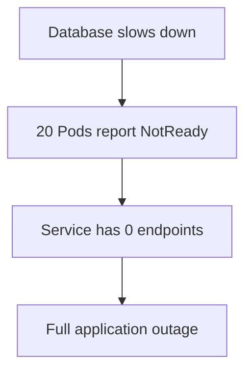

<MermaidSteps :steps="[
  { nodes: ['D'], focusNodes: ['D'] },
  { at: 1, nodes: ['R'], focusNodes: ['R'], edges: ['D->R'] },
  { at: 2, nodes: ['E'], focusNodes: ['E'], edges: ['R->E'] },
  { at: 3, nodes: ['O'], focusNodes: ['O'], edges: ['E->O'] },
]" />

</div>
<div>

<p class="col-label">Readiness asks one question</p>

<p><strong>Can this process accept useful requests right now?</strong></p>

<ul>
  <li v-click="4">A slow database may affect some routes while others still work.</li>
  <li v-click="5">Do not put one giant "check every dependency" endpoint behind readiness.</li>
  <li v-click="6">If no request can succeed without a dependency, checking it can be reasonable.</li>
</ul>

</div>
</div>

<p class="cite">Kubernetes: <a href="https://kubernetes.io/docs/concepts/configuration/liveness-readiness-startup-probes/">Liveness, readiness and startup probes</a></p>

<!--
Walk the left-hand failure chain first: degraded dependency → NotReady replicas
→ zero Service endpoints → application outage. Then use the three right-hand
points as the design rule; they are not paired one-to-one with a diagram step.

The exception matters. If the process cannot serve any useful request without
the dependency, readiness may check it. The warning is against the common
all-dependencies health endpoint: database, cache, queue and several remote APIs
combined into one traffic gate.
-->

---
part: 03 Kubernetes model
class: probe-failure-loop
---

# Use liveness only when a restart might help

<div class="exhibit">
<div>

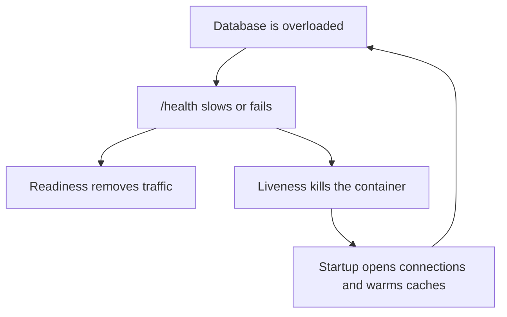

<MermaidSteps :steps="[
  { nodes: ['D'], focusNodes: ['D'] },
  { at: 1, nodes: ['H'], focusNodes: ['H'], edges: ['D->H'] },
  { at: 2, nodes: ['R'], focusNodes: ['R'], edges: ['H->R'] },
  { at: 3, nodes: ['L', 'S'], focusNodes: ['L'], edges: ['H->L', 'L->S', 'S->D'] },
]" />

</div>
<div>

<p class="col-label">Keep the probes separate</p>

<div class="probe-contracts">
  <div v-click="4">
    <code>/ready</code>
    <span>initialization complete; accepts useful work</span>
  </div>
  <div v-click="5">
    <code>/health</code>
    <span>process works; no dependency calls</span>
  </div>
  <div v-click="6">
    <code>/status/dependencies</code>
    <span>DB degraded; Redis healthy; Payments unavailable</span>
  </div>
</div>

<p class="mt-3" v-click="6">Use dependency status for monitoring. Do not let every dependency problem remove or restart the Pod.</p>

</div>
</div>

<p class="cite">Kubernetes: <a href="https://kubernetes.io/docs/concepts/configuration/liveness-readiness-startup-probes/">Liveness, readiness and startup probes</a></p>

<!--
Walk the failure chain before revealing the design contracts. State the line
exactly: "Liveness should test whether restarting this container is likely to
fix the problem." If the database is down, a restart will not fix it. It may
make it worse by opening more connections and repeating startup work.

Then reveal the three contracts as the remedy: readiness asks whether traffic
should be sent here; liveness should use a local process-health signal with no
dependency calls; dependency status belongs in monitoring, where it can name
which dependency is degraded without removing or restarting the Pod.
-->

---
part: 03 Kubernetes model
---

# Forty minutes in the lab makes reconciliation observable, not theoretical

<div class="exhibit">
<div>

<p class="col-label">KodeKloud, in the browser</p>

1. **Kubernetes Pods**, required baseline.
2. **Kubernetes Deployments**, target for everyone.

<p class="mt-3">Finished early? Scale a Deployment, delete one of its Pods, and be ready to explain what you saw.</p>

<div class="note mt-3">
Work through the labs in your own browser. Use the Teams chat to share a blocker or an observation before the debrief.
</div>

<p class="mt-2" style="font-size:19px;color:var(--z-text-muted)">At 40 minutes we stop, finished or not.</p>

</div>
<div class="kodekloud-link">


<p class="col-label">Open the lab</p>

<p><a href="https://zure.ly/kodecloud">zure.ly/kodecloud</a></p>

</div>
</div>

<p class="cite">Lab environment: <a href="https://kodekloud.com/studio/labs/kubernetes">KodeKloud Kubernetes labs</a></p>

<!--
Logistics slide. Get people moving fast, every minute of setup is a minute of
lab lost. In Teams, ask participants to post blockers in chat so they can be
handled without interrupting the lab for everyone.

Hard stop at forty minutes even if nobody has finished lab two.

Keep the lab platform-neutral. Do not introduce AKS Automatic, ACA, or Azure
until the debrief.
-->

---
part: 03 Kubernetes model
---

# Deleting a Deployment-owned Pod proves reconciliation, not fragility

<div class="exhibit">
<div>

<p class="col-label">Answer these before we move on</p>


- What changed when you used a **Deployment** instead of a standalone Pod?
- Which object recorded the **desired replica count**?
- Why did deleting a Pod not reduce capacity permanently?
- Which **labels and selectors** connected the objects?
- What object would give those Pods a **stable endpoint**?


</div>
<div>

<p class="col-label">Run these after the lab</p>

```bash
kubectl get deployments,replicasets,pods
export DEPLOYMENT_NAME="$(kubectl get deployments -o jsonpath='{.items[0].metadata.name}')"
export POD_NAME="$(kubectl get pods -o jsonpath='{.items[0].metadata.name}')"
kubectl describe deployment "$DEPLOYMENT_NAME"
kubectl delete pod "$POD_NAME"
kubectl get pods --watch
```

<div class="sowhat" v-click>
everything you just learned is the <span class="aks">AKS Automatic</span> application contract. In the next lesson, <span class="aca">ACA</span> replaces all of it with three nouns: app, revision and replica.
</div>

<p class="mt-4">Hold this question: <em>which of these objects do you actually want to own?</em></p>

</div>
</div>

<!--
Debrief. Ask the questions, then invite short answers in Teams chat before
explaining the model. Do not turn this into a round-the-room exercise.

Close on the last line and pause on it. Everything they just learned is the AKS
Automatic contract. Before lunch, connect those generic nouns to the real
workshop application and inspect the resulting controller trees in k9s. After
lunch, ACA replaces all of it with three nouns.
-->

---
part: 03 Kubernetes model
class: demo-application-flow slide-fill
---

# Our demo application is deliberately only an API, a queue, and a worker

<div class="application-flow">
  <div class="application-node">
    <strong>Browser</strong>
    <span>submits work</span>
  </div>
  <div class="application-link"><b>→</b><span>HTTP request</span></div>
  <div class="application-node application-runtime">
    <small>workshop/api image</small>
    <strong>API</strong>
    <span>validates and enqueues</span>
  </div>
  <div class="application-link"><b>→</b><span>message</span></div>
  <div class="application-node application-queue">
    <strong>Service Bus queue</strong>
    <span>durable hand-off</span>
  </div>
  <div class="application-link"><b>→</b><span>delivery</span></div>
  <div class="application-node application-runtime">
    <small>workshop/worker image</small>
    <strong>Worker</strong>
    <span>processes and completes</span>
  </div>
</div>

<div class="sowhat application-flow-takeaway">
Two images, one queue, no in-container state—the same flow runs on AKS and ACA.
</div>

<p class="cite">Repository sources: <code>src/Workshop.Api/</code>, <code>src/Workshop.Worker/</code>, <code>src/Workshop.Messaging/</code></p>

<!--
This is the missing bridge between the abstract Kubernetes lesson and every
demo later in the day. Keep it under a minute.

The browser calls the API. The API places work on Service Bus. The worker
processes it. There is deliberately no database or durable filesystem inside
the containers, because the workshop is comparing deployment and operating
models rather than application architecture.

Point out that API and worker are separate images and separate deployable
processes. The next slide maps those two processes to the Kubernetes objects the
room has just learned.
-->

---
part: 03 Kubernetes model
class: traffic-glossary
---

# AKS turns those two processes into the controller trees you just learned

<div class="traffic-flow-diagram">

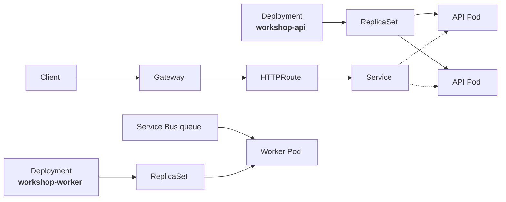

</div>

<div class="note mt-4">
Open k9s in <code>workshop</code>: Deployment → ReplicaSet → Pod; then Service → endpoints. Start with the API; the worker may be at zero.
</div>

<p class="cite">Repository source: <code>src/deploy/aks/workshop.yaml</code></p>

<!--
Switch to k9s here. This is a short recognition exercise, not a new lecture.

Start with the workshop-api Deployment because it has two replicas. Drill from
Deployment to ReplicaSet to Pods and show that the generated names preserve the
ownership chain. If useful, show the Service and its selected endpoints.

Then show workshop-worker. It may have zero Pods because queue-driven scaling is
configured later in the deck; simply say that zero is valid desired state and
that Part 06 explains who changes the replica count.

Do not walk every manifest field and do not introduce KEDA yet. The objective is
only to make the generic object graph tangible in the application participants
will see for the rest of the day.
-->

---
nofooter: true
layout: none
class: zsection
---

<div class="zsplit">
  <div class="zbreak">
    <p class="zbreak-label">Lunch</p>
    <p class="zbreak-time">12:00</p>
    <p class="zbreak-note">Back at 12:00. After lunch we finally put the two Azure platforms side by side.</p>
  </div>
  <div class="zsplit-art">
    
  </div>
</div>

---
nofooter: true
layout: none
class: zsection
---

<div class="zsplit">
  <div class="zsection-body">
    <p class="eyebrow">Part 04 · 12:00–12:55</p>
    <h1>AKS Automatic and Azure Container Apps</h1>
    <p class="zsection-sub">The same containers run on both. Almost everything around them is different.</p>
  </div>
  <div class="zsplit-art">
    
  </div>
</div>

<!--
An hour. Worth using part of it to check the demo environment is healthy: both platforms reachable, queue empty, images pulled.
-->

<!--
First slot after lunch, so energy is low. Lead with the side-by-side inspection rather than the tables if the room looks flat.
-->

---
part: 04 What you own
class: aca-value-slide
---

# ACA wraps an application platform around your containers

<div class="aca-value-flow">
  <div class="aca-value-input">
    <p class="aca-value-kicker">You provide</p>
    <strong>Image + application intent</strong>
    <div class="aca-value-input-list">
      <span>CPU and memory</span>
      <span>Configuration</span>
      <span>Health probes</span>
      <span>Scale limits</span>
    </div>
  </div>

  <div class="aca-value-arrow">→</div>

  <div class="aca-value-platform">
    <div class="aca-value-header">
      
      <div>
        <strong>Azure Container Apps</strong>
        <span>Application-level control plane</span>
      </div>
      <b>App or Job</b>
    </div>

<div class="aca-value-capabilities">
  <div class="aca-value-card" v-click="1">
    <span>Reach it</span>
    <strong>Managed ingress and service discovery</strong>
    <small>HTTPS, TLS, custom domains and internal app-to-app names</small>
  </div>
  <div class="aca-value-card" v-click="2">
    <span>Release it</span>
    <strong>Immutable revisions and traffic control</strong>
    <small>Keep revision history and split traffic between active versions</small>
  </div>
  <div class="aca-value-card" v-click="3">
    <span>Scale it</span>
    <strong>HTTP and event-driven elasticity</strong>
    <small>Set replica bounds and scale eligible workloads to zero</small>
  </div>
  <div class="aca-value-card" v-click="4">
    <span>Connect and observe it</span>
    <strong>Azure-native application integration</strong>
    <small>Managed identity, secrets, VNet integration, logs and metrics</small>
  </div>
</div>
  </div>
</div>

<div class="sowhat aca-value-takeaway" v-click="5">
The selling point is the contract: operate applications and jobs—not clusters, node pools or Kubernetes objects.
</div>

<p class="cite">Microsoft Learn: <a href="https://learn.microsoft.com/azure/container-apps/overview">Azure Container Apps overview</a> · <a href="https://learn.microsoft.com/azure/container-apps/revisions">Revisions</a> · <a href="https://learn.microsoft.com/azure/container-apps/scale-app">Scaling</a></p>

<!--
This is the positive case for ACA before discussing its compute profiles or
contrasting it with AKS. Pace the four cards one click at a time; do not read
them as a feature checklist.

Start with the customer contract on the left. The team supplies an OCI image
and application intent: resources, configuration, probes and scaling bounds.
ACA supplies the application-level machinery commonly assembled from several
Kubernetes resources and controllers.

Reach it: managed ingress terminates TLS and the environment supplies service
discovery between apps.

Release it: configuration changes create immutable revisions. Multiple-revision
mode can keep revisions active and divide traffic between them.

Scale it: ACA exposes HTTP and KEDA-backed event rules as app configuration.
Eligible Consumption workloads can reach zero replicas; that is a configured
behavior, not a promise for every profile or workload.

Connect and observe it: managed identity, secrets, network integration and
Azure Monitor integration are part of the Azure resource model.

Land on the control-plane argument. ACA is compelling because it hides the
cluster API and its object graph, not because application operations disappear.
The rest of the lesson makes the remaining ownership explicit.
-->

---
part: 04 What you own
class: platform-options-slide
clicksStart: 1
---

# One ACA environment can mix compute profiles

<div class="platform-option-header">
  
  <div>
    <strong>Workload profiles (v2) environment</strong>
    <span>Shared networking and observability boundary for many apps and jobs</span>
  </div>
</div>

<div class="profile-environment">
  <div class="profile-cards">
    <div class="profile-card consumption-profile">
      <div class="profile-card-top"><strong>Consumption</strong><span>Included by default</span></div>
      <p>Shared serverless compute</p>
      <ul>
        <li>Per-replica usage billing</li>
        <li>Event-driven scale, including zero</li>
        <li>Best default for variable demand</li>
      </ul>
    </div>
    <div class="profile-card dedicated-profile" v-click="2">
      <div class="profile-card-top"><strong>Dedicated</strong><span>Add when needed</span></div>
      <p>Reserved single-tenant profile instances</p>
      <ul>
        <li>General, memory and GPU options</li>
        <li>Larger or steady workloads</li>
        <li>Pay for profile instances</li>
      </ul>
    </div>
    <div class="profile-card flex-profile" v-click="3">
      <div class="profile-card-top"><strong>Flex</strong><span>Preview</span></div>
      <p>Usage billing plus a management fee</p>
      <ul>
        <li>Single-tenant and larger replicas</li>
        <li>Planned maintenance windows</li>
        <li>Does not scale to zero</li>
      </ul>
    </div>
  </div>
  <div class="profile-assignment" v-click="4">
    <span class="profile-app-chip">API</span>
    <span class="profile-app-chip">Worker</span>
    <span class="profile-app-chip">Job</span>
    <b>Each app or job targets one configured workload profile</b>
  </div>
</div>

<div class="sowhat mt-3" v-click="5">
Choose the environment boundary once, then place each workload on the profile whose isolation, capacity and cost model fit it.
</div>

<p class="cite">Microsoft Learn: <a href="https://learn.microsoft.com/azure/container-apps/workload-profiles-overview">Workload profiles</a> · <a href="https://learn.microsoft.com/azure/container-apps/structure">Compute and billing structures</a></p>

<!--
Use this slide to separate three concepts that are easy to blur together:
environment, workload profile and Container App.

The recommended environment type is Workload profiles v2. It contains the
shared networking and observability boundary and includes a Consumption profile
by default. Additional profiles can be added to the same environment, and each
Container App or Job is assigned to one configured profile.

Walk the cards from left to right. Consumption is visible first; reveal
Dedicated, Flex, the workload assignment and the conclusion one click at a
time.

Consumption is the serverless default: replicas are billed while running and
can scale to zero. It suits variable or event-driven workloads without special
compute requirements.

Dedicated reserves a single-tenant pool of selected VM-shaped profile
instances. Several apps can share that profile capacity. It fits steady
workloads, larger CPU or memory requirements, or dedicated GPU needs.

Flex is a preview middle ground. It keeps per-replica usage billing and simpler
setup, but adds a single-tenant pool, dedicated networking, larger replica
sizes and planned maintenance windows. It adds a management fee and does not
scale to zero.

Mention the legacy Consumption-only v1 environment only briefly. It is not a
fourth compute profile and should not be the starting point for a new design.
The later subnet slide explains why v1 and v2 still appear separately in
networking documentation.
-->

---
part: 04 What you own
class: platform-options-slide aks-options-slide
---

# AKS offers two operating modes—we use Automatic

<div class="platform-option-header">
  
  <div>
    <strong>Azure Kubernetes Service</strong>
    <span>Both modes expose the Kubernetes API and run standard Kubernetes workloads</span>
  </div>
</div>

<div class="aks-mode-cards">
  <div class="aks-mode-card automatic-mode">
    <div class="mode-heading">
      <strong>AKS Automatic</strong>
      <span>Recommended default</span>
    </div>
    <p>Azure applies an opinionated, production-oriented cluster configuration.</p>
    <ul>
      <li>Managed system nodes and Node Auto Provisioning</li>
      <li>Managed upgrade and security defaults</li>
      <li>Fewer infrastructure choices and escape hatches</li>
    </ul>
    <div class="mode-owner">You still own Kubernetes workloads and operations</div>
  </div>
  <div class="aks-mode-card standard-mode" v-click="1">
    <div class="mode-heading">
      <strong>AKS Standard</strong>
      <span>More configurable</span>
    </div>
    <p>The team chooses and operates more of the cluster configuration.</p>
    <ul>
      <li>Direct node-pool and capacity design</li>
      <li>Broader networking, upgrade and add-on choices</li>
      <li>More platform-engineering responsibility</li>
    </ul>
    <div class="mode-owner">Use when a requirement needs control Automatic withholds</div>
  </div>
</div>

<div class="kubernetes-common-strip" v-click="2">
  <span>Deployment</span><b>·</b><span>Service</span><b>·</b><span>Gateway API</span><b>·</b><span>Helm</span><b>·</b><span>operators and CRDs</span>
</div>

<div class="sowhat mt-3" v-click="3">
Automatic reduces cluster engineering; it does not turn AKS into an application-level platform.
</div>

<p class="cite">Microsoft Learn: <a href="https://learn.microsoft.com/azure/aks/what-is-aks">What is AKS?</a> · <a href="https://learn.microsoft.com/azure/aks/intro-aks-automatic">Introduction to AKS Automatic</a></p>

<!--
Start with the shared strip at the bottom. Automatic and Standard are both AKS:
the application still targets the Kubernetes API and uses Kubernetes workload
objects and ecosystem tooling.

Then contrast the operating model. Automatic is visible first because it is the
workshop choice and the recommended default for most production workloads.
Azure selects and manages more of the cluster configuration, including the
managed system pool, Node Auto Provisioning, upgrades and production-oriented
safeguards. The trade-off is that some cluster-level choices are constrained.

Reveal Standard on click one. It exposes more cluster engineering decisions.
That is useful when a documented workload requirement needs a node-pool shape,
add-on, networking choice or operational control that Automatic does not
support. It also returns more lifecycle and capacity responsibility to the
platform team.

Click two reveals the common Kubernetes object surface; click three lands the
responsibility boundary.

Avoid implying that Standard is "the advanced version" everyone eventually
graduates to. Start with Automatic and move only for a specific requirement.

If pricing tiers come up, distinguish them from these operating modes. Free,
Standard and Premium are control-plane pricing tiers; Automatic versus Standard
describes how the cluster is configured and operated.
-->

---
part: 04 What you own
class: table-fill platform-contract-table slide-fill
---

# The platforms differ in the API you own, not in the images they run

| Concern | <span class="aks">AKS Automatic</span> | <span class="aca">Azure Container Apps</span> |
| --- | --- | --- |
| Customer-facing API | Kubernetes API | Azure resource API |
| Runtime unit | Pod | Replica |
| Workload rollout | Deployment → ReplicaSet | Immutable app revision |
| Stable traffic path | Service + Gateway + HTTPRoute | Managed ingress + environment service discovery |
| Workload identity | ServiceAccount + Workload Identity federation | Managed identity assigned to the app or job |
| Workload scaling | KEDA / HPA / VPA objects | App-level scale rules |
| Infrastructure capacity | Managed system pool + Node Auto Provisioning | Platform-managed capacity within workload profiles |
| Operational tools | `kubectl`, k9s, Kubernetes events, Azure Monitor | Azure CLI, portal, log streams, Azure Monitor |

<p class="cite">Conceptual mappings, not one-to-one conversions. Microsoft Learn: <a href="https://learn.microsoft.com/azure/container-apps/compare-options">Comparing container options</a></p>

<!--
The reference table for the entire afternoon. Do not read it aloud row by row ,
that is a guaranteed way to lose the room straight after lunch.

Pick three rows and dwell: runtime unit, rollout, and operational tools. Those
three carry the difference.

Say the caveat out loud: these are conceptual mappings, not conversions. A
Deployment does not "become" a revision. People will try to build a translation
table and it will mislead them.

Tell them this slide is in the handout so they stop transcribing it.
-->

---
part: 04 What you own
---

# AKS Automatic removes infrastructure engineering, not Kubernetes ownership

<div class="exhibit">
<div>

<p class="col-label">Azure manages</p>


- Control plane, and **automatic cluster upgrades**.
- **Managed system node pools**.
- **Node Auto Provisioning (NAP)**, the AKS-managed Karpenter implementation.
- **Azure RBAC only** and Entra-integrated. `az aks get-credentials` still writes a kubeconfig, but it uses `kubelogin`; local admin credentials are disabled.
- Production-oriented security and monitoring defaults.
- **HPA, VPA and KEDA** enabled on the cluster.


</div>
<div>

<p class="col-label">You still own</p>

<v-clicks>

- Manifests and application architecture.
- Namespaces, access conventions, platform governance.
- **Requests, limits, probes, disruption budgets.**
- **Workload Identity** federation configuration.
- Releases, rollback, and troubleshooting.

</v-clicks>

<div class="sowhat mt-4" v-click>
Automatic changes who runs the cluster. It does not change who is paged when a rollout fails.
</div>

</div>
</div>

<p class="cite">Microsoft Learn: <a href="https://learn.microsoft.com/azure/aks/intro-aks-automatic">Introduction to AKS Automatic</a> · <a href="https://learn.microsoft.com/azure/aks/concepts-scale#node-autoprovisioning">Node autoprovisioning</a></p>

<!--
The most commonly misunderstood slide about AKS Automatic. Give it real time.

Left column is genuinely impressive and you should say so, this removes most of
the work that made AKS expensive to run.

Then the right column, slowly. Every item there is still yours, and every item
there is a thing that pages someone at 03:00.

The local-accounts point has a practical sting: `az aks get-credentials` still
downloads a kubeconfig, but that file uses `kubelogin` to obtain an Entra token.
It does not contain static local admin credentials. Terraform and Helm pipelines
need an Entra-compatible authentication flow. Teams discover this on their first
pipeline run.

Land the callout: Automatic changes who runs the cluster, not who gets paged.
-->

---
part: 04 What you own
---

# ACA replaces the object graph with app, revision, and replica

<div class="exhibit">
<div>

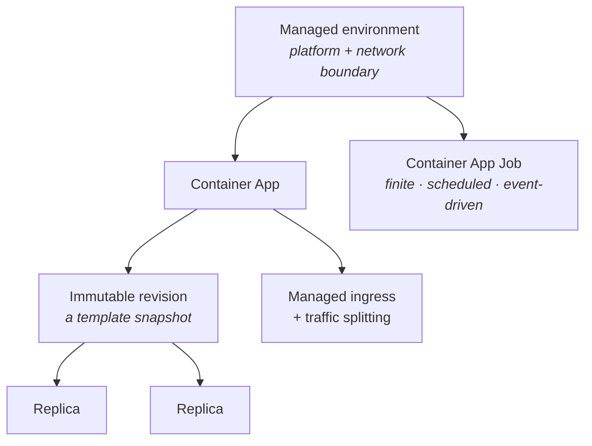

<MermaidSteps :steps="[
  { at: 1, nodes: ['E'], focusNodes: ['E'] },
  { at: 2, nodes: ['A', 'R', 'P1', 'P2'], focusNodes: ['R'], edges: ['E->A', 'A->R', 'R->P1', 'R->P2'] },
  { at: 3, nodes: ['I'], edges: ['A->I'] },
  { at: 4, nodes: ['J'], edges: ['E->J'] },
]" />

</div>
<div>

<p class="col-label">Three things to internalise</p>

<v-clicks>

- The **environment** is the platform and networking boundary shared by many apps.
- Any change to `properties.template`, including the image, environment variables or **scale rules**, creates a **new revision**.
- Changes to `properties.configuration`, such as secrets, ingress, traffic weights and registry credentials, apply **across** revisions without creating one.

</v-clicks>

<p class="mt-3" v-click><strong>Jobs</strong> cover finite, scheduled and event-driven execution.</p>

</div>
</div>

<p class="cite">Microsoft Learn: <a href="https://learn.microsoft.com/azure/container-apps/revisions">Revisions in Azure Container Apps</a> · <a href="https://learn.microsoft.com/azure/container-apps/environment">Environments</a> · <a href="https://learn.microsoft.com/azure/container-apps/jobs">Jobs</a></p>

<!--
Deliberately fewer nouns than the previous slide. Let people feel that relief ,
then make sure they understand what they traded for it.

The revision-versus-configuration split is the one thing people get wrong in
practice. Changing scale rules creates a new revision; changing a secret does
not. That surprises everyone at least once.

If someone asks "so where did my Deployment go?", that is exactly the right
question. It did not go anywhere; you no longer have one.
-->

---
part: 04 What you own
class: platform-portal-demo
---

# Portal demo · Find the same workload on both platforms

<div class="exhibit">
<div>

<p class="col-label"><span class="aca">Azure Container Apps</span></p>

- **Container App** is the application resource.
- **Revision → replica** is the running rollout and instance chain.
- Ingress, identity, scaling and logs are app-level portal surfaces.

</div>
<div>

<p class="col-label"><span class="aks">AKS Automatic</span></p>

- The **cluster** is the Azure resource; the application lives under Kubernetes resources.
- **Deployment → ReplicaSet → Pod** is the running rollout and instance chain.
- Routing, identity, scaling and events span several Kubernetes objects.

</div>
</div>

<div class="sowhat mt-4">
Find the application boundary, one running instance, and the first place you would investigate a failed rollout.
</div>

<!--
Live Azure Portal walkthrough, about five minutes. Do not tour every blade.

Open the two resources side by side in separate browser tabs.

ACA:
1. Open the workshop-api Container App. On Overview, identify the application
   URL, environment and current status.
2. Open Application → Revisions and replicas. Drill from the active revision to
   one replica. Name the chain aloud: app → revision → replica.
3. Point out Settings → Ingress, Settings → Identity, Application → Scale, and
   Monitoring → Log stream. Do not open every blade; the menu itself shows that
   these are app-level platform features.

AKS Automatic:
1. Open the AKS cluster. On Overview, identify the API-server address, Automatic
   SKU, identity model and network configuration.
2. Open Kubernetes resources → Workloads and find workshop-api. Drill from its
   Deployment to a Pod. Name the chain aloud: cluster → namespace → Deployment
   → ReplicaSet → Pod.
3. Point out Services and ingresses plus Monitor insights. Emphasise that the
   application contract is distributed across Kubernetes objects rather than
   represented by one Azure application resource.

End by asking: where would you look first if the newest rollout never became
ready? The answer should differ: revision/replica state in ACA; Deployment,
ReplicaSet, Pod state and events in AKS.
-->

---
part: 04 What you own
class: job-lifecycle-slide slide-fill
---

# Jobs run to completion; triggers only decide when execution starts

<div class="job-models">
  <div class="job-model">
    <p class="col-label">Kubernetes</p>
    <div class="job-stage" v-click="1"><span>Trigger</span><strong>Manual · CronJob · KEDA ScaledJob</strong></div>
    <div class="job-stage" v-click="2"><span>Execution</span><strong><code>Job</code> creates one or more Pods</strong></div>
    <div class="job-stage" v-click="3"><span>Outcome</span><strong>Successful completions and retries are tracked</strong></div>
  </div>
  <div class="job-model">
    <p class="col-label">Azure Container Apps</p>
    <div class="job-stage" v-click="1"><span>Trigger</span><strong>Manual · scheduled · event-driven</strong></div>
    <div class="job-stage" v-click="2"><span>Execution</span><strong>A Job creates a tracked execution with replicas</strong></div>
    <div class="job-stage" v-click="3"><span>Outcome</span><strong>Completion, retries and execution history are recorded</strong></div>
  </div>
</div>

<div class="sowhat job-lifecycle-takeaway" v-click="4">
Retries and overlapping executions can repeat work. Design every job handler to be <strong>idempotent</strong>.
</div>

<p class="cite">Kubernetes: <a href="https://kubernetes.io/docs/concepts/workloads/controllers/job/">Jobs</a> · <a href="https://kubernetes.io/docs/concepts/workloads/controllers/cron-jobs/">CronJobs</a> · KEDA: <a href="https://keda.sh/docs/latest/concepts/scaling-jobs/">ScaledJobs</a> · Microsoft Learn: <a href="https://learn.microsoft.com/azure/container-apps/jobs">Container Apps Jobs</a></p>

<!--
The first distinction is lifecycle, not platform: a job is finite work that
must exit. A continuously polling worker belongs in a Deployment or Container
App instead.

Advance the two columns together. Kubernetes starts with Job, adds CronJob for
time, and commonly adds KEDA ScaledJob for external events. ACA presents those
three trigger modes on one managed Job resource and records each run as an
execution containing one or more replicas.

The success contract is the process exit code. Configure retries, timeout,
parallelism, concurrency and retained execution history intentionally. Neither
a cron schedule nor an event trigger promises exactly-once processing, and a
retry can repeat work after the first attempt already changed external state.
That is why the idempotency callout is the operational takeaway.
-->

---
part: 04 What you own
class: portability-code-slide
---

# The same digest runs on both platforms. The deployment resources do not transfer

<div class="exhibit">
<div>

<p class="col-label">AKS · Kubernetes manifest</p>

```yaml {*}
kind: Deployment
metadata:
  name: workshop-worker
  namespace: workshop
spec:
  replicas: 1
  template:
    spec:
      serviceAccountName: workshop-app
      containers:
      - name: worker
        image: ${ACR}/workshop/worker:${TAG}
```

</div>
<div>

<p class="col-label">ACA · Bicep</p>

```bicep {*}
resource worker 'Microsoft.App/containerApps@2025-01-01' = {
  identity: {
    type: 'UserAssigned'
    userAssignedIdentities: { ... }
  }
  properties: {
    template: {
      containers: [{
        name: 'worker'
        image: '${acr}/workshop/worker:${tag}'
      }]
      scale: { minReplicas: 0, maxReplicas: 10 }
    }
  }
}
```

</div>
</div>

<div class="sowhat portability-takeaway" v-click>
Image portability is real. Orchestration portability is not. Everything around <code>image:</code> is platform-specific.
</div>

<p class="cite">Repository sources: <code>src/deploy/aks/workshop.yaml</code>, <code>src/deploy/aca/applications.bicep</code></p>

<!--
The centrepiece of Lesson 04. Two code blocks, one line in common.

Point at the `image:` line on each side. That line is portable. Draw a box in the
air around everything else, identity, scaling, ingress, probes, and say that
none of it transfers.

This is the honest answer to "is it easy to move later?" Yes for the image,
weeks of work for everything else.
-->

---
part: 04 What you own
class: release-visual-slide aks-release
---

# AKS promotes a new ReplicaSet only after its Pods become Ready

<div class="release-flow">
  <div class="release-stage">
    <p class="release-kicker">01 · Before</p>
    <strong>Deployment targets v1</strong>
    <div class="release-runtime">
      <span class="release-controller">ReplicaSet v1</span>
      <div class="release-instances">
        <span class="release-instance ready">v1</span>
        <span class="release-instance ready">v1</span>
      </div>
    </div>
    <small>Two Ready Pods serve traffic.</small>
  </div>

  <div class="release-arrow" v-click="1">→</div>

  <div class="release-stage" v-click="1">
    <p class="release-kicker">02 · Roll out v2</p>
    <strong>Two ReplicaSets coexist</strong>
    <div class="release-runtime">
      <span class="release-controller old">ReplicaSet v1</span>
      <div class="release-instances">
        <span class="release-instance ready">v1</span>
        <span class="release-instance ready">v1</span>
      </div>
      <span class="release-controller new">ReplicaSet v2</span>
      <div class="release-instances">
        <span class="release-instance starting">v2</span>
      </div>
    </div>
    <small><code>maxUnavailable: 0</code> · <code>maxSurge: 1</code></small>
  </div>

  <div class="release-arrow" v-click="2">→</div>

  <div class="release-stage" v-click="2">
    <p class="release-kicker">03 · Promote</p>
    <strong>Readiness unlocks replacement</strong>
    <div class="release-runtime">
      <span class="release-controller new">ReplicaSet v2</span>
      <div class="release-instances">
        <span class="release-instance ready">v2</span>
        <span class="release-instance ready">v2</span>
      </div>
      <span class="release-controller retired">ReplicaSet v1 · scaled to 0</span>
    </div>
    <small>The Deployment records revision history.</small>
  </div>
</div>

<div class="release-rollback" v-click="3">
  <div>
    <p class="release-kicker">Rollback</p>
    <strong>The Deployment restores the previous Pod template and rolls forward again.</strong>
  </div>
  <p>It cannot undo database migrations, emitted messages, or other external-state changes.</p>
</div>

<p class="cite">Repository source: <code>src/deploy/aks/workshop.yaml</code> · Kubernetes: <a href="https://kubernetes.io/docs/concepts/workloads/controllers/deployment/#rolling-update-deployment">Rolling updates</a> · <a href="https://kubernetes.io/docs/concepts/workloads/controllers/deployment/#rolling-back-a-deployment">Rolling back</a></p>

<!--
Start with the stable v1 state. On click one, the Deployment creates a new
ReplicaSet while the old Ready Pods continue serving. The repository uses
maxUnavailable zero and maxSurge one, so temporary replacement capacity appears
before an old Pod is removed.

On click two, readiness is the promotion gate. Once the new Pods are Ready, the
controller scales the old ReplicaSet down. The old ReplicaSet remains as rollout
history rather than continuing to serve traffic.

On click three, explain that `rollout undo` is not time travel. It restores the
previous Pod template and the controller performs another rollout. It cannot
reverse database migrations, messages already published, or any other external
side effect. Ask who owns that rollback runbook.
-->

---
part: 04 What you own
class: release-visual-slide aca-release
---

# ACA keeps the active revision serving until its replacement is Ready

<div class="release-flow">
  <div class="release-stage">
    <p class="release-kicker">01 · Before</p>
    <strong>Revision v1 is active</strong>
    <div class="release-runtime">
      <span class="release-controller">Revision v1 · 100% traffic</span>
      <div class="release-instances">
        <span class="release-instance ready">v1</span>
        <span class="release-instance ready">v1</span>
      </div>
    </div>
    <small>The app runs in single revision mode.</small>
  </div>

  <div class="release-arrow" v-click="1">→</div>

  <div class="release-stage" v-click="1">
    <p class="release-kicker">02 · Create v2</p>
    <strong>v1 keeps all ingress traffic</strong>
    <div class="release-runtime">
      <span class="release-controller old">Revision v1 · active</span>
      <div class="release-instances">
        <span class="release-instance ready">v1</span>
        <span class="release-instance ready">v1</span>
      </div>
      <span class="release-controller new">Revision v2 · provisioning</span>
      <div class="release-instances">
        <span class="release-instance starting">v2</span>
      </div>
    </div>
    <small>Startup and readiness probes must pass.</small>
  </div>

  <div class="release-arrow" v-click="2">→</div>

  <div class="release-stage" v-click="2">
    <p class="release-kicker">03 · Promote</p>
    <strong>Traffic switches to v2</strong>
    <div class="release-runtime">
      <span class="release-controller new">Revision v2 · 100% traffic</span>
      <div class="release-instances">
        <span class="release-instance ready">v2</span>
        <span class="release-instance ready">v2</span>
      </div>
      <span class="release-controller retired">Revision v1 · inactive</span>
    </div>
    <small>The previous revision remains available for rollback.</small>
  </div>
</div>

<div class="release-rollback" v-click="3">
  <div>
    <p class="release-kicker">Declarative rollback</p>
    <strong>Reapply the last known-good image and template → new revision v3.</strong>
  </div>
  <p>Reactivating v1 is also possible while it is retained, but it is an operational shortcut—not a rollback of the declared configuration.</p>
</div>

<p class="cite">Repository source: <code>src/deploy/aca/applications.bicep</code> · Microsoft Learn: <a href="https://learn.microsoft.com/azure/container-apps/revisions">ACA revisions</a> · <a href="https://learn.microsoft.com/azure/container-apps/revisions-manage">Manage revisions</a></p>

<!--
Start with the current workshop configuration: single revision mode. On click
one, changing the image or another template property creates immutable revision
v2. Revision v1 keeps receiving all ingress traffic while v2 provisions.

On click two, the platform switches traffic only after v2 has scaled to the
required replica count and passed its startup and readiness probes. It then
deactivates v1. This is the default zero-downtime release path for an
ingress-enabled app in single revision mode.

On click three, distinguish two valid actions. The normal pipeline or IaC
rollback reapplies the last known-good image and template, which creates a new
immutable revision, shown here as v3. Directly reactivating v1 is also possible
while the revision is retained, and can be useful as an emergency traffic
operation. It does not reconcile Git or Bicep, and it does not restore
application-scoped configuration such as secrets. Reconcile the declared state
afterward.

Multiple revision mode is a deliberate choice, not automatically better. Use it
when the release process needs percentage traffic splits, revision labels,
canary validation, or blue-green control. That additional control also becomes
something the team must operate.
-->

---
part: 04 What you own
class: dense demo-contracts
---

# Demo 01 · Prove the same image has two runtime contracts

<div class="exhibit exhibit-wide">
<div>

<p class="col-label">Start the paired Ghostty workspace</p>

```bash
zsh slides/scripts/demo-workspace 01
```

```text
ACA                           AKS
/info                         /info
revision → replicas           Deployment → Pods → routes
```

Both observers run immediately; a focused presenter shell stays available below them.

</div>
<div>

<p class="col-label">Say what changed</p>

- Same service version and HTTP health contract.
- <span v-click="1">ACA shows Container App → latest ready revision → running replica.</span>
- <span v-click="2">AKS shows Deployment → Pod → Gateway → HTTPRoute.</span>

<div class="sowhat mt-3" v-click="3">
Portability ends at <code>image:</code>. The operator API begins immediately after it.
</div>

</div>
</div>

<p class="cite">Azure CLI: <a href="https://learn.microsoft.com/cli/azure/containerapp/revision">containerapp revision</a> · <a href="https://learn.microsoft.com/cli/azure/containerapp/replica">containerapp replica</a></p>

<!--
Run this immediately after the same-digest comparison. Keep the two /info
responses side by side and ask participants to name one portable fact and one
platform-specific fact.

Then derive the latest ready ACA revision from the setup variables. The revision
command exposes its active state and desired replica count; the replica command
shows the concrete running instance. Contrast that short chain with the
Kubernetes object list.

Advance once more after the Kubernetes command so the complete command sequence
is readable. If one endpoint is slow, use the recorded response from the
Appendix D backup without changing the conclusion.
-->

---
part: 04 What you own
class: demo-output-fallback
---

# Demo 01 fallback · Recorded output


<!--
Use this only if the live environment does not respond. The two JSON responses
show the same service name, version and readiness contract, but distinct
environments and instance identities. The Kubernetes output then makes the
AKS-side object model visible without needing a working cluster.
-->

---
part: 04 What you own
---

# For {{ $slidev.configs.customerName }}'s workload profile, ACA is the default — then test it

| Requirement | Starting hypothesis |
| --- | --- |
| Conventional Linux API, web app, worker or job with no Kubernetes dependency | <span class="aca">ACA</span> |
| Vendor delivery based on **Helm charts, operators or CRDs** | <span class="aks">AKS Automatic</span> |
| Direct **Kubernetes API or ecosystem integration** is a stated requirement | <span class="aks">AKS Automatic</span> |
| Infrastructure customization blocked by an Automatic restriction | Validate an exceptional path beyond Automatic |
| Windows or .NET Framework 4.8 | Modernize, or evaluate another hosting option |

<div class="exhibit mt-4">
<div>
<div class="sowhat" v-click>
Today's deck tests that default: the same API and worker, then network, scale, identity and operational evidence.
</div>
</div>
<div>
<div class="sowhat" v-click>
The other rows are requirement gates: inspect the vendor runbook, a platform boundary or OS support—not a performance comparison.
</div>
</div>
</div>

<!--
Start from the customer profile on slide 9. The conventional Linux API and
worker with managed external state is why ACA is the default—not because ACA is
the simpler product.

Hypothesis, not verdict. Say the word "hypothesis" twice. This deck tests the
first row end-to-end: Part 04 runs the same image and application contract on
both platforms; Part 05 tests private connectivity and identity; Part 06 tests
the scaling and capacity response; Part 07 tests the operational evidence.

The other rows are gates rather than paired runtime experiments. For a vendor
workload, inspect the supported installation and operating procedure: does it
require Helm, CRDs, an operator, or custom Kubernetes objects after install?
For an Automatic restriction, identify the exact blocked requirement and
validate the boundary. For Windows, the operating-system support boundary is
already decisive. Part 08 uses those gates in the decision scenarios.

Explain the Kubernetes terms in the vendor-delivery row:

- A **Custom Resource Definition (CRD)** extends the Kubernetes API with a
  product-specific object, such as `PostgresCluster`, `Certificate`, or
  `KafkaTopic`. Teams can create and inspect those objects with `kubectl`,
  just like built-in Kubernetes objects.
- An **operator** is a controller that watches those objects and reconciles
  them into the resources and actions the product needs: Pods, Services,
  configuration, upgrades, backups, failover, or status reporting.
- **Helm** is commonly the installation mechanism for the chart that adds the
  CRDs and deploys the operator.

Make the decision boundary explicit: if the vendor's supported procedure asks
the team to install a chart, CRDs, or an operator—or to manage the custom
objects afterward—the workload needs the Kubernetes API. That is a concrete
reason to choose AKS Automatic; it is not a vague preference for "more
control." Do not imply that every Kubernetes product is automatically suitable
for AKS Automatic: validate its documented requirements against the Automatic
boundaries before committing.

Anchor the afternoon: every later lesson either tests the ACA default or gives
you evidence to trigger one of the exception gates.
-->

---
part: 04 What you own
class: decision-gates slide-fill
---

# Five questions test whether ACA remains the default

<div class="exhibit">
<div>

<p class="col-label">Tested in Lessons 05–07</p>


1. Does the workload require the **Kubernetes API**, operators, CRDs, or Helm-based vendor procedures?
2. Can the platform meet **private ingress, dependency access, DNS and egress** requirements?
3. What **scales** the application, and who owns the capacity response?
4. Which live state, logs, events, traces and metrics will **operators** need?
5. Are the platform's **OS, protocol, storage and privilege** boundaries acceptable?


</div>
<div>


<p class="mt-2 text-center" style="font-size:15px;color:var(--z-text-muted)">One artifact. Two very different operating surfaces.</p>

</div>
</div>

<!--
Bridge slide, two minutes.

Read the five questions as a checklist they should be holding for their own
workloads, not for the demo app.

Point at the image: one artifact, two operating surfaces. That is where the
platform-model comparison ends. After the break, networking, scaling and
operations test the ACA default against evidence.
-->

---
nofooter: true
layout: none
class: zsection
---

<div class="zsplit">
  <div class="zbreak">
    <p class="zbreak-label">Break</p>
    <p class="zbreak-time">13:05</p>
    <p class="zbreak-note">Back at 13:05.</p>
  </div>
  <div class="zsplit-art">
    
  </div>
</div>

---
nofooter: true
layout: none
class: zsection
---

<div class="zsplit">
  <div class="zsection-body">
    <p class="eyebrow">Part 05 · 13:05–14:00</p>
    <h1>Private networking and security boundaries</h1>
    <p class="zsection-sub">Private endpoints are easy to create and easy to misread. We check the evidence instead.</p>
  </div>
  <div class="zsplit-art">
    
  </div>
</div>

<!--
Ten minutes. The networking lesson is the one most likely to overrun, so restart on time.
-->

<!--
The lesson most likely to overrun. Watch the clock, the traffic-path model and the private-endpoint rule are the two things that must land.
-->

---
part: 05 Networking
---

# Test six traffic paths separately

<div class="exhibit exhibit-wide">
<div>

| # | Path | Fails as |
| --- | --- | --- |
| 1 | User or upstream service → **application ingress** | 404, timeout, wrong endpoint exposed |
| 2 | Operator and tooling → **platform management API** | `kubectl` hangs; no DNS for the API FQDN |
| 3 | Platform runtime → **ACR image endpoint** | `ImagePullBackOff`, revision fails to provision |
| 4 | Application → **Key Vault, Storage, Service Bus** | Startup failure, 403, DNS failure |
| 5 | Platform agents → **Azure Monitor ingestion** | Silent telemetry gap |
| 6 | Application or platform → **controlled egress** | Blocked updates, blocked exports |

</div>
<div>

<div class="sowhat" v-click>
one green path does not prove the other five are private, or even working. Each one has its own DNS, its own firewall and its own identity.
</div>

<p class="mt-4">Teams often discover path 5 during the first incident.</p>

</div>
</div>

<!--
Set the frame before any Azure detail. People conflate "we have a private
endpoint" with "the system is private", and this table is the antidote.

Ask which of the six they have actually tested in their own environment. The
honest answer is usually one or two.

Path 5, monitoring ingestion, is the one nobody checks. Say that it is normally
discovered during the first incident, when the telemetry you need is missing.
-->

---
part: 05 Networking
class: network-access-rule slide-fill
---

# A private endpoint adds a private path; it does not remove the public one

<div class="network-access-panels">
<div class="network-access-panel">

<p class="col-label">The general rule</p>

<div class="network-access-control">
  <span>Private endpoint</span>
  <strong>Adds a private route and DNS path</strong>
</div>
<div class="network-access-separator">+</div>
<div class="network-access-control">
  <span><code>publicNetworkAccess</code></span>
  <strong>Remains a separate resource property</strong>
</div>
<div class="network-access-separator">+</div>
<div class="network-access-control">
  <span>Network ACLs</span>
  <strong><code>defaultAction</code> and trusted-service <code>bypass</code> form a third control</strong>
</div>

<p class="network-access-note">Verified independently for <strong>ACR</strong>, <strong>Key Vault</strong>, <strong>Storage</strong> and <strong>Azure Monitor</strong>.</p>

</div>
<div class="network-access-panel aca-access-panel" v-click="1">

<p class="col-label">The ACA exception</p>

<div class="network-access-control network-access-accent">
  <span>ACA environment private endpoint</span>
  <strong>Requires public network access to be disabled</strong>
</div>

<div class="network-access-rule-arrow">↓</div>

<div class="sowhat">
<strong>Azure Container Apps couples them.</strong> A private endpoint on an ACA managed environment <strong>requires</strong> public network access to be disabled.
</div>

<p class="network-access-note" v-click="2">The practical rule is: <em>check each resource's own access properties.</em> A private endpoint does not automatically disable every public path.</p>

</div>
</div>

<p class="cite">Microsoft Learn: <a href="https://learn.microsoft.com/azure/container-registry/container-registry-private-endpoints">ACR private endpoints</a> · <a href="https://learn.microsoft.com/azure/key-vault/general/network-security">Key Vault network security</a> · <a href="https://learn.microsoft.com/azure/storage/common/storage-private-endpoints">Storage private endpoints</a> · <a href="https://learn.microsoft.com/azure/container-apps/private-endpoints-with-dns">ACA private endpoints</a></p>

<!--
Walk the rule first. Then reveal the ACA exception, then the decision habit.
Teaching only the rule would be wrong.

Left side: for ACR, Key Vault, Storage and Azure Monitor these really are
separate switches, plus network ACLs as a third control.

Right side: ACA couples them. Creating an environment private endpoint requires
public access to be off.

The takeaway is not a rule to memorise, it is a habit. Check each resource's own
access properties, every time.
-->

---
part: 05 Networking
clicksStart: 1
---

# Six checks turn "we created a private endpoint" into evidence

<div class="exhibit exhibit-wide">
<div>

<v-clicks every="2" at="1">

| Check | Evidence required |
| --- | --- |
| Private endpoint connection is **approved** | Connection state on the resource |
| The expected **private DNS zone** exists | Zone name matches the service |
| The consuming VNet is **linked** to the zone | Virtual network link, or a working forwarder |
| The public FQDN **resolves privately** from the workload network | `nslookup` from inside the subnet |
| **Public network access** is disabled where required | Resource property, plus a failed public-path test |
| Build agents and operators still have an **intentional** path | Documented exception, not an accident |

</v-clicks>

</div>
<div>

<p class="col-label">Relevant private DNS zone names</p>

<div v-click="2">

- `privatelink.azurecr.io`
- `privatelink.vaultcore.azure.net`
- `privatelink.blob.core.windows.net`
- `privatelink.<region>.azmk8s.io`
- `privatelink.<region>.azurecontainerapps.io`

</div>

<p class="mt-3" style="font-size:20px" v-click="3">ACR also uses regional <strong>data endpoint</strong> records in its DNS zone. If they are missing, image pulls fail after login succeeds.</p>

</div>
</div>

<p class="cite">Microsoft Learn: <a href="https://learn.microsoft.com/azure/private-link/private-endpoint-dns">Azure Private Endpoint DNS configuration</a></p>

<!--
Hand them the checklist and tell them it is the deliverable from this lesson.
The slide starts with the connection and zone checks. Reveal VNet linking,
resolution and the relevant zone names together; then reveal public-path
closure, intentional operator access and the ACR data-endpoint caveat.

The fourth row is the one that actually catches problems: resolve the public FQDN
from inside the workload subnet and look at what comes back.

The ACR data-endpoint note on the right is a genuine field trap, the login
succeeds, then pulls fail, and people debug RBAC for an hour.
-->

---
part: 05 Networking
class: dense
---

# Compare the networking surfaces, not just Private Link support

| Decision | <span class="aca">Azure Container Apps</span> | <span class="aks">AKS Automatic</span> |
| --- | --- | --- |
| Application ingress | Managed environment exposure + app ingress | Service + Gateway/HTTPRoute or another ingress implementation |
| Management plane | Azure resource API | Azure resource API **and** Kubernetes API server |
| VNet integration | Environment infrastructure subnet | Cluster networking plus an API-server subnet when VNet integration is used |
| Private Azure dependencies | Azure Private Endpoints and private DNS | The same Azure Private Endpoints and private DNS |
| Public exposure | Environment access and app ingress are separate settings | API-server exposure and workload ingress are separate designs |
| Egress control | Environment routes, NSGs and firewall design | Pod/node routes, outbound type, NSGs and firewall design |

<div class="sowhat mt-3" v-click>
The dependency side is mostly shared Azure networking. The largest difference is the extra Kubernetes management and workload-network surface on AKS.
</div>

<p class="cite">Microsoft Learn: <a href="https://learn.microsoft.com/azure/container-apps/networking">Container Apps networking</a> · <a href="https://learn.microsoft.com/azure/aks/concepts-network">AKS network concepts</a> · <a href="https://learn.microsoft.com/azure/aks/plan-control-plane-networking">AKS control-plane networking</a></p>

<!--
This is the comparison slide the lesson previously lacked. Do not read every
cell. Walk down three rows: application ingress, management plane and private
Azure dependencies.

The key distinction is that ACR, Key Vault, Storage and Service Bus networking
are Azure-service decisions regardless of compute platform. AKS adds another
networked API and a Kubernetes workload-routing layer that the team must design
and operate. ACA exposes fewer networking surfaces, but it still requires
explicit decisions about environment exposure, app ingress, DNS and egress.
-->

---
part: 05 Networking
class: network-architecture-slide
clicksStart: 1
---

# ACA separates environment networking from app ingress

<div class="network-map">
  <div class="network-actors">
    <div class="network-actor">
      <strong>Application client</strong>
      <span>Public internet or connected private network</span>
    </div>
    <div class="network-arrow">↓ <span>application traffic</span></div>
  </div>
  <div class="network-vnet-frame">
    <div class="network-frame-title">Customer virtual network</div>
    <div class="network-subnet-frame aca-subnet">
      <div class="network-frame-title">
        Dedicated infrastructure subnet
        <span>delegated to <code>Microsoft.App/environments</code></span>
      </div>
      <div class="network-platform-frame">
        <div class="network-platform-title">
          <strong>Container Apps environment</strong>
          <span>VNet integration · environment accessibility · shared platform boundary</span>
        </div>
        <div class="network-ingress-bar">
          Environment ingress boundary
          <span>public or internal environment</span>
        </div>
        <div class="network-stage-prompt" v-click-hide="2">
          <strong>One shared environment boundary</strong>
          <span>Each app still chooses whether it accepts ingress</span>
        </div>
        <div class="network-app-row" v-click="2">
          <div class="network-app-card aca-card">
            <strong>API Container App</strong>
            <span>Ingress enabled</span>
            <small>visibility · protocol · target port · TLS</small>
            <div class="network-runtime">Revision → replicas</div>
          </div>
          <div class="network-app-card">
            <strong>Worker Container App</strong>
            <span>No application ingress</span>
            <small>still shares the environment network</small>
            <div class="network-runtime">Revision → replicas</div>
          </div>
        </div>
      </div>
    </div>
    <div class="network-dependency-row" v-click="3">
      <div class="network-egress">Routes · NSG · firewall<br/><span>environment egress</span></div>
      <div class="network-horizontal-arrow">→</div>
      <div class="network-private-endpoint">Private endpoint<br/><span>private DNS resolves the service name</span></div>
      <div class="network-horizontal-arrow">→</div>
      <div class="network-dependency">ACR · Key Vault · Storage</div>
    </div>
  </div>
</div>

<div class="sowhat network-takeaway" v-click="4">
The environment owns VNet integration and the shared boundary. Each Container App independently decides whether and how it accepts ingress.
</div>

<p class="cite">Microsoft Learn: <a href="https://learn.microsoft.com/azure/container-apps/networking">Container Apps networking</a> · <a href="https://learn.microsoft.com/azure/container-apps/ingress-overview">Container Apps ingress</a></p>

<!--
Walk from the outside inward. The slide starts with the client, nested network
boundaries and the environment ingress boundary. Reveal the individual apps,
the outbound dependency path and the conclusion one click at a time.

First identify the environment as the networking boundary. When an existing
customer VNet is used, the workload-profiles environment occupies a dedicated
infrastructure subnet delegated to Microsoft.App/environments. The environment
choice determines its VNet integration and whether its inbound virtual IP is
public or internal.

Then move one level down. Ingress is still configured per Container App. The API
can accept traffic while the worker exposes no application endpoint at all.
Enabling ingress adds app-level choices such as visibility, protocol, target
port and TLS. The environment and app settings therefore answer different
questions; neither replaces the other.

Finally follow outbound traffic. The applications share the environment's
network path, routes and security controls. Access to ACR, Key Vault or Storage
uses the same Azure private-endpoint and private-DNS pattern discussed later.
Do not imply that the private endpoint belongs inside the Container Apps
environment—it is a separate resource attached to the customer VNet.
-->

---
part: 05 Networking
class: network-architecture-slide
clicksStart: 1
---

# AKS separates API access from application ingress

<div class="network-map aks-network-map">
  <div class="network-aks-actors">
    <div class="network-actor">
      <strong>Operator and automation</strong>
      <span><code>kubectl</code>, CI/CD and platform tooling</span>
    </div>
    <div class="network-actor">
      <strong>Application client</strong>
      <span>Public internet or connected private network</span>
    </div>
  </div>
  <div class="network-aks-arrows">
    <div class="network-arrow">↓ <span>management traffic</span></div>
    <div class="network-arrow">↓ <span>application traffic</span></div>
  </div>
  <div class="network-vnet-frame">
    <div class="network-frame-title">Customer virtual network</div>
    <div class="network-aks-columns">
      <div class="network-subnet-frame api-subnet">
        <div class="network-frame-title">
          API-server subnet
          <span>delegated when API Server VNet Integration is used</span>
        </div>
        <div class="network-stage-prompt" v-click-hide="2">
          <strong>Management path</strong>
          <span>Who can reach the Kubernetes API?</span>
        </div>
        <div class="network-ingress-bar aks-management" v-click="2">
          Kubernetes API endpoint
          <span>public or private access is a separate decision</span>
        </div>
        <div class="network-control-plane" v-click="2">
          <strong>Azure-managed control plane</strong>
          <span>API server · controllers · scheduler</span>
        </div>
      </div>
      <div class="network-subnet-frame node-subnet">
        <div class="network-frame-title">
          Cluster network
          <span>node subnet plus the selected Pod and Service network model</span>
        </div>
        <div class="network-stage-prompt" v-click-hide="3">
          <strong>Application path</strong>
          <span>How does client traffic reach Pods?</span>
        </div>
        <div class="network-ingress-bar aks-workload" v-click="3">
          Public or private frontend
          <span>independent of API-server exposure</span>
        </div>
        <div class="network-routing-chain" v-click="3">
          <div>Gateway / ingress</div>
          <b>→</b>
          <div>Service</div>
          <b>→</b>
          <div>Pods</div>
        </div>
      </div>
    </div>
    <div class="network-dependency-row" v-click="4">
      <div class="network-egress">Pod/node routes · outbound type · firewall</div>
      <div class="network-horizontal-arrow">→</div>
      <div class="network-private-endpoint">Private endpoint<br/><span>private DNS resolves the service name</span></div>
      <div class="network-horizontal-arrow">→</div>
      <div class="network-dependency">ACR · Key Vault · Storage</div>
    </div>
  </div>
</div>

<div class="sowhat network-takeaway" v-click="5">
AKS adds two independently designed entry paths: one for the Kubernetes API and another for application traffic.
</div>

<p class="cite">Microsoft Learn: <a href="https://learn.microsoft.com/azure/aks/plan-control-plane-networking">AKS control-plane networking</a> · <a href="https://learn.microsoft.com/azure/aks/concepts-network">AKS network concepts</a></p>

<!--
Present this as two vertical paths before discussing outbound dependencies.
The two actors and their traffic types are visible first. Reveal the
management path, the application path, the outbound dependency path and the
conclusion one click at a time.

On the left is the management path. Operators, deployment automation and Azure
components need to reach the Kubernetes API server. A private cluster controls
API-server exposure; API Server VNet Integration projects the endpoint into a
delegated subnet. These are control-plane choices, not workload-ingress choices.

On the right is application traffic. A public or private frontend leads through
the chosen Gateway or ingress implementation to Services and Pods. Making the
API server private does not make application ingress private, and exposing an
application does not require exposing the Kubernetes API.

The cluster network beneath that path includes the node subnet and the chosen
Pod and Service network model. Avoid teaching one fixed CNI layout here; the
point is that AKS exposes networking decisions below the application abstraction
that ACA manages as part of the environment.

Close across the bottom. Private Azure dependencies use the same private
endpoint and private-DNS resources as ACA. The platform-specific difference is
the source network and egress path: Pods and nodes, the selected outbound type,
routes, NSGs and any firewall.
-->

---
part: 05 Networking
---

# ACA needs one exclusive subnet, and workload profiles are now the default

<div class="exhibit exhibit-wide">
<div>

| Environment / profile | Minimum subnet | Notes |
| --- | --- | --- |
| **Workload profiles (v2)** | `/27` | Recommended, current default; delegated subnet |
| Consumption-only (v1) | `/23` | Legacy; no longer the default |
| v2 environment with **Flex** *(preview)* | `/25` | Flex raises the environment minimum |

<p class="mt-3" style="font-size:19px">Every app in the environment draws from this subnet. Size for the <strong>aggregate peak</strong>: Consumption plans about one IP per 10 replicas, Dedicated one per node, plus temporary rollout headroom.</p>

</div>
<div>

<p class="col-label">Also decide explicitly</p>

<v-clicks>

- **Internal** versus externally reachable environment ingress.
- Private access from replicas to ACR, Key Vault and Storage.
- **UDR and firewall** implications for egress.
- Private DNS for both dependencies **and** environment ingress.

</v-clicks>

<div class="sowhat mt-4" v-click>
VNet integration is not the same as "public ingress is disabled". They are separate decisions.
</div>

</div>
</div>

<p class="cite">Microsoft Learn: <a href="https://learn.microsoft.com/azure/container-apps/networking">Networking in Azure Container Apps</a> · <a href="https://learn.microsoft.com/azure/container-apps/workload-profiles-overview">Workload profiles</a></p>

<!--
Correct the two things people most often have stale knowledge about: workload
profiles are now the default, and the subnet minimum is /27, not /23.

Pause on the Flex row because "does not scale to zero" otherwise makes it sound
strictly worse than Consumption. Flex is for teams that want the simple
per-replica setup and usage billing style of Consumption, but need several
Dedicated-like properties:

- a single-tenant compute pool rather than shared serverless infrastructure;
- dedicated networking;
- larger replica sizes; and
- planned maintenance windows.

It is therefore aimed at workloads where isolation, larger instances,
performance characteristics or maintenance control matter more than
scale-to-zero economics. Billing is still based on replica usage, but it also
includes a dedicated management fee, and at least one replica remains running.
If the workload is bursty or idle for long periods, ordinary Consumption is
usually the more natural starting point. If it is steady and the team wants to
choose and pay for a reserved VM-shaped pool, compare Flex with a Dedicated
workload profile. Flex is still preview, so availability and production
suitability must be checked before selecting it.

Connect subnet sizing to application scaling. Every Container App and Job in the
environment shares this infrastructure subnet, so the capacity calculation is
for the aggregate peak across the environment—not one calculation per app.

Correct the tempting simplification that every replica always consumes one
subnet address. In a workload-profiles environment the allocation model depends
on the profile:

- Consumption: one subnet IP can be shared by multiple replicas; Microsoft says
  to plan approximately one IP address per ten replicas.
- Dedicated: plan one subnet IP per workload-profile node, not per application
  replica, because several replicas can run on a node.

The "times two" consideration is real, but it is rollout headroom rather than a
permanent two-address allocation for every replica. During an update in
single-revision mode, the old and new revisions overlap to support a
zero-downtime deployment, so the required address space can temporarily double.
This means max-replica settings across several apps can collectively exhaust the
environment subnet even when normal traffic uses far less capacity.

For a concrete scale reference, Microsoft's current table gives a /27
workload-profiles subnet a documented maximum of 90 Consumption replicas or
nine Dedicated nodes in single-revision mode; those figures already account for
the rollout overlap and reserved infrastructure addresses. Treat them as subnet
planning limits, not recommended operating targets. Flex has its own /25
minimum; because it is preview, check its current regional capacity guidance
before relying on a precise density assumption.

Close on the callout. VNet integration and disabled public ingress are different
decisions, and conflating them is how "private" deployments end up reachable.
-->

---
part: 05 Networking
class: api-server-access slide-fill
---

# AKS API-server exposure is a decision you make, not a default you inherit

<div class="exhibit">
<div>

<p class="col-label">The network model</p>

<ul>
  <li><strong>Custom / bring-your-own VNet</strong> is supported by AKS Automatic.</li>
  <li v-click="1"><strong>API Server VNet Integration</strong> projects the API server into a <strong>delegated API-server subnet</strong>.</li>
  <li v-click="1"><strong>Private cluster</strong> mode is configured separately, including after VNet integration is enabled.</li>
  <li v-click="2">Private DNS resolution for the API FQDN is mandatory for a private cluster.</li>
  <li v-click="2"><strong>NAP-created capacity</strong> follows the configured network model; it does not invent its own.</li>
</ul>

</div>
<div>

<p class="col-label">Reaching a private API server</p>

<p class="access-chain-intro">Every direct tool needs <strong>all five</strong>:</p>

<div class="access-chain">
  <div v-click="3"><b>1</b><span><strong>Route</strong> to the private endpoint</span></div>
  <div v-click="3"><b>2</b><span><strong>DNS</strong> resolution of the API FQDN</span></div>
  <div v-click="4"><b>3</b><span><strong>TCP 443</strong> from the management origin</span></div>
  <div v-click="4"><b>4</b><span><strong>Entra authentication</strong> through <code>kubelogin</code></span></div>
  <div v-click="4"><b>5</b><span><strong>Authorization</strong> through Azure RBAC for Kubernetes</span></div>
</div>

<div class="note command-contingency" v-click="5">
<code>az aks command invoke</code> is an ARM contingency path. It can be disabled with <code>disableRunCommand</code>; it is not an operations workflow.
</div>

</div>
</div>

<p class="cite">Microsoft Learn: <a href="https://learn.microsoft.com/azure/aks/api-server-vnet-integration">API Server VNet Integration</a> · <a href="https://learn.microsoft.com/azure/aks/access-private-cluster">Access a private cluster</a> · <a href="https://learn.microsoft.com/azure/aks/kubelogin-authentication">kubelogin</a> · AKS Engineering Blog: <a href="https://blog.aks.azure.com/2026/01/09/deploy-aks-automatic-terraform-helm">Deploy apps to AKS Automatic with Terraform</a></p>

<!--
Left side is architecture, right side is the thing that ruins people's week.

Walk the five requirements on the right slowly and ask, for their own
environment, which of the five they could satisfy today from a laptop.

Use the clicks to separate four ideas: VNet integration versus private-cluster
mode; DNS and node capacity; the network prerequisites for direct tooling; then
authentication and authorization.

On Automatic, kubelogin is not optional. The kubeconfig uses it to obtain an
Entra token rather than storing static local credentials.

Be firm about `az aks command invoke`. It is a contingency path through ARM. It
is not an operations workflow, and it can be disabled outright.
-->

---
part: 05 Networking
class: portal-network-demo
---

# Portal demo · Trace exposure, private access and DNS

<div class="exhibit">
<div>

<p class="col-label">Compare the platform boundary</p>

- ACA environment networking and app ingress
- AKS cluster networking and API-server access
- The public application endpoint on each platform

</div>
<div>

<p class="col-label">Follow one shared dependency</p>

- Private endpoint connection and network interface
- Private DNS zone, VNet link and record set
- Resource public-network access and firewall policy

</div>
</div>

<div class="sowhat mt-4">
The portal makes the boundaries visible: where exposure is configured, where private connectivity attaches, and where DNS is linked.
</div>

<!--
Live Azure Portal walkthrough, about seven minutes. Use ACR as the shared
example because both platforms must pull the same images. Key Vault and Storage
use the same three-control pattern in the Bicep: private endpoint, private DNS
integration, and an independent public-network/firewall policy.

Platform comparison:
1. Open the ACA managed environment → Networking. Identify its infrastructure
   subnet, public network access and whether the environment is internal. Then
   open workshop-api → Ingress and show that application ingress is configured
   separately from the environment boundary.
2. Open the AKS cluster → Networking. Identify the cluster network configuration,
   API-server address/private-cluster state and the VNet/subnet information.
   State explicitly that workload ingress lives under Kubernetes resources and
   is separate from API-server exposure.

Shared dependency walkthrough using ACR:

3. Open the registry → Networking. Identify public network access, firewall or
   selected-network policy, and the Private endpoint connections list.
4. Open one private endpoint. Show connection status, target subresource,
   subnet, network interface and private IP.
5. Follow DNS configuration to the private DNS zone. Show the VNet link and the
   A/record set for the registry endpoint. Mention that ACR data-endpoint records
   matter for image pulls.
6. If time permits, open Key Vault or Storage only to show that the same portal
   pattern repeats with a different subresource and DNS zone. Do not perform a
   second full walkthrough.

Keep this as a visual comparison of configuration surfaces, not an audit of the
workshop environment. Runtime validation would use name resolution and
connection tests from the consuming network, but that is outside this portal
walkthrough.
-->

---
part: 05 Networking
class: service-bus-tier-slide slide-fill
---

# Service Bus Standard has no Private Link. That trade-off is deliberate here

<div class="service-bus-tier-grid">
  <div class="service-bus-tier service-bus-standard">
    <p class="col-label">Standard · workshop choice</p>
    <div><span>Network endpoint</span><strong>Authenticated public endpoint</strong></div>
    <div><span>Private Link</span><strong>Not available</strong></div>
    <div><span>Authorization</span><strong>Managed identity and Azure RBAC still apply</strong></div>
    <div><span>Decision effect</span><strong>Lower-cost workshop tier; the data path is not entirely private</strong></div>
  </div>
  <div class="service-bus-tier service-bus-premium" v-click="1">
    <p class="col-label">Premium · private-path requirement</p>
    <div><span>Network endpoint</span><strong>Private endpoint can be configured</strong></div>
    <div><span>Private Link</span><strong>Available</strong></div>
    <div><span>Authorization</span><strong>Managed identity and Azure RBAC still apply</strong></div>
    <div><span>Decision effect</span><strong>Required when Private Link is mandatory; validate the cost delta</strong></div>
  </div>
</div>

<div class="sowhat service-bus-tier-takeaway" v-click="2">
This application's data path is not entirely private. Premium is required when Private Link is mandatory, and the cost delta belongs in the decision record.
</div>

<p class="service-bus-collision">This is the clearest example of the day where a <strong>security requirement and a service cost collide</strong>, and the collision has to be visible to whoever signs off.</p>

<p class="cite">Microsoft Learn: <a href="https://learn.microsoft.com/azure/service-bus-messaging/private-link-service">Service Bus and Private Link</a> · <a href="https://learn.microsoft.com/azure/service-bus-messaging/authenticate-application">Authenticate with Microsoft Entra ID</a></p>

<!--
Short, honest slide. It matters because it models intellectual honesty about our
own demo environment.

We chose Standard for cost. That means the data path is not fully private, and
we say so rather than quietly hoping nobody notices.

Managed identity still applies, authentication and network privacy are separate
concerns, and this is a clean example of that.

Ask what their own answer would be if security mandated Private Link. The answer
is Premium, and it has a price tag that belongs in the decision record.
-->

---
part: 05 Networking
class: code-audit
---

# One Bicep pattern repeats across private Azure dependencies

<div class="exhibit">
<div>

```bicep {2-8|11-16|all}
resource registry 'Microsoft.ContainerRegistry/registries@...' = {
  sku: { name: 'Premium' }
  properties: {
    adminUserEnabled: false
    publicNetworkAccess: 'Enabled'
    networkRuleBypassOptions: 'AzureServices'
    networkRuleSet: {
      defaultAction: restrictPublicAccess ? 'Deny' : 'Allow'
    }
  }
}

resource acrPrivateEndpoint 'Microsoft.Network/privateEndpoints@...' = {
  properties: {
    privateLinkServiceConnections: [{
      properties: { groupIds: [ 'registry' ] }
    }]
  }
}
```

</div>
<div>

<p class="col-label">What this example configures</p>

<ul>
  <li>The service owns its <strong>public-network and firewall policy</strong>.</li>
  <li v-click="1">A separate private endpoint targets the required subresource; its DNS zone group supplies private resolution.</li>
</ul>

<div class="note mt-4" v-click="2">
The repository repeats this shape for Key Vault and Storage with service-specific subresources and DNS zones. Azure Monitor private connectivity instead requires an Azure Monitor Private Link Scope.
</div>

</div>
</div>

<p class="cite">Workshop source: <code>deployment/shared/modules/registry-platform.bicep</code> · <code>deployment/*/modules/private-connectivity.bicep</code></p>

<!--
Use ACR as one representative Bicep example, not as an audit of the current
environment. Ask participants to identify the three independent concerns:
service access policy, private endpoint, and private DNS integration.

The exact resource types, subresources and zone names differ, but Key Vault and
Storage use the same overall pattern in this repository. Do not walk their
templates separately. Azure Monitor is the exception: private ingestion and
query use an Azure Monitor Private Link Scope rather than only a private endpoint
on the workspace.
-->

---
nofooter: true
layout: none
class: zsection
---

<div class="zsplit">
  <div class="zbreak">
    <p class="zbreak-label">Break</p>
    <p class="zbreak-time">14:10</p>
    <p class="zbreak-note">Back at 14:10.</p>
  </div>
  <div class="zsplit-art">
    
  </div>
</div>

---
nofooter: true
layout: none
class: zsection
---

<div class="zsplit">
  <div class="zsection-body">
    <p class="eyebrow">Part 06 · 14:10–15:00</p>
    <h1>Event-driven scaling</h1>
    <p class="zsection-sub">We fill a Service Bus queue and watch what each platform does about it.</p>
  </div>
  <div class="zsplit-art">
    
  </div>
</div>

<!--
Ten minutes. Kick off any slow scale-out or pre-warm the demo now so Lesson 06 does not open with a wait.
-->

<!--
Demo-heavy. Have the recorded scale-out output ready; node provisioning does not respect your agenda.
-->

---
part: 06 Scaling
class: dense
---

# HPA and VPA answer different scaling questions

<div class="exhibit exhibit-wide">
<div>

<p class="col-label">HPA · how many Pods?</p>

~~~yaml {all|4-7|8-9|10-16|all}
apiVersion: autoscaling/v2
kind: HorizontalPodAutoscaler
spec:
  scaleTargetRef:
    apiVersion: apps/v1
    kind: Deployment
    name: workshop-api
  minReplicas: 2
  maxReplicas: 10
  metrics:
  - type: Resource
    resource:
      name: cpu
      target:
        type: Utilization
        averageUtilization: 70
~~~

<p class="mt-2">CPU, memory, or custom/external metrics drive replica count.</p>

</div>
<div>

<p class="col-label">VPA · how large are the Pods?</p>

~~~yaml {all|4-7|8-9|all}
apiVersion: autoscaling.k8s.io/v1
kind: VerticalPodAutoscaler
spec:
  targetRef:
    apiVersion: apps/v1
    kind: Deployment
    name: workshop-api
  updatePolicy:
    updateMode: "Off" # recommendations only
~~~

<p class="mt-2"><code>Off</code> calculates recommendations but does not mutate Pods. Other modes decide how recommendations are applied; none add replicas.</p>

</div>
</div>

<p class="cite">Kubernetes documentation: <a href="https://kubernetes.io/docs/concepts/workloads/autoscaling/horizontal-pod-autoscale/">Horizontal Pod Autoscaling</a> · <a href="https://kubernetes.io/docs/concepts/workloads/autoscaling/vertical-pod-autoscale/">Vertical Pod Autoscaling</a></p>

<!--
This is a concept/example slide, not another live exercise. Ask participants to
classify HPA as replica-count scaling and VPA as request-sizing. The next slide
adds event-driven and node-capacity scaling.

Let the code do the pacing:

1. Both manifests are fully visible: two controllers, two different questions.
2. Highlight the HPA targetRef: this controller watches the Deployment.
3. Highlight min/max replicas: HPA changes how many Pods exist.
4. Highlight the metric and threshold: observed CPU drives that replica decision.
5. Return HPA to the full manifest, then move to the VPA side.
6. Highlight the VPA targetRef: it watches the same Deployment.
7. Highlight updatePolicy: this decides how recommendations may reach Pods.
8. Return to the full VPA manifest.

The key updatePolicy distinction is recommendation versus application:

- Off: calculate and publish recommendations in VPA status, but never mutate Pods.
- Initial: apply recommendations only when a Pod is created.
- Recreate: apply at creation and evict/recreate existing Pods when an update is
  warranted, subject to disruption controls.
- InPlaceOrRecreate: attempt an in-place resize and fall back to replacement when
  the cluster and workload cannot resize in place.
- Auto is deprecated and currently behaves like Recreate. InPlace is newer and
  should be introduced only after checking the installed VPA and Kubernetes
  versions.

Start with Off so teams can compare recommendations with existing requests
before allowing VPA to change a running workload.
-->

---
part: 06 Scaling
class: requests-capacity requests-capacity-fill slide-fill
---

# Requests are the Pod's capacity claim

<div class="requests-flow">

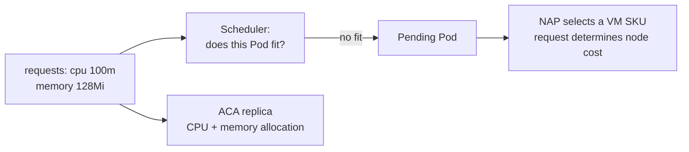

<MermaidSteps :steps="[
  { at: 1, nodes: ['A', 'B'], focusNodes: ['A'], edges: ['A->B'] },
  { at: 2, nodes: ['C', 'D'], focusNodes: ['D'], edges: ['B->C', 'C->D'] },
  { at: 3, focusNodes: ['A'] },
  { at: 4, nodes: ['E'], edges: ['A->E'] },
]" />

</div>

<div class="requests-takeaways">

<p class="col-label">The number drives placement</p>

<v-clicks>

- A request tells the scheduler the CPU and memory capacity a Pod claims.
- If that request cannot fit, the Pod stays **Pending**; NAP can then add suitable node capacity.
- Over-requesting buys larger VMs. Under-requesting causes throttling or OOM kills that look like application bugs.
- ACA has the same sizing decision as CPU/memory allocation per replica.

</v-clicks>

</div>

<!--
Put this bridge before KEDA and NAP so "unschedulable Pod" and "VM selection"
already have meaning. Requests are the capacity claim Kubernetes schedules
against; limits are deliberately not the headline here.

The cost message is important: automation does not correct a bad request. It
acts on it faster. Return to this point after the live scale observation.
-->

---
part: 06 Scaling
class: dense
---

# KEDA and NAP complete the scaling picture

<div class="exhibit exhibit-wide">
<div>

<p class="col-label">KEDA · what event means "wake"?</p>

~~~yaml {1-2|4-5|6-7|8-13|all}
apiVersion: keda.sh/v1alpha1
kind: ScaledObject
spec:
  scaleTargetRef:
    name: workshop-worker
  minReplicaCount: 0
  maxReplicaCount: 10
  triggers:
  - type: azure-servicebus
    metadata:
      messageCount: "5"
      activationMessageCount: "0"
~~~

<p class="mt-2" v-click="3">KEDA exposes queue depth to a generated HPA; KEDA itself handles scaling to and from zero.</p>

</div>
<div>

<p class="col-label">NAP · where can those Pods run?</p>

<div v-click="4">

~~~text
Queue event → more worker Pods
                 ↓
       no node capacity available?
                 ↓
      Node Auto Provisioning adds
      a suitable node pool/node
~~~

<p class="mt-2">NAP changes node capacity, not the desired Pod count. It matters
when HPA/KEDA creates Pods that cannot be scheduled.</p>

</div>
</div>
</div>

<div class="note mt-3" v-click="5">
HPA changes count from resource/custom metrics,
VPA changes requests, KEDA changes count from events, and NAP supplies nodes.
Define ownership before enabling more than one controller on the same workload.
</div>

<!--
This is a concept/example slide, not another live exercise. Mention that KEDA
creates an HPA behind the scenes; the live worker HPA is visible with
<code>kubectl get hpa</code>. NAP is the node-capacity layer underneath the
workload autoscalers, so it only acts when scheduling needs more capacity.

Click through the ScaledObject in four beats: object, target, bounds, trigger.
Then reveal the NAP path and close on controller ownership.
-->

---
part: 06 Scaling
class: scaling-layers-slide
---

# Queue depth drives replicas on both platforms. Capacity is where they diverge

<div class="exhibit">
<div>

<div class="scaling-layer-map">
  <div class="scaling-source">Service Bus queue depth</div>
  <div class="scaling-branches">
    <div class="scaling-branch aca-branch" v-click="1">
      <span class="scaling-branch-label aca">ACA</span>
      <b>↓</b>
      <div class="scaling-node scaling-focus">Managed KEDA rule</div>
      <b>↓</b>
      <div class="scaling-node">Worker replicas</div>
      <b>↓</b>
      <div class="scaling-node scaling-focus">Microsoft-managed capacity</div>
    </div>
    <div class="scaling-branch aks-branch">
      <span class="scaling-branch-label aks">AKS Automatic</span>
      <b>↓</b>
      <div class="scaling-node">KEDA ScaledObject → Pods</div>
      <b>↓</b>
      <div class="scaling-node">Pending Pod requirements</div>
      <b>↓</b>
      <div class="scaling-node scaling-focus">NAP provisions nodes</div>
    </div>
  </div>
</div>

</div>
<div>

<div class="sowhat" v-click>
<span class="aca">ACA</span> has <strong>one</strong> scaling layer you configure. <span class="aks">AKS Automatic</span> has <strong>two</strong>: KEDA creates workload demand, and NAP answers it with virtual machines.
</div>

<p class="mt-4">KEDA never creates a VM. It creates <em>unschedulable Pods</em>, and NAP reacts to those.</p>

</div>
</div>

<p class="cite">Microsoft Learn: <a href="https://learn.microsoft.com/azure/container-apps/scale-app">Scaling in Azure Container Apps</a> · <a href="https://learn.microsoft.com/azure/aks/concepts-scale#node-autoprovisioning">AKS node autoprovisioning</a></p>

<!--
The key slide of Lesson 06. Trace both branches of the diagram with your finger.

The sentence to land: KEDA never creates a virtual machine. It creates Pods that
cannot be scheduled, and NAP reacts to that.

ACA has one layer you configure. AKS Automatic has two, and the second one is
invisible in your manifests but very visible on your invoice.
-->

---
part: 06 Scaling
---

# ACA scales replicas to zero and stops there

<div class="exhibit">
<div>

```bicep {2-3|4-9|10-13}{maxHeight:'418px'}
scale: {
  minReplicas: 0
  maxReplicas: 10
  rules: [{
    name: 'service-bus-queue'
    custom: {
      type: 'azure-servicebus'
      metadata: {
        queueName: queueName
        namespace: serviceBusNamespace
        messageCount: '5'
      }
      identity: workloadIdentityResourceId
    }
  }]
}
```

</div>
<div>

<p class="col-label">Configure and discuss</p>

<ul>
  <li><code>minReplicas</code> and <code>maxReplicas</code> bound idle cost and burst capacity.</li>
  <li v-click="1">The rule names the queue and sets the <strong>messages-per-replica</strong> threshold; polling, activation and cooldown tune its response.</li>
  <li v-click="2">Managed identity authenticates the scaler. At zero replicas, the next message also pays the cold-start and reconnection cost.</li>
</ul>

<div class="sowhat mt-3" v-click="3">
Scale rules live in <code>properties.template</code>, so changing them <strong>creates a new revision</strong>.
</div>

</div>
</div>

<p class="cite">Repository source: <code>src/deploy/aca/applications.bicep</code> · Microsoft Learn: <a href="https://learn.microsoft.com/azure/container-apps/scale-app">Set scaling rules</a></p>

<!--
Straightforward. Click through the scale block.

Spend the time on scale-to-zero rather than the syntax: it is genuinely valuable
for bursty workloads and genuinely painful if your cold start is slow and your
caller has a short timeout.

Remind them the scale block lives in the template, so touching it creates a new
revision. That surprises people during incident response.
-->

---
part: 06 Scaling
---

# AKS scales in two layers, and only the first one is in your manifest

<div class="exhibit">
<div>

```yaml {1-7|8-11|12-14|15-21|22-23}{maxHeight:'418px'}
apiVersion: keda.sh/v1alpha1
kind: ScaledObject
metadata:
  name: workshop-worker
spec:
  scaleTargetRef:
    name: workshop-worker
  pollingInterval: 10
  cooldownPeriod: 30
  minReplicaCount: 0
  maxReplicaCount: 10
  fallback:                 # scaler goes blind → 1, not 0
    failureThreshold: 3
    replicas: 1
  triggers:
  - type: azure-servicebus
    metadata:
      queueName: ${SERVICE_BUS_QUEUE_NAME}
      namespace: ${SERVICE_BUS_NAMESPACE}
      messageCount: "5"
      activationMessageCount: "0"   # any queued message wakes the worker
    authenticationRef:
      name: workshop-service-bus   # workload identity
```

</div>
<div>

<p class="col-label">Follow the two layers</p>

<ul>
  <li><code>scaleTargetRef</code> names the Deployment KEDA controls.</li>
  <li v-click="1">Polling, cooldown, minimum and maximum values shape the <strong>replica response</strong>.</li>
  <li v-click="2"><code>fallback</code> keeps one replica if the scaler goes blind.</li>
  <li v-click="3">Queue thresholds create Pods; <strong>NAP reacts only when they cannot be scheduled</strong>.</li>
  <li v-click="4">Identity authenticates the scaler. Pod constraints select VMs; disruption budgets can delay consolidation.</li>
</ul>

</div>
</div>

<p class="cite">Repository source: <code>src/deploy/aks/workshop.yaml</code> · Microsoft Learn: <a href="https://learn.microsoft.com/azure/aks/node-auto-provisioning-disruption">NAP disruption and consolidation</a></p>

<!--
Click through the ScaledObject. Each code range now lands with its operational
meaning on the right, including the handoff from KEDA-created Pods to NAP.

Consolidation is the interesting one. It saves money, and Pod Disruption Budgets
can silently prevent it, so a well-intentioned availability setting becomes a
permanent bill.

The fallback block is worth calling out as a design decision made in YAML: when
the scaler goes blind you get one replica, not zero. Ask whether that is what
they would want.
-->

---
part: 06 Scaling
---

# Compare the same queue signal through two operating models

<div class="exhibit">
<div>

<p class="col-label">Demonstration sequence</p>


1. Confirm both queues are empty and both workers are at zero.
2. Enqueue the same **bounded batch** through the ACA UI, then the AKS UI.
3. On ACA, follow queue depth → revision replicas → worker logs.
4. On AKS, follow queue depth → KEDA → Pods → **pending scheduling** → Nodes.
5. Let both drain, then compare **cooldown and consolidation**.


</div>
<div>

<p class="col-label">Start the paired Ghostty watch workspace</p>

```bash
zsh slides/scripts/demo-workspace 02
```

```text
ACA  queue | replicas | worker log
AKS  queue | KEDA | worker Pods | Nodes
presenter shell (focused)
```

<div class="note mt-3" v-click>
Infrastructure scale-out can exceed a live workshop slot. Screenshots and recorded output are prepared as a fallback.
</div>

</div>
</div>

<!--
Demo slide. The order in the title is the order to watch, and it is deliberate.
The Zellij layout creates separate ACA and AKS columns with one observer per
signal. kubectl cannot watch ScaledObjects and Pods in one invocation.

Run ACA first because it is usually faster and gives a clean result. Then enqueue
the same batch on AKS, where the wait for capacity is itself the teaching point.

Node provisioning can outlast the slot. Have the recorded output ready and use it
without apology rather than watching a terminal in silence.

Finish with the poison message so the dead-letter behaviour is seen before
Lesson 07 depends on it.
-->

---
part: 06 Scaling
class: dense
---

# Demo 02 · Where queue scaling is configured

<div class="exhibit exhibit-wide">
<div>

<p class="col-label">ACA · Bicep</p>

```bicep
scale: {
  minReplicas: 0
  maxReplicas: 10
  rules: [{
    name: 'service-bus-queue'
    custom: {
      type: 'azure-servicebus'
      metadata: { messageCount: '5' }
      identity: workloadIdentityResourceId
    }
  }]
}
```

</div>
<div>

<p class="col-label">AKS · KEDA manifest</p>

```yaml
minReplicaCount: 0
maxReplicaCount: 10
triggers:
- type: azure-servicebus
  metadata:
    entityType: queue
    messageCount: "5"
    activationMessageCount: "0"
  authenticationRef:
    name: workshop-service-bus
```

</div>
</div>

<div class="note mt-3">
Enqueue 40 normal items at 1,000 ms, then watch queue depth → KEDA/HPA → Pods → NAP nodes. The Bicep and YAML are the settings; the platform supplies the reconciliation.
</div>

<!--
This is the first live demo in Lesson 06. Point at the two snippets before
enqueuing anything: ACA owns one scale rule, while AKS owns a ScaledObject and
the managed NAP layer responds to unschedulable Pods. Keep the exact output from
the live run ready on the next evidence slide or in Appendix D.
-->

---
part: 06 Scaling
class: dense
---

# Live evidence · queue depth became four worker Pods

<div class="exhibit exhibit-wide">
<div>

<p class="col-label">Observed Service Bus samples</p>

```text
start       active 40   dead-letter 1
scaler      active 36   ScaledObject ACTIVE=True
scale-out   active 16   HPA replicas=4
drained     active 0    ScaledObject ACTIVE=False
```

</div>
<div>

<p class="col-label">Observed Kubernetes state</p>

```text
workshop-worker   0/0 → 0/1 → 1/4 → 4/4
HPA target        <unknown>/5 → 23/5
worker image      workshop/worker:0.1.0-demo.2
worker nodes      aks-default-2mmpz
```

<div class="sowhat mt-2">
The queue signal made KEDA active. HPA created Pod demand. Existing AKS capacity admitted all four Pods.
</div>

</div>
</div>

<!--
These are real samples from the bounded 40-item run. The cluster had enough
existing capacity, so NAP did not need to add a node this time; that is still a
useful result. Ask what additional Pod requirement would make the final step
visible, then keep the node-provisioning fallback from Appendix D ready.
-->

---
part: 06 Scaling
class: dense
---

# What the scaling commands show

<div class="exhibit exhibit-wide">
<div>

```bash
curl -sS -X POST "$AKS_URL/work" \
  -H 'content-type: application/json' \
  -d '{"count":40,"processingDelayMilliseconds":1000,"behavior":"Normal"}' | jq .

for i in 1 2 3 4 5; do
  queue=$(az servicebus queue show --name "$SERVICE_BUS_QUEUE" \
    --namespace-name "$SERVICE_BUS_NAMESPACE" --resource-group "$AKS_RG" \
    --query countDetails.activeMessageCount -o tsv)
  replicas=$(kubectl get deployment "$AKS_WORKER" --namespace "$WORKSHOP_NAMESPACE" \
    -o jsonpath='{.spec.replicas}')
  active=$(kubectl get scaledobject "$AKS_WORKER" --namespace "$WORKSHOP_NAMESPACE" \
    -o jsonpath='{.status.conditions[1].status}')
  printf 'queue=%s worker=%s active=%s\\n' "$queue" "$replicas" "$active"
  sleep 4
done
```

</div>
<div>

```text
count: 40
behavior: Normal

09:57:14 queue=40 worker=0 active=False
09:57:22 queue=40 worker=1 active=True
09:57:28 queue=28 worker=4 active=True
09:57:35 queue=0  worker=4 active=True
09:57:41 queue=0  worker=4 active=False
```

<div class="sowhat mt-2">
Read left to right: queue signal → KEDA/HPA → worker Pods → cooldown.
</div>

</div>
</div>

<!--
The exact timestamps are from the captured 40-item run. If the room catches the
HPA one sample late, keep the order of the signals and explain metric lag; do not
wait for a perfect staircase.
-->

---
part: 06 Scaling
class: dense
---

# What Kubernetes reports during scale-out

<div class="exhibit exhibit-wide transcript">
<div>

```bash
kubectl get events --namespace "$WORKSHOP_NAMESPACE" \
  --sort-by=.metadata.creationTimestamp \
  | rg "$AKS_WORKER|SuccessfulRescale"
kubectl get pods --namespace "$WORKSHOP_NAMESPACE" \
  --selector "app.kubernetes.io/name=$AKS_WORKER" \
  -o custom-columns='POD:.metadata.name,IMAGE:.spec.containers[0].image,NODE:.spec.nodeName,READY:.status.containerStatuses[0].ready'
```

</div>
<div>

```text
SuccessfulRescale  New size: 4
  reason: external metric ... above target
ScalingReplicaSet  Scaled up ... from 1 to 4

POD                  IMAGE                    NODE
workshop-worker-...  .../worker:0.1.0-demo.2  aks-default-2mmpz
```

<div class="note mt-2">
This run used existing capacity: no new NAP node was needed. A later HPA sample
can briefly be higher after the queue reaches zero; wait through cooldown.
</div>

</div>
</div>

<!--
Point out that KEDA does not create nodes. The HPA creates Deployment demand;
the scheduler and AKS Automatic capacity layer decide where the Pods run.
-->

---
part: 06 Scaling
class: scale-policy-slide slide-fill
---

# Scale settings are reliability controls, not only cost controls

<div class="exhibit">
<div class="policy-panel">

<p class="col-label">Cost shape</p>


- <span class="aca">ACA Consumption</span> rewards idle time and can genuinely scale an application **to zero**.
- <span class="aks">AKS Automatic</span> keeps a Kubernetes platform and a capacity lifecycle even when workloads scale down.
- **Pooled capacity** can be economical across a large, consistently used estate. It rarely makes sense for one bursty worker.


</div>
<div class="policy-panel">

<p class="col-label">Reliability shape</p>

<v-clicks>

- `minReplicas: 0` controls cold starts as well as cost.
- `fallback` decides what happens when the scaler is blind.
- Queue processing must be **idempotent** and safe across retries and scale changes.

</v-clicks>

<div class="sowhat mt-3" v-click>
the same two numbers, <code>min</code> and <code>max</code>, are simultaneously your budget and your availability policy. Review them with both hats on.
</div>

</div>
</div>

<!--
Closing synthesis for the lesson, three minutes.

The honest cost message: ACA wins on idle, pooled AKS capacity wins across a
large consistently-used estate. Neither is universally cheaper, and anyone
claiming otherwise is selling something.

End on min and max being simultaneously a budget and an availability policy. Ask
who owns that number in their organisation, it is often nobody.
-->

---
nofooter: true
layout: none
class: zsection
---

<div class="zsplit">
  <div class="zbreak">
    <p class="zbreak-label">Break</p>
    <p class="zbreak-time">15:15</p>
    <p class="zbreak-note">Back at 15:15.</p>
  </div>
  <div class="zsplit-art">
    
  </div>
</div>

---
nofooter: true
layout: none
class: zsection
---

<div class="zsplit">
  <div class="zsection-body">
    <p class="eyebrow">Part 07 · 15:15–16:00</p>
    <h1>Operations, observability, and troubleshooting</h1>
    <p class="zsection-sub">We break the application on purpose, then find out why using each platform's own tools.</p>
  </div>
  <div class="zsplit-art">
    
  </div>
</div>

<!--
Fifteen minutes. Put the application into its failed state before restarting so the troubleshooting lesson opens on a real symptom.
-->

<!--
This is where operations teams decide whether the workshop earned its time. Show the tools in use.
-->

---
part: 07 Operations
class: evidence-layers-slide slide-fill
---

# Three evidence layers answer three different questions

<div class="evidence-layers">
  <div class="evidence-layer">
    <strong>Live platform state</strong>
    <span>Kubernetes objects; ACA revision and replica state</span>
    <em>What is happening right now?</em>
  </div>
  <div class="evidence-layer" v-click="1">
    <strong>Runtime logs and events</strong>
    <span>Container stdout/stderr, Kubernetes events, ACA system logs</span>
    <em>Why did this instance fail?</em>
  </div>
  <div class="evidence-layer" v-click="2">
    <strong>Durable telemetry</strong>
    <span>Log Analytics, Application Insights, managed Prometheus</span>
    <em>What happened over time and across instances?</em>
  </div>
</div>

<div class="sowhat evidence-layers-takeaway" v-click="3">
startup, image-pull, scheduling, identity and DNS failures happen <strong>before</strong> application telemetry is ever exported. Application Insights cannot be your only source of truth.
</div>

<p class="cite">Microsoft Learn: <a href="https://learn.microsoft.com/azure/azure-monitor/containers/kubernetes-monitoring-overview">Kubernetes monitoring overview</a> · <a href="https://learn.microsoft.com/azure/container-apps/log-streaming">ACA log streaming</a></p>

<!--
Frame the lesson before touching a tool.

Each layer answers a different question, and reaching for the wrong layer is why
investigations stall.

The callout is the important part: image-pull, scheduling, identity and DNS
failures all happen before your app emits a single span. If Application Insights
is your only source of truth you are blind exactly when it matters.
-->

---
part: 07 Operations
class: message-lifecycle
---

# A queue message has a bounded delivery life

<div class="exhibit">
<div>

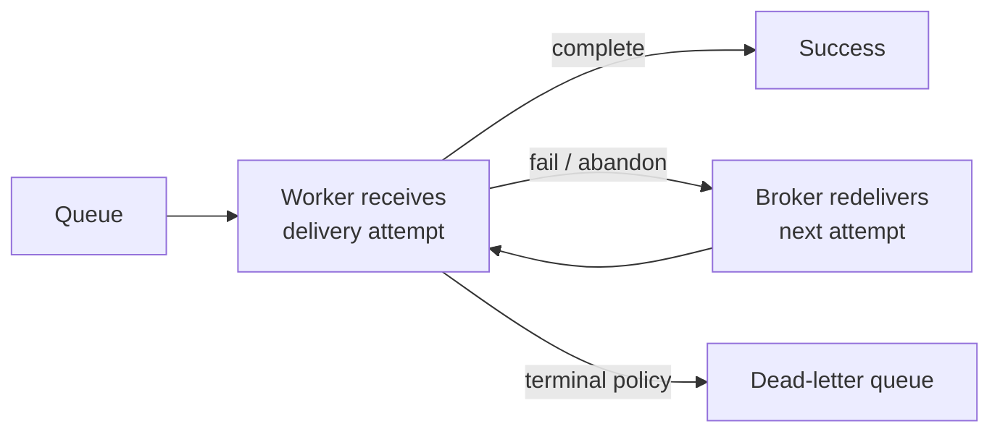

<MermaidSteps :steps="[
  { at: 1, nodes: ['Q', 'D', 'S'], focusNodes: ['S'], edges: ['Q->D', 'D->S'] },
  { at: 2, nodes: ['R'], edges: ['D->R', 'R->D'] },
  { at: 3, nodes: ['L'], edges: ['D->L'] },
  { at: 4, focusNodes: ['D', 'L'] },
]" />

</div>
<div>

<p class="col-label">What the next demo makes visible</p>

<v-clicks>

- A worker **completes** a successful message; it leaves the queue.
- A transient failure can **abandon** it, allowing another broker delivery attempt.
- A poison message reaches a **terminal** outcome: this workshop explicitly dead-letters it on attempt three.
- Production policies vary: bound attempts, make handlers idempotent, and investigate the dead-letter queue.

</v-clicks>

</div>
</div>

<p class="cite">Microsoft Learn: <a href="https://learn.microsoft.com/azure/service-bus-messaging/message-transfers-locks-settlement">Service Bus message settlement</a> · <a href="https://learn.microsoft.com/azure/service-bus-messaging/service-bus-dead-letter-queues">Dead-letter queues</a></p>

<!--
This is the smallest possible Service Bus delivery model, placed before the
first retry/dead-letter demo. "Retry" in this workshop is a deliberate
abandon/redelivery cycle; the worker explicitly dead-letters the controlled
poison message on its third delivery. Do not imply that every Service Bus queue
uses the same count or terminal behavior, those are application and broker
policy choices.

Land the engineering rule: delivery is at least once, so handlers must be
idempotent. The dead-letter queue is evidence to inspect, not a recovery plan
by itself.
-->

---
part: 07 Operations
class: dense
---

# Demo 03 · The same retry policy leaves different platform evidence

<div class="exhibit exhibit-wide">
<div>

<p class="col-label">Start the paired Ghostty workspace</p>

```bash
zsh slides/scripts/demo-workspace 03
```

Both worker logs and queue-count panes start immediately. The ACA and AKS trigger panes wait for <strong>Enter</strong>; a focused presenter shell remains free.

</div>
<div>

<p class="col-label">Run in order</p>

1. Run **ACA transient → poison** and follow its revision log and queue counts.
2. Press Enter again in that pane only after the transient item completes.
3. Repeat the same two messages on AKS.
4. Compare ACA replica activation with KEDA-created worker Pods.

<div class="sowhat mt-2">
Expect two retries. Attempt three is dead-lettered. No hot loop.
</div>

</div>
</div>

<!--
Run the transient item first so the room sees the same message ID survive two
abandon/redelivery cycles and then complete. Run one poison item second and use
the queue dead-letter count as the terminal evidence. The longer fallback runbook
is kept later for when the live worker or portal is unavailable.

The paired columns make the application policy look deliberately identical while
the platform evidence differs: revision/replica on ACA, Deployment/Pod on AKS.
-->

---
part: 07 Operations
class: dense
---

# What retry output shows

<div class="exhibit exhibit-wide transcript">
<div>

```bash
curl -sS -X POST "$AKS_URL/work" \
  -H 'content-type: application/json' \
  -d '{"count":1,"behavior":"TransientFailure","transientFailures":2}' | jq .

az monitor log-analytics query --workspace "$LOG_ANALYTICS_WORKSPACE_ID" \
  --analytics-query "AppTraces
  | where TimeGenerated > ago(10m)
  | where AppRoleName == '$AKS_WORKER'
  | where Message startswith 'WorkItem'
  | project TimeGenerated, Message, OperationId
  | order by TimeGenerated asc" -o json
```

</div>
<div>

```text
traceId: f0945151c474844ff5cbee01393941da

WorkItemProcessingStarted: message 8e1491628bb947e5b05fc3a2355de496, behavior TransientFailure, attempt 1, delay 500 ms
WorkItemProcessingStarted: message 8e1491628bb947e5b05fc3a2355de496, behavior TransientFailure, attempt 2, delay 500 ms
WorkItemProcessingStarted: message 8e1491628bb947e5b05fc3a2355de496, behavior TransientFailure, attempt 3, delay 500 ms
WorkItemProcessingSucceeded: completed message 8e1491628bb947e5b05fc3a2355de496 with behavior TransientFailure on attempt 3
```

<div class="note mt-2">
The same message ID and OperationId appear on all four rows. The two controlled
exceptions are visible in <code>AppExceptions</code>, but the terminal outcome is
the successful trace row.
</div>

</div>
</div>

<!--
Use the workspace GUID in AKS_WORKSPACE. The App Insights resource and the
workspace-backed Logs view query the same AppTraces table for this deployment.
-->

---
part: 07 Operations
class: dense
---

# What dead-letter output shows

<div class="exhibit exhibit-wide transcript">
<div>

```bash
curl -sS -X POST "$AKS_URL/work" \
  -H 'content-type: application/json' \
  -d '{"count":1,"behavior":"Poison"}' | jq .

az monitor log-analytics query --workspace "$LOG_ANALYTICS_WORKSPACE_ID" \
  --analytics-query 'AppTraces
  | where TimeGenerated > ago(10m)
  | where Message has "Poison"
  | project TimeGenerated, Message, OperationId
  | order by TimeGenerated asc' -o json
az servicebus queue show --name "$SERVICE_BUS_QUEUE" --namespace-name "$SERVICE_BUS_NAMESPACE" \
  --resource-group "$AKS_RG" --query countDetails -o json
```

</div>
<div>

```text
WorkItemProcessingStarted: message 934414837e4940d5b62e9bda5feb7893, behavior Poison, attempt 1, delay 500 ms
WorkItemRetry: abandoning poison message 934414837e4940d5b62e9bda5feb7893 on attempt 1; terminal attempt is 3
WorkItemProcessingStarted: message 934414837e4940d5b62e9bda5feb7893, behavior Poison, attempt 2, delay 500 ms
WorkItemRetry: abandoning poison message 934414837e4940d5b62e9bda5feb7893 on attempt 2; terminal attempt is 3
WorkItemProcessingStarted: message 934414837e4940d5b62e9bda5feb7893, behavior Poison, attempt 3, delay 500 ms

AppExceptions:
OuterMessage: Controlled poison message reached terminal attempt 3.
ProblemId: Workshop.Worker.PoisonWorkshopException

activeMessageCount: 0
deadLetterMessageCount: 2
```

<div class="sowhat mt-2">
Retry is bounded, the message is terminal, and the queue is not hot-looping.
</div>

</div>
</div>

<!--
The dead-letter count was 2 in the captured run because an earlier poison item
was intentionally retained as evidence. Explain that the count delta, not the
absolute number, is the useful workshop observation.
-->

---
part: 07 Operations
class: dense
---

# Demo 04 · Readiness and restart look different at the platform boundary

<div class="exhibit exhibit-wide">
<div>

<p class="col-label">Start the paired Ghostty workspace</p>

```bash
zsh slides/scripts/demo-workspace 04
```

ACA revision/console observers and AKS Pod/previous-log observers start immediately. Each platform has one suspended trigger pane that runs readiness first and exit second.

`/ready` becomes `503`; traffic avoids that replica and it recovers without a restart.

</div>
<div>

<p class="col-label">Run in order</p>

1. Run ACA readiness → recovery → exit; watch replica/container identity, READY, RESTARTS, and console output.
2. Repeat on AKS; watch Pod READY, RESTARTS, and the previous-container log.
3. Compare ACA's revision/replica interface with Kubernetes container state.

Exit changes the instance ID and restart count. Startup failure happens before HTTP telemetry.

</div>
</div>

<!--
Use this as a taxonomy demo, not a button tour: readiness is traffic eligibility;
liveness/process exit is restart; DEMO_STARTUP_FAILURE is a deployment failure.
Always wait for the healthy replica set before moving to the next symptom.

The application controls are identical. The evidence chain is not: ACA exposes
app → revision → replica; AKS exposes Deployment → ReplicaSet → Pod → container.
-->

---
part: 07 Operations
class: dense
---

# What readiness and restart output shows

<div class="exhibit exhibit-wide transcript">
<div>

~~~bash
curl -sS -X POST "$AKS_URL/demo/failures/readiness" \
  -H 'content-type: application/json' \
  -d '{"durationSeconds":20}' | jq .
curl -sS -o /dev/null -w '/ready HTTP %{http_code}\n' "$AKS_URL/ready"
kubectl get pods --namespace "$WORKSHOP_NAMESPACE" \
  --selector "app.kubernetes.io/name=$AKS_API"
~~~

~~~text
instanceId: workshop-api-7bb9ccfcd7-qkw4c-9c357232
traceId: 5bee57fc392908ddb6126f2b69df83a1
/ready HTTP 503 → 200 after the other replica is selected

workshop-api-...-lwwqg  1/1  Running  0
workshop-api-...-qkw4c  0/1  Running  0
~~~

</div>
<div>

~~~bash
curl -sS -X POST "$AKS_URL/demo/failures/exit" \
  -H 'content-type: application/json' \
  -d '{"delayMilliseconds":1000}' | jq .
sleep 4
kubectl get pods --namespace "$WORKSHOP_NAMESPACE" \
  --selector "app.kubernetes.io/name=$AKS_API"
export AKS_API_POD="$(kubectl get pods --namespace "$WORKSHOP_NAMESPACE" \
  --selector "app.kubernetes.io/name=$AKS_API" \
  --sort-by=.status.containerStatuses[0].restartCount \
  -o jsonpath='{.items[-1].metadata.name}')"
kubectl get pod "$AKS_API_POD" --namespace "$WORKSHOP_NAMESPACE" \
  -o jsonpath='{.metadata.name} restarts={.status.containerStatuses[0].restartCount}'; echo
kubectl logs --namespace "$WORKSHOP_NAMESPACE" "$AKS_API_POD" --previous --timestamps \
  | rg 'DemoExitTriggered|Application is shutting down'
~~~

~~~text
exitCode: 42
workshop-api-...-qkw4c  0/1  Running  1 (3s ago)
restarts=1
DemoExitTriggered: ... exits with code 42
Application is shutting down...
~~~

</div>
</div>

<div class="note transcript-summary mt-3">
Readiness <code>503</code> removes an instance from traffic without restarting it.
Exit code <code>42</code> increments the restart count and the Deployment controller
brings the Pod back.
</div>

<!--
The readiness response is accepted by the healthy process, but its probe changes
to 503. Show that the other API Pod can still serve /ready. For exit, show the
restart count and --previous log; the process failure is different from a
readiness failure even though both are visible in the Pod table.
-->

---
part: 07 Operations
---

# Demo 05 · Make a deployment fail before telemetry exists

<div class="exhibit">
<div>

```csharp {1-3|5-8|10-12}{maxHeight:'300px'}
var app = builder.Build();

if (builder.Configuration.GetValue<bool>("DEMO_STARTUP_FAILURE"))
{
    app.Logger.LogCritical(
        "DemoStartupFailure: DEMO_STARTUP_FAILURE=true intentionally " +
        "stopped service {ServiceName} instance {InstanceId}",
        identity.ServiceName, identity.InstanceId);

    throw new InvalidOperationException(
        "DemoStartupFailure: DEMO_STARTUP_FAILURE=true " +
        "intentionally caused startup to fail.");
}
```

```bash
zsh slides/scripts/demo-workspace 05
```

<div class="note mt-2">ACA revisions/system events and AKS Pods/events start immediately. Each platform's fail → recover sequence waits for <strong>Enter</strong>.</div>

</div>
<div>

<p class="col-label">What each step proves</p>

<ul>
  <li>The deployment flag is read <strong>before</strong> the HTTP API starts.</li>
  <li v-click="1">A distinctive critical log names the configured cause before the process disappears.</li>
  <li v-click="2">ACA retains the healthy revision while the candidate fails. AKS retains old Ready Pods; recovery restores their exact template, so Kubernetes reuses that ReplicaSet.</li>
</ul>

<div class="sowhat mt-3" v-click="3">
Changing the flag means editing a <strong>manifest or ACA revision</strong>. Letting the app mutate its own deployment would require control-plane privileges and teach the wrong pattern.
</div>

</div>
</div>

<p class="cite">Repository sources: <code>src/Workshop.Api/Program.cs</code>, <code>src/deploy/aks/startup-failure-patch.yaml</code></p>

<!--
Explain why this exists before you run it: repeatable failures beat waiting for
an accidental one.

Click through the code and explanation together. It has to take effect before
the HTTP server starts, and letting an app mutate its own deployment would need
control-plane rights and teach exactly the wrong pattern.

Note that the log message names the flag as the cause. That is a deliberate
kindness so participants can tell evidence from guesswork.
-->

---
part: 07 Operations
class: dense
---

# What CrashLoopBackOff looks like

<div class="exhibit exhibit-wide transcript">
<div>

~~~bash
kubectl patch deployment "$AKS_API" --namespace "$WORKSHOP_NAMESPACE" \
  --patch-file src/deploy/aks/startup-failure-patch.yaml
sleep 10
kubectl get pods --namespace "$WORKSHOP_NAMESPACE" \
  --selector "app.kubernetes.io/name=$AKS_API"
kubectl get events --namespace "$WORKSHOP_NAMESPACE" \
  --sort-by=.metadata.creationTimestamp \
  | rg "$AKS_API|BackOff|Failed" | tail -n 12
export AKS_API_POD="$(kubectl get pods --namespace "$WORKSHOP_NAMESPACE" \
  --selector "app.kubernetes.io/name=$AKS_API" \
  -o jsonpath='{.items[0].metadata.name}')"
kubectl logs --namespace "$WORKSHOP_NAMESPACE" "$AKS_API_POD" --previous --timestamps \
  | rg 'DemoStartupFailure|Unhandled exception'
~~~

</div>
<div>

~~~text
workshop-api-...-cwb4d  0/1  CrashLoopBackOff  1 (7s ago)

Warning  BackOff
  Back-off restarting failed container api

Critical DemoStartupFailure: DEMO_STARTUP_FAILURE=true
  intentionally stopped service workshop-api
Unhandled exception. System.InvalidOperationException:
  DemoStartupFailure: DEMO_STARTUP_FAILURE=true intentionally
  caused startup to fail.
~~~

~~~bash
kubectl patch deployment "$AKS_API" --namespace "$WORKSHOP_NAMESPACE" \
  --patch-file src/deploy/aks/startup-recovery-patch.yaml
kubectl rollout status "deployment/$AKS_API" --namespace "$WORKSHOP_NAMESPACE"
# deployment "workshop-api" successfully rolled out
~~~

</div>
</div>

<div class="note transcript-summary mt-3">
Failure is visible before application telemetry: Kubernetes events and previous
container logs prove the cause. Recovery restores the prior template, reuses its
healthy ReplicaSet, and confirms desired state with rollout status.
</div>

<!--
This transcript is from the captured run. The application emitted one explicit
critical line, then the process failed; the BackOff event came from Kubernetes.
Use --previous because the current container may have no useful startup output.
Always show the recovery patch and rollout status before continuing.
-->

---
part: 07 Operations
---

# kubectl gives you the facts; k9s only makes them faster to reach

<div class="exhibit">
<div>

```bash {1-2|3-4|5-7}{maxHeight:'320px'}
kubectl get deployments,replicasets,pods --namespace "$WORKSHOP_NAMESPACE"
kubectl rollout status "deployment/$AKS_API" --namespace "$WORKSHOP_NAMESPACE"
export AKS_API_POD="$(kubectl get pods --namespace "$WORKSHOP_NAMESPACE" \
  --selector "app.kubernetes.io/name=$AKS_API" -o jsonpath='{.items[0].metadata.name}')"
kubectl describe pod "$AKS_API_POD" --namespace "$WORKSHOP_NAMESPACE"
kubectl get events --namespace "$WORKSHOP_NAMESPACE" --sort-by=.metadata.creationTimestamp
kubectl logs "$AKS_API_POD" --namespace "$WORKSHOP_NAMESPACE" -c api --previous --timestamps
kubectl logs --namespace "$WORKSHOP_NAMESPACE" --follow \
  --selector "app.kubernetes.io/name=$AKS_API" \
  --all-containers --timestamps
```

<p class="mt-3">Then: open k9s, walk Deployment → ReplicaSet → Pod → events → logs, apply the corrected manifest, and watch <code>rollout status</code> go healthy.</p>

</div>
<div>

<p class="col-label">The two commands people forget</p>

- `--previous`, the **only** way to read the logs of the container that already died.
- `get events`, the scheduler, kubelet and image-pull layers report here, not in application logs.

<div class="sowhat mt-4" v-click>
teach k9s <em>after</em> kubectl. An operator who only knows the TUI cannot describe what they did in an incident review.
</div>

</div>
</div>

<!--
Run the commands, then the same investigation in k9s.

The two commands people forget are on the right. `--previous` is the only way to
read a dead container's logs, and `get events` is where the scheduler and kubelet
talk, none of that appears in application logs.

Be explicit about the teaching order: kubectl first, k9s second. An operator who
only knows the TUI cannot describe what they did in an incident review.
-->

---
part: 07 Operations
---

# ACA gives you revisions and streams instead of objects and events

<div class="exhibit">
<div>

<p class="col-label">Investigation sequence</p>


1. Identify the **active** and **failed** revisions.
2. Inspect provisioning state and replica health.
3. Read **system logs** for image, scheduling, ingress or identity failures.
4. Stream **console logs** for the chosen revision and replica.
5. Correct the configuration. ACA creates a **new revision**.
6. Verify traffic and health after activation.


</div>
<div>

```bash
az containerapp revision list \
  --name "$ACA_API" \
  --resource-group "$ACA_RG" -o table

az containerapp logs show \
  --name "$ACA_API" \
  --resource-group "$ACA_RG" --follow
```

<div class="sowhat mt-4" v-click>
ACA has fewer nouns and fewer places to inspect. That helps until the cause sits outside those places.
</div>

</div>
</div>

<p class="cite">Microsoft Learn: <a href="https://learn.microsoft.com/azure/container-apps/log-streaming">ACA log streaming</a> · <a href="https://learn.microsoft.com/azure/container-apps/revisions">Revisions</a></p>

<!--
Same failure, different interface. Run the equivalent investigation.

Fewer nouns means fewer places to look, which is genuinely faster, right up
until the answer is not in any of them.

Point out that fixing the config creates a new revision. The fix and the audit
trail are the same object, which is a real advantage worth naming.
-->

---
part: 07 Operations
class: mermaid-inline
---

# One trace connects the API request, the queue, and the worker

<div class="exhibit">
<div>

```csharp {1-5|7-10}{maxHeight:'210px'}
// Service Bus messaging spans are still experimental
// in the Azure SDK and must be switched on explicitly.
AppContext.SetSwitch(
    "Azure.Experimental.EnableActivitySource",
    true);

// Resource attributes both services publish
new KeyValuePair<string, object>(
    "deployment.environment.name", environmentName)
// plus service.name, service.version, service.instance.id
```

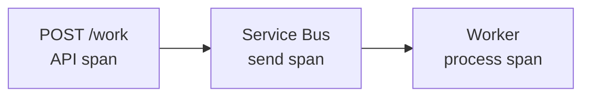

<MermaidSteps :steps="[
  { nodes: ['A', 'B'], focusNodes: ['B'], edges: ['A->B'] },
  { at: 1, nodes: ['C'], focusNodes: ['A', 'C'], edges: ['B->C'] },
  { at: 2, focusNodes: ['A', 'C'] },
]" />

</div>
<div>

<p class="col-label">What makes this work</p>

<ul>
  <li>Enabling the Azure SDK activity source lets <strong>W3C trace context</strong> cross Service Bus in the <code>Diagnostic-Id</code> application property.</li>
  <li v-click="1">Stable resource attributes give the API and worker distinct <code>service.name</code> values; logs retain trace/span IDs and sampling stays configurable.</li>
</ul>

<div class="note mt-3" v-click="2">
The <code>deployment.environment.name</code> convention is current but its OTel entity is still marked <em>Development</em>. Expect churn.
</div>

</div>
</div>

<p class="cite">Repository source: <code>src/Workshop.Messaging/ServiceBusMessaging.cs</code> · <a href="https://learn.microsoft.com/azure/service-bus-messaging/service-bus-end-to-end-tracing">Service Bus end-to-end tracing</a> · <a href="https://opentelemetry.io/docs/specs/semconv/resource/deployment-environment/">OTel deployment conventions</a></p>

<!--
The observability payoff. Show the actual trace in Application Insights if the
environment is up.

The AppContext switch is worth pausing on, messaging spans are still
experimental in the Azure SDK, so this is opt-in. Without that line the trace
breaks at the queue and nobody can tell you why.

Distinct service names matter more than people expect; with one shared name the
Application Map becomes useless.

Flag that the deployment.environment.name convention is still moving.
-->

---
part: 07 Operations
class: dense
---

# Demo 06 · Verify the same trace boundary on ACA and AKS

<div class="exhibit exhibit-wide">
<div>

<p class="col-label">Start the paired Ghostty workspace</p>

```bash
zsh slides/scripts/demo-workspace 06
```

Both worker logs start immediately. Enqueue once on ACA and once on AKS, copying each response trace ID. A focused presenter shell remains free.

```csharp
// ServiceBusMessaging.cs
message.ApplicationProperties["Diagnostic-Id"] =
  Activity.Current?.Id;
```

</div>
<div>

<p class="col-label">Portal beside Ghostty · trace evidence</p>

```kusto
AppRequests
| where TimeGenerated > ago(30m)
| project TimeGenerated,
          Name,
          Success,
          OperationId
| order by TimeGenerated desc
```

Query each platform's Application Insights resource, then follow API → Service Bus → worker. If a dependency span is absent, say so and fall back to the matching live log row.


</div>
</div>

<!--
Copy the response trace ID before opening Application Insights. The point is to
prove correlation, not merely to show a pretty Application Map. The code example
is the contract boundary: W3C context is explicitly copied into the message.
-->

---
part: 07 Operations
class: dense
---

# Live evidence · the Portal query and the CLI query agree

<div class="exhibit exhibit-wide">
<div>

<p class="col-label">Run in Log Analytics / Portal Logs</p>

```kusto
AppRequests
| where TimeGenerated > ago(1h)
| project TimeGenerated, Name, Success, OperationId
| order by TimeGenerated desc
| take 8
```

<p class="mt-2">Use the workspace-backed Logs view when the Application Insights resource opens a different table context.</p>

</div>
<div>

<p class="col-label">Observed from this run</p>

```text
GET /info                         200  True
POST /demo/failures/readiness     202  True
POST /demo/failures/exit          202  True
ServiceBusProcessor.ProcessMessage  0  True
work-item process                 0  True
```

<div class="sowhat mt-2">
The request proves the symptom. The worker span and platform state explain the mechanism.
</div>

</div>
</div>

<!--
This is the evidence checkpoint. Run the query after the demo request and join
the OperationId from the API response to downstream Service Bus processor and
worker activity. If the Application Insights blade is scoped to classic tables,
open the linked Log Analytics workspace; the data is the same.
-->

---
part: 07 Operations
class: dense
---

# What one trace query shows

<div class="exhibit exhibit-wide transcript">
<div>

~~~bash
RESPONSE=$(curl -sS -X POST "$AKS_URL/work" \
  -H 'content-type: application/json' \
  -d '{"count":1,"processingDelayMilliseconds":500,"behavior":"Normal"}')
echo "$RESPONSE" | jq .
TRACE_ID=$(echo "$RESPONSE" | jq -r .traceId)

az monitor log-analytics query --workspace "$LOG_ANALYTICS_WORKSPACE_ID" \
  --analytics-query "AppRequests
  | where TimeGenerated > ago(10m)
  | where OperationId == '$TRACE_ID'
  | project TimeGenerated, Name, ResultCode, Success, AppRoleName
  | order by TimeGenerated asc" -o json
~~~

</div>
<div>

~~~text
traceId: 094d6a019f35fe2132db32a0da07b5da

workshop-api     POST /work                         202  True
workshop-worker  ServiceBusProcessor.ProcessMessage  0  True
workshop-worker  work-item process                  0  True
~~~

~~~bash
az monitor log-analytics query --workspace "$LOG_ANALYTICS_WORKSPACE_ID" \
  --analytics-query "AppDependencies
  | where TimeGenerated > ago(10m)
  | where OperationId == '$TRACE_ID'
  | where Name in ('ServiceBusSender.Send','ServiceBusReceiver.Complete')
  | project Name, Target, Success
  | order by TimeGenerated asc" -o json
~~~

~~~text
ServiceBusSender.Send     .../workshop-events  True
ServiceBusReceiver.Complete .../workshop-events True
~~~

</div>
</div>

<!--
This is the precise CLI transcript from the captured trace. The three AppRequests
rows demonstrate API request, Service Bus processor callback, and worker span.
The dependency query proves send and completion against the same queue. In Portal,
run the same KQL from the linked workspace-backed Logs blade if the App Insights
blade opens a different table context.
-->

---
part: 07 Operations
class: dense
---

# What telemetry onboarding shows

<div class="exhibit exhibit-wide transcript">
<div>

~~~bash
az aks show -g "$AKS_RG" -n "$AKS_NAME" \
  --query '{containerInsights:azureMonitorProfile.containerInsights.enabled,metrics:azureMonitorProfile.metrics.enabled,appMonitoring:azureMonitorProfile.appMonitoring}' \
  -o json
kubectl get pods -n kube-system | rg 'ama-logs|ama-metrics'
kubectl get instrumentation -A
az feature show --namespace Microsoft.ContainerService \
  --name AzureMonitorAppMonitoringPreview \
  --query properties.state -o tsv
~~~

~~~text
containerInsights: true
metrics: true
appMonitoring: null
ama-logs-*       Running
ama-metrics-*    Running
No Instrumentation resources found
NotRegistered
~~~

</div>
<div>

~~~bash
az monitor log-analytics query --workspace "$LOG_ANALYTICS_WORKSPACE_ID" \
  --analytics-query "AppRequests
  | where TimeGenerated > ago(1h)
  | where AppRoleName in ('$AKS_API','$AKS_WORKER')
  | summarize requests=count(), lastSeen=max(TimeGenerated) by AppRoleName" -o json
~~~

~~~text
workshop-api     requests > 0
workshop-worker  requests > 0
workspace: aksworkshop-demo-aks-logs
Application Insights: aksworkshop-demo-appins
~~~

<div class="sowhat mt-2">
The cluster is healthy and emitting telemetry through code-based .NET OpenTelemetry
plus Container Insights. It is not currently onboarded to AKS codeless
autoinstrumentation; that .NET path is a limited preview and needs explicit
cluster preparation, an Instrumentation resource, pod annotation, and restart.
</div>

</div>
</div>

<p class="cite">Microsoft Learn: <a href="https://learn.microsoft.com/azure/azure-monitor/containers/kubernetes-codeless">AKS codeless Application Insights</a> · <a href="https://learn.microsoft.com/azure/azure-monitor/containers/kubernetes-codeless-python-net">.NET limited preview</a></p>

<!--
This is a verification slide, not a claim that the preview feature is enabled.
The repo application already calls AddOpenTelemetry().UseAzureMonitor with the
workspace-based Application Insights connection string, so the observed AppRequests
and AppTraces prove the chosen code-based path. If the workshop explicitly wants
to teach codeless .NET onboarding later, opt into the preview first and add the
required Instrumentation CR/annotation as a separate exercise.
-->

---
part: 07 Operations
class: identity-comparison-fill slide-fill
---

# Identity is configured in Azure on ACA and inside Kubernetes on AKS

<div class="exhibit">
<div>

| <span class="aca">ACA</span> | <span class="aks">AKS Automatic</span> |
| --- | --- |
| Managed identity attached to the app or job | Managed identity **federated** to a Kubernetes ServiceAccount |
| One Azure resource configuration | OIDC issuer + federated credential + ServiceAccount annotation + Pod label |
| Replica receives identity context | Pod receives workload identity context |

</div>
<div>

<div class="sowhat" v-click>
AKS Workload Identity has <strong>four</strong> configuration points that must agree. Three of them live in your manifests, so a broken identity looks like an application bug.
</div>

<p class="mt-4">Both models still require correct <strong>Azure RBAC</strong> on Service Bus, Key Vault and Storage. The identity existing is not the identity being allowed.</p>

</div>
</div>

<p class="cite">Microsoft Learn: <a href="https://learn.microsoft.com/azure/aks/workload-identity-overview">AKS Workload Identity</a> · <a href="https://learn.microsoft.com/azure/container-apps/managed-identity">Managed identities in ACA</a></p>

<!--
Short and practical.

The asymmetry is the point: ACA is one Azure-side setting, AKS Workload Identity
has four configuration points that must all agree, three of which live in
manifests. So a broken identity presents as an application bug.

Close on the last line. Having an identity and being authorised are different
things, and Azure RBAC on the dependency is still required either way.
-->

---
part: 07 Operations
---

# A private API server changes which tools still work

<div class="exhibit exhibit-wide">
<div>

| Capability | Needs API access from the operator? |
| --- | --- |
| `kubectl`, k9s, Stern, Headlamp | **Yes**, route, DNS, 443, auth, RBAC |
| Azure portal **live** logs and live data | **Yes**, the browser reaches the API directly |
| Container Insights **historical** queries | **No**, but cluster ingestion must be working |
| Image and dependency diagnostics | Check **private DNS and public-access policy**, not only app logs |
| Monitoring export under strict egress | May require **AMPLS** or an allowed route |

</div>
<div>

<div class="sowhat" v-click>
"we made it private" quietly changes the on-call runbook. Choose the management path before production: VM, AVD, VPN, ExpressRoute or peering. Do not invent it during the first incident.
</div>

</div>
</div>

<p class="cite">Microsoft Learn: <a href="https://learn.microsoft.com/azure/azure-monitor/containers/container-insights-livedata-overview">Container Insights live data</a> · <a href="https://learn.microsoft.com/azure/azure-monitor/fundamentals/private-link-vm-kubernetes">Azure Monitor Private Link</a></p>

<!--
Ties Lesson 05 and Lesson 07 together.

Live data needs API access from the operator's machine; historical queries do
not, but ingestion has to be healthy. People routinely conflate the two.

The real message is organisational: going private silently rewrites the on-call
runbook. Decide the management path, VM, AVD, VPN, ExpressRoute, before
production, not during the first incident.
-->

---
part: 07 Operations
class: ownership-fill slide-fill
---

# Name the owner of each failure type before you choose the platform

<div class="exhibit">
<div>

<p class="col-label">Who is paged?</p>


- Application exception
- Invalid release configuration
- Missing Azure role assignment
- Broken private DNS
- Insufficient requests or limits
- Failed platform capacity provisioning
- Monitoring ingestion failure


</div>
<div>

<div class="sowhat" v-click>
The exercise shows where ownership <em>differs</em>. Neither platform removes operations.
</div>

<p class="mt-4">On <span class="aca">ACA</span>, rows 5 and 6 mostly leave your organisation. On <span class="aks">AKS Automatic</span>, row 6 leaves and row 5 emphatically does not.</p>

</div>
</div>

<!--
Discussion, not presentation. Read each failure type and ask who gets paged.

With twelve people this works as an open room. Push for a named team, not
"platform" or "it depends".

The comparison at the end is the honest summary: ACA moves rows five and six out
of your organisation, AKS Automatic moves six but emphatically not five.
-->

---
nofooter: true
layout: none
class: zsection
---

<div class="zsplit">
  <div class="zbreak">
    <p class="zbreak-label">Break</p>
    <p class="zbreak-time">16:10</p>
    <p class="zbreak-note">Back at 16:10. The last session turns the evidence into a decision record.</p>
  </div>
  <div class="zsplit-art">
    
  </div>
</div>

---
nofooter: true
layout: none
class: zsection
---

<div class="zsplit">
  <div class="zsection-body">
    <p class="eyebrow">Part 08 · 16:10–17:00</p>
    <h1>Platform decision exercise</h1>
    <p class="zsection-sub">Five workloads, and a checklist you can take to your next architecture review.</p>
  </div>
  <div class="zsplit-art">
    
  </div>
</div>

<!--
Fifty minutes and it is theirs, not yours. Set up the exercise fast and then get out of the way.
-->

---
part: 08 Decision
---

# Produce a decision record, not a preference

<div class="exhibit">
<div>

<p class="col-label">Work through the scenarios</p>

- Start with Scenario 1 as a worked example.
- Apply the same reasoning to Scenarios 2–5.
- Use the Teams chat for a recommendation, decisive requirement and open risk.

<p class="col-label mt-3">For each scenario, write down</p>

1. Recommended platform, and the **decisive requirement**
2. Main operational owner
3. Private-networking implication and scaling model
4. Largest unresolved risk
5. **One validation action** before production approval


</div>
<div>

<p class="col-label">Allowed answers</p>

<v-clicks>

- <span class="aca">Azure Container Apps</span>
- <span class="aks">AKS Automatic</span>
- Modernize or clarify requirements first
- Exceptional escalation beyond Automatic

</v-clicks>

<div class="sowhat mt-4" v-click>
Item 2 is the one that matters. A recommendation without a decisive requirement is a preference wearing a suit.
</div>

</div>
</div>

<!--
Set up the exercise crisply, you have fifty minutes and setup eats it. Work
through Scenario 1 as the shared example, then invite short answers in Teams
chat for the remaining scenarios.

Item 1 is the one that matters: the decisive requirement. A recommendation
without one is a preference in a suit, and you should say that.

Keep each scenario bounded. Give a ten-minute and a five-minute warning before
the final recap.
-->

---
part: 08 Decision
class: scenario-choice-slide slide-fill
---

# Five scenarios, four allowed answers

| # | Scenario |
| --- | --- |
| 1 | Modern Linux API + Service Bus worker, managed database, small team |
| 2 | Vendor ships **Helm charts with an operator and CRDs** |
| 3 | **.NET Framework 4.8** Windows service, one instance per customer |
| 4 | Linux HTTP + WebSocket, private ACR/KV/Storage, controlled egress |
| 5 | Cluster security agent: privileged host access, node agent, admission |

<p class="col-label scenario-answer-label">Four allowed answers</p>
<div class="scenario-answer-options">
  <span class="aca">Azure Container Apps</span>
  <span class="aks">AKS Automatic</span>
  <span>Modernize or clarify first</span>
  <span>Exceptional escalation beyond Automatic</span>
</div>

<div class="sowhat scenario-instruction" v-click>
<strong>Choose from the four allowed answers.</strong> For each scenario, name the decisive requirement and one validation action that would test it.
</div>

<!--
Work through Scenario 1 aloud, then invite attendees to post a recommendation
and decisive requirement in Teams chat for the other scenarios. Steer the
discussion toward stated requirements, not product familiarity.

Facilitator answer key:
- Scenario 1: ACA. Test networking, cold starts and the operating model.
- Scenario 2: AKS Automatic; the operator and CRDs make the ecosystem the requirement.
- Scenario 3: modernize or clarify first.
- Scenario 4: ACA. Test subnet, DNS, ingress and public access.
- Scenario 5: ACA is disqualified. Validate Automatic before escalating.

Scenario 3 is the trap and someone usually falls into it, "it is a container
platform, put it on AKS". Let them present it, then let the room correct it.

Across the five scenarios, all four allowed answers appear. That is exactly the
point: there is no universal default.
-->

---
part: 08 Decision
class: dense
---

# Use this checklist in the next architecture review

| Question | Direction |
| --- | --- |
| Is the Kubernetes API, Helm/operator ecosystem or a CRD required? | <span class="aks">AKS Automatic</span> hypothesis |
| Windows, privileged host access, UDP, or unsupported customization? | ACA may be disqualified. Validate whether Automatic meets the actual constraint before escalating |
| Conventional Linux API, worker or job with managed external state? | <span class="aca">ACA</span> hypothesis |
| If Kubernetes is required, who will own manifests, RBAC, probes, requests, disruption, and troubleshooting? | Required for AKS Automatic |
| Is true scale-to-zero economically important? | Strong ACA consideration |
| Are private endpoints mandatory for every dependency? | Validate SKU and cost implications |
| Does a private endpoint exist while public access remains enabled? | The design is **dual-path**, not private-only |
| Has the team named the people who own that Kubernetes work? | Name them before choosing AKS Automatic |
| What exact requirement prevents AKS Automatic? | **Required** before choosing Standard |

<!--
This is the actual deliverable of the day. Say that plainly.

Do not read all nine rows. Pick the last one and dwell on it: naming the exact
requirement that prevents AKS Automatic is the gate before anyone chooses
Standard.

Tell them it is in the handout and encourage them to take it to their next
architecture review.
-->

---
part: 08 Decision
class: evidence-decision-slide slide-fill
---

# Which evidence changes the recommendation?

<div class="evidence-decision-head">
  <p class="col-label">Workload pattern</p>
  <p class="col-label">Decisive evidence and direction</p>
</div>

<div class="evidence-decision-rows">
  <div class="evidence-decision-row">
    <strong>Linux HTTP API + Service Bus worker, no local state</strong>
    <p><span class="aca">ACA hypothesis.</span> Test the network boundary: an ACA private endpoint forces public access off, while Service Bus Standard has no Private Link.</p>
  </div>
  <div class="evidence-decision-row" v-click="1">
    <strong>Vendor Helm charts with an operator and CRDs</strong>
    <p><span class="aks">AKS Automatic.</span> The Kubernetes API is decisive; budget for two scaling layers and four agreeing Workload Identity configuration points.</p>
  </div>
  <div class="evidence-decision-row" v-click="2">
    <strong>Large .NET Framework 4.8 Windows service</strong>
    <p><strong>Modernize or choose another hosting path.</strong> AKS Automatic has no Windows nodes, and ACA ordinary apps require Linux containers.</p>
  </div>
</div>

<!--
Use this as a concise evidence review, not a recap of an earlier vote. Pick one
workload pattern, ask which requirement determines its placement, then use the
right column to identify the relevant fact from the day.
-->

---
part: 08 Decision
class: platform-recap slide-fill
---

# ACA buys simplicity; AKS Automatic buys Kubernetes control

<div class="exhibit">
<div class="platform-recap-card aca-recap-card">

<p class="col-label"><span class="aca">Azure Container Apps</span></p>

<p><strong>Benefits</strong></p>

- Managed ingress, service discovery, revisions, traffic splitting and eligible custom-domain TLS.
- Scale-to-zero and first-class jobs, with no cluster or node lifecycle to operate.

<div class="recap-costs" v-click="1">
<p class="mt-4"><strong>Costs and constraints</strong></p>

- No Kubernetes API, operator, CRD or Helm-based platform model.
- Narrower runtime, protocol, storage, privilege and networking boundaries.
</div>

</div>
<div class="platform-recap-card aks-recap-card">

<p class="col-label"><span class="aks">AKS Automatic</span></p>

<p><strong>Benefits</strong></p>

- Full Kubernetes API and ecosystem, with richer workload, policy and networking control.
- Azure manages system nodes, NAP, upgrades, repair and hardened defaults.

<div class="recap-costs" v-click="1">
<p class="mt-4"><strong>Costs and constraints</strong></p>

- You own manifests, RBAC, probes, requests, releases, disruption and troubleshooting.
- More objects; workload scaling and infrastructure capacity remain separate layers.
</div>

</div>
</div>

<p class="cite">Microsoft Learn: <a href="https://learn.microsoft.com/azure/container-apps/compare-options">Comparing container options</a> · <a href="https://learn.microsoft.com/azure/container-apps/custom-domains-managed-certificates">ACA managed certificates</a> · <a href="https://learn.microsoft.com/azure/aks/intro-aks-automatic">AKS Automatic</a></p>

<!--
This is the requested pros-and-cons recap, but do not present it as a product
scorecard. The left column buys a smaller platform contract. The right column
buys the Kubernetes API and its ecosystem while removing much of the node and
cluster infrastructure work.

Read the benefits first. On ACA, include the edge conveniences that are easy to
understate during a Kubernetes-heavy workshop: managed ingress, service
discovery, revisions, traffic splitting and eligible public-domain
certificates. On AKS Automatic, emphasize that the Kubernetes benefit is real:
operators, CRDs, policy, workload primitives and detailed live state remain
available without manually engineering normal node-pool operations.

Advance once for the costs. Neither side is free: ACA constrains the platform
surface; AKS preserves it and therefore leaves more application-platform
ownership with the team. AKS can automate DNS and certificate delivery through
its ingress/Gateway stack and Azure Key Vault integrations, but that remains
cluster application plumbing rather than ACA's free managed-certificate
offering.

Land on the decision rule: choose the smaller operating contract that still
satisfies the workload's explicit requirements.
-->

---
part: 08 Decision
class: watch-next-slide slide-fill
---

# What to watch next

<div class="exhibit">
<div>

<p class="col-label">Migration and emerging capabilities</p>

<div class="watch-items">
  <div class="watch-item"><strong>ACA → AKS migration</strong><span>A deployment-platform translation, not an image rewrite. Budget for manifests, identity and ingress—not rebuilding the application.</span></div>
  <div class="watch-item"><strong>ACA Sandboxes</strong><span>Isolated, on-demand microVMs for AI agents and untrusted code, with lifecycle control, snapshots, persistent volumes and egress policy.</span></div>
  <div class="watch-item"><strong>Emerging ACA capabilities</strong><span>Flexible workload profiles (preview), GPU profiles, native private endpoints and deployment labels (preview).</span></div>
</div>

</div>
<div>

<p class="col-label">Capture after the session</p>

<div class="capture-list">
  <div v-click="1">The agreed decision checklist</div>
  <div v-click="2">Open questions needing customer evidence</div>
  <div v-click="3">Workloads needing a modernization assessment</div>
  <div v-click="4">Networking and SKU decisions needing cost validation</div>
  <div v-click="5">Ownership gaps for production operations</div>
</div>

</div>
</div>

<p class="cite">Azure Container Apps: <a href="https://sandboxes.azure.com/docs/sandboxes">ACA Sandboxes</a> · Microsoft Learn: <a href="https://learn.microsoft.com/azure/container-apps/workload-profiles-overview">Workload profiles</a></p>

<!--
Five minutes maximum. Resist every temptation to expand this.

The migration point is the useful one: ACA to AKS is a deployment translation,
not an application rewrite. Budget for manifests, identity and ingress.

Give Sandboxes one sentence unless someone asks. The distinction from Dynamic
Sessions is control: a sandbox is an individually managed microVM that can
suspend, resume, snapshot, retain volumes and apply explicit egress policy.
Dynamic Sessions instead route request-scoped work through a managed pool.

The right column is your follow-up list. Write down who owns each item before
people leave the room.
-->

---
part: Appendix · References
---

# References

<div class="zrefs">

**AKS Automatic and Kubernetes**
AKS Engineering Blog, [Deploy apps to AKS Automatic with Terraform and the Helm provider](https://blog.aks.azure.com/2026/01/09/deploy-aks-automatic-terraform-helm) (Azure RBAC only, local accounts disabled, Workload Identity)
Microsoft Learn, [Introduction to AKS Automatic](https://learn.microsoft.com/azure/aks/intro-aks-automatic) · [AKS Automatic limitations](https://learn.microsoft.com/azure/aks/automatic/quick-automatic-managed-network#limitations) · [Node autoprovisioning](https://learn.microsoft.com/azure/aks/concepts-scale#node-autoprovisioning) · [NAP disruption](https://learn.microsoft.com/azure/aks/node-auto-provisioning-disruption) · [Gateway API with application routing](https://learn.microsoft.com/azure/aks/app-routing-gateway-api) · [Application routing DNS and TLS](https://learn.microsoft.com/azure/aks/app-routing-dns-ssl) · [API Server VNet Integration](https://learn.microsoft.com/azure/aks/api-server-vnet-integration) · [Access a private cluster](https://learn.microsoft.com/azure/aks/access-private-cluster) · [kubelogin](https://learn.microsoft.com/azure/aks/kubelogin-authentication) · [Workload Identity](https://learn.microsoft.com/azure/aks/workload-identity-overview)
Kubernetes, [Deployments](https://kubernetes.io/docs/concepts/workloads/controllers/deployment/) · [Jobs](https://kubernetes.io/docs/concepts/workloads/controllers/job/) · [CronJobs](https://kubernetes.io/docs/concepts/workloads/controllers/cron-jobs/) · [Probes](https://kubernetes.io/docs/tasks/configure-pod-container/configure-liveness-readiness-startup-probes/) · [Gateway API](https://gateway-api.sigs.k8s.io/) · KEDA, [ScaledJobs](https://keda.sh/docs/latest/concepts/scaling-jobs/)

**Azure Container Apps**
Microsoft Learn, [Environments](https://learn.microsoft.com/azure/container-apps/environment) · [Revisions](https://learn.microsoft.com/azure/container-apps/revisions) · [Networking](https://learn.microsoft.com/azure/container-apps/networking) · [Private endpoints with DNS](https://learn.microsoft.com/azure/container-apps/private-endpoints-with-dns) · [Custom domains and free managed certificates](https://learn.microsoft.com/azure/container-apps/custom-domains-managed-certificates) · [Workload profiles](https://learn.microsoft.com/azure/container-apps/workload-profiles-overview) · [Scaling](https://learn.microsoft.com/azure/container-apps/scale-app) · [Jobs](https://learn.microsoft.com/azure/container-apps/jobs) · [Managed identity](https://learn.microsoft.com/azure/container-apps/managed-identity) · [Log streaming](https://learn.microsoft.com/azure/container-apps/log-streaming) · ACA, [Sandboxes](https://sandboxes.azure.com/docs/sandboxes) · [Comparing container options](https://learn.microsoft.com/azure/container-apps/compare-options)

**Registry, networking and identity**
Microsoft Learn, [ACR private endpoints](https://learn.microsoft.com/azure/container-registry/container-registry-private-endpoints) · [ACR ABAC repository permissions](https://learn.microsoft.com/azure/container-registry/container-registry-rbac-abac-repository-permissions) · [ACR authentication](https://learn.microsoft.com/azure/container-registry/container-registry-authentication) · [Private Endpoint DNS](https://learn.microsoft.com/azure/private-link/private-endpoint-dns) · [Key Vault network security](https://learn.microsoft.com/azure/key-vault/general/network-security) · [Storage private endpoints](https://learn.microsoft.com/azure/storage/common/storage-private-endpoints) · [Service Bus and Private Link](https://learn.microsoft.com/azure/service-bus-messaging/private-link-service) · [Service Bus Entra authentication](https://learn.microsoft.com/azure/service-bus-messaging/authenticate-application)

**Observability**
Microsoft Learn, [Enable OpenTelemetry for Application Insights](https://learn.microsoft.com/azure/azure-monitor/app/opentelemetry-enable) · [OTel configuration and sampling](https://learn.microsoft.com/azure/azure-monitor/app/opentelemetry-configuration) · [Service Bus end-to-end tracing](https://learn.microsoft.com/azure/service-bus-messaging/service-bus-end-to-end-tracing) · [Kubernetes monitoring overview](https://learn.microsoft.com/azure/azure-monitor/containers/kubernetes-monitoring-overview) · [Container Insights live data](https://learn.microsoft.com/azure/azure-monitor/containers/container-insights-livedata-overview) · [Azure Monitor Private Link](https://learn.microsoft.com/azure/azure-monitor/fundamentals/private-link-vm-kubernetes) · [ACA OpenTelemetry agent](https://learn.microsoft.com/azure/container-apps/opentelemetry-agents)
OpenTelemetry, [Deployment semantic conventions](https://opentelemetry.io/docs/specs/semconv/resource/deployment-environment/) · [Service attributes](https://opentelemetry.io/docs/specs/semconv/registry/attributes/service/)

**Labs and repository**
[KodeKloud Kubernetes labs](https://kodekloud.com/studio/labs/kubernetes) · Workshop sources: `src/`, `src/deploy/`, `deployment/`

</div>

<!--
Reference slide, not a talking slide. Point at it, say the deck and links go out afterwards, move on.
-->

---
nofooter: true
layout: none
class: zsection
---

<div class="zdark zdark-pad">
  <p class="eyebrow">Conclusions</p>

  <ol class="zconcl">
    <li><strong>The OCI digest can move. The operating work does not.</strong> ACA and AKS Automatic run the same image, but you deploy and operate it through different interfaces.</li>
    <li><strong>AKS Automatic reduces infrastructure engineering, not Kubernetes application ownership.</strong> Manifests, probes, requests, disruption and identity stay with you.</li>
    <li><strong>ACA is a valid long-term platform</strong> when the application fits its limits. It is not a stepping stone you are expected to outgrow.</li>
    <li><strong>Private connectivity must be verified</strong> across DNS, public-access policy, firewalls and every one of the six traffic paths. Service Bus Standard shows that security requirements and cost genuinely conflict.</li>
    <li><strong>Choose AKS Standard only after naming the requirement</strong> that Automatic cannot meet.</li>
  </ol>

  <p class="zcontact">Zure · <a href="https://zure.com">zure.com</a>. Workshop material and demo application: this repository.<br />Deployment templates under <code>deployment/</code> support the workshop. They are not a production reference architecture.</p>
</div>

<!--
This slide stays up for the whole discussion, do not advance past it.

Read the five conclusions, then stop talking. The room has been listening for seven hours and the useful conversation happens now.

If nothing comes, prompt with: which of your workloads does not fit either platform cleanly?
-->

---
part: Appendix A
---

# Appendix A: AKS Automatic limitations to check before you commit

<div class="exhibit">
<div>

<p class="col-label">Hard limits</p>

- **No Windows node pools.**
- **No in-place migration** from a base/Standard AKS cluster, plan a redeployment.
- **Dapr and Azure ML extensions are not supported.**
- **No static local admin credentials.** `az aks get-credentials` still writes a kubeconfig. Terraform, Helm, and CI tooling must authenticate through Entra, typically with the `kubelogin` exec plugin. Plan this before the first pipeline run.
- The `MC_` node resource group is locked down; custom DNS and cross-VNet designs must use the documented route.
- Availability is region-limited.

</div>
<div>

<p class="col-label">Ingress caveats</p>

- The `approuting-istio` GatewayClass is default only for **new AKS Automatic clusters on AKS 1.36+**. Existing clusters must migrate.
- It **cannot coexist** with the Istio service-mesh add-on.
- **TLSRoute / SNI passthrough** and egress traffic management are unsupported.
- Confirm with `kubectl get gatewayclass` before applying.

</div>
</div>

<p class="cite">Microsoft Learn: <a href="https://learn.microsoft.com/azure/aks/automatic/quick-automatic-managed-network#limitations">AKS Automatic limitations</a> · <a href="https://learn.microsoft.com/azure/aks/app-routing-gateway-api">Gateway API application routing</a></p>

<!--
Q&A backup. Jump here when someone asks what Automatic cannot do, most often Windows, or migrating an existing cluster.
-->

---
part: Appendix B
class: dense
---

# Appendix B: Workshop application controls

<div class="exhibit exhibit-wide">
<div>

| Endpoint | Purpose |
| --- | --- |
| `GET /health` | Liveness, minimal dependencies |
| `GET /ready` | Readiness incl. temporary demo state |
| `GET /info` | Version, instance ID, environment, control state |
| `POST /work` | Enqueue a bounded batch of Service Bus messages |
| `POST …/exception` | Controlled HTTP 500 with a recorded exception |
| `POST …/latency` | Bounded delay, 1–10 000 ms |
| `POST …/readiness` | This instance unready for 5–120 s, then recovers |
| `POST …/exit` | Process exits with code 42 after 500–5 000 ms |

<p style="font-size:17px;color:var(--z-text-muted);margin-top:0.4rem">… = <code>/demo/failures</code></p>

</div>
<div>

<p class="col-label">Safety rules</p>

- All failure controls are **disabled by default** and always disabled when `DOTNET_ENVIRONMENT=Production`.
- Enable explicitly with `DEMO_FAILURES_ENABLED=true`.
- `DEMO_WORKSHOP_KEY` gates the UI via an `X-Workshop-Key` header. It is a workshop guard, not authentication.
- Every input is bounded. No shell execution, no arbitrary URLs, no resource exhaustion.
- The UI holds **no Azure control-plane permissions** and cannot modify its own deployment.

</div>
</div>

<p class="cite">Repository sources: <code>src/Workshop.Api/Program.cs</code>, <code>src/Workshop.Api/DemoControls.cs</code>, <code>09-demo-application-requirements.md</code></p>

<!--
Q&A backup. Use if people want to reproduce the demos themselves, or if someone asks how the failure injection is kept safe.
-->

---
part: Appendix C
---

# Appendix C: Repository map

<div class="exhibit">
<div>

```text
AKSWorkshop/
├── 00-workshop-agenda.md
├── 01..08-*.md            lesson plans
├── 09-demo-application-requirements.md
├── slides/                this deck
├── src/
│   ├── apphost.cs         Aspire AppHost (local run)
│   ├── Workshop.Api/      API + control panel + Dockerfile
│   ├── Workshop.Worker/   Service Bus consumer + Dockerfile
│   ├── Workshop.Messaging/  contracts, telemetry, identity
│   ├── Workshop.ServiceDefaults/  OTel + health
│   └── deploy/
│       ├── aks/workshop.yaml
│       └── aca/applications.bicep
└── deployment/
    ├── shared/            ACR
    ├── aks-automatic/     platform Bicep
    └── aca/               platform Bicep
```

</div>
<div>

<p class="col-label">Run it locally</p>

```bash
cd src
aspire doctor
aspire start
aspire wait workshop-api
```

<p class="mt-3">Aspire builds both services as Linux containers, starts the Service Bus emulator, and wires the dashboard to receive OpenTelemetry logs, traces and metrics from both services.</p>

<div class="note mt-3">
The same two Dockerfiles feed local Aspire, AKS and ACA. That is the point.
</div>

</div>
</div>

<p class="cite">Repository source: <code>src/README.md</code>, <code>src/deploy/README.md</code>, <code>deployment/README.md</code></p>

<!--
Q&A backup, and the natural last slide if someone asks how to run the whole thing locally.
-->

---
part: Appendix D · Demo runbooks
class: dense
---

# Demo runbooks: one app, six paired stories

<div class="exhibit exhibit-wide">
<div>

| Demo | Start with | Leave the room with |
| --- | --- | --- |
| 01 · Contract | The same `/info` response on ACA and AKS | Same image; different runtime API |
| 02 · Scale | The same bounded batch on each platform | ACA replicas vs KEDA → Pods → Nodes |
| 03 · Messaging | One transient item, then one poison item | Same policy; platform-specific logs and queue evidence |
| 04 · Instance health | Readiness, then process exit | ACA replica lifecycle vs Pod/container state |
| 05 · Startup | The same startup-failure flag | ACA revision rollback vs Kubernetes rolling update |
| 06 · Trace | One normal item per platform | API → Service Bus → worker correlation on both |

</div>
<div>

<p class="col-label">Preflight</p>

1. Confirm the control panel says **Connected**, **ready**, and **enabled**.
2. Keep the ACA and AKS control panels plus the Azure resource view ready.
3. Clear or drain **both** platform queues before scaling or retry demos.
4. If a live step stalls, stop waiting and narrate the **Expected evidence** on the next slides.

<div class="note mt-3">
The UI is deliberately not an administration portal. It can create application symptoms, but it cannot change ACA, AKS, identities, or scaling resources.
</div>

</div>
</div>

<p class="cite">Repository sources: <code>src/Workshop.Api/wwwroot/index.html</code>, <code>src/Workshop.Api/Program.cs</code>, <code>src/Workshop.Worker/Worker.cs</code></p>

<!--
Use this as the instructor's map before the first live demo. The four stories are
independent: if Azure Portal, telemetry, or node provisioning is unavailable, jump
to the matching runbook and keep the explanation moving.

Before the workshop, open both application URLs and verify that the control panel
shows failure controls enabled. On a deployed environment, enter the workshop key
once if the UI asks for it. Do not preflight by triggering a failure; use GET /ready,
GET /info, and one small normal work item instead.
-->

---
part: Appendix D · Demo setup
class: dense
---

# One command builds each Ghostty demo workspace

<div class="exhibit exhibit-wide">
<div>

<p class="col-label">Run once on the presenter Mac</p>

```bash
brew install zellij
```

Then start a demo from the repository root:

```bash
zsh slides/scripts/demo-workspace 02
```

<div class="note mt-3">
The exported workshop variables flow into every pane. Outside Zellij the launcher creates the numbered session, replaces an exited one, or adds a fresh layout tab to a running one; inside Zellij it opens a new demo tab.
</div>

</div>
<div>

<p class="col-label">Each demo owns a checked-in layout</p>

```text
demo-01  ACA contract | AKS contract
demo-02  ACA queue/replicas/log | AKS queue/KEDA/Pods/Nodes watches
demo-03  ACA trigger/log/queue | AKS trigger/log/queue
demo-04  ACA health/revision/log | AKS health/Pods/previous log
demo-05  ACA fail/recover/state | AKS fail/recover/state
demo-06  ACA request/log | AKS request/log
```

Every layout opens with a focused presenter shell. Potentially disruptive actions start suspended; focus the named pane and press <strong>Enter</strong> only when the room is ready.

</div>
</div>

<p class="cite">Zellij: <a href="https://zellij.dev/documentation/creating-a-layout.html">layout files</a> · Repository layouts: <code>slides/zellij/demo-01.kdl</code> … <code>demo-06.kdl</code></p>

<!--
Launch Zellij from the same Ghostty shell where the workshop variables were
exported. Zellij inherits those values and passes them to every command pane.
Read-only observers start immediately. Commands that enqueue work, trigger a
failure, or change a Deployment use start_suspended=true.
-->

---
part: Appendix D · Demo 01
class: dense
---

# Demo 01, Read the same image on two platforms

<div class="exhibit exhibit-wide">
<div>

<p class="col-label">Live sequence</p>

```bash
zsh slides/scripts/demo-workspace 01
```

1. Open the **same workshop UI** on ACA and AKS.
2. Read **service version, environment, host/Pod/replica, instance ID, process start, and readiness**.
3. Refresh or send one normal request so participants can see that instance identity is runtime state.
4. Show the platform objects behind the UI:

```bash
kubectl get deploy,svc,pods,gateway,httproute --namespace "$WORKSHOP_NAMESPACE"
az containerapp revision list --name "$ACA_API" --resource-group "$ACA_RG" -o table
```

</div>
<div>

<p class="col-label">Expected evidence</p>

| Same | Different |
| --- | --- |
| Service name and release version | `workshop-aks` vs `workshop-aca` environment |
| Health contract: `/health`, `/ready` | Pod/Deployment/Service vs App/Revision/Replica |
| OCI image and dependency contract | Workload identity wiring and operator tools |

<div class="sowhat mt-3">
Image portability is real. The deployment model does not transfer.
</div>

</div>
</div>

<p class="cite">Repository sources: <code>src/Workshop.Api/Program.cs</code>, <code>src/deploy/aks/workshop.yaml</code>, <code>src/deploy/aca/applications.bicep</code></p>

<!--
Set the frame before opening the tabs: we are not proving that the platforms are
identical. We are proving that the application image and its HTTP contract can be
the same while the customer-owned API changes around it.

Useful fallback commands:

  curl -s "$ACA_URL/info" | jq
  curl -s "$AKS_URL/info" | jq
  kubectl get deployment "$AKS_API" --namespace "$WORKSHOP_NAMESPACE" -o jsonpath='{.spec.template.spec.containers[0].image}'; echo
  az containerapp show --name "$ACA_API" --resource-group "$ACA_RG" --query properties.template.containers[0].image -o tsv

If the tags do not look identical, use the recorded release digest file or the ACR
digest command from the earlier artifact demo. Do not let a mutable tag derail this
demo; the teaching point is the split between image and contract.
-->

---
part: Appendix D · Demo 02
class: dense appendix-scaling-demo
---

# Demo 02, Queue depth becomes replicas

<div class="exhibit exhibit-wide">
<div>

<p class="col-label">Use these control-panel values</p>

```bash
zsh slides/scripts/demo-workspace 02
```

```text
Message count       40
Processing delay    1000 ms
Behavior            Normal
```

1. Confirm both queues are empty and both workers are at zero.
2. Enqueue the same batch through ACA first, then AKS; leave each trace ID visible.
3. Keep the paired Zellij columns visible until both queues drain.

<p class="col-label mt-3">Inspect the event history after the watches</p>

```bash
kubectl get events --namespace "$WORKSHOP_NAMESPACE" --sort-by=.metadata.creationTimestamp
kubectl describe scaledobject --namespace "$WORKSHOP_NAMESPACE"
```

</div>
<div>

<p class="col-label">Expected evidence</p>

```text
ACA: its queue depth
       → managed scale rule
       → revision replicas + console log

AKS: its queue depth
       → KEDA ScaledObject
       → worker Pods
       → pending scheduling
       → AKS NAP capacity
```

<div class="note mt-3">
Node provisioning can outlast the workshop slot. The wait is part of the model, not a successful demo outcome. Use the sequence above as the backup visual and resume at the drain/cooldown discussion.
</div>

</div>
</div>

<p class="cite">Repository sources: <code>src/deploy/aks/workshop.yaml</code>, <code>src/deploy/aca/applications.bicep</code>, <code>06-event-driven-scaling.md</code></p>

<!--
Run ACA first if both platforms are available: its worker replica response is
usually faster. The important order is queue, replicas, Pods, Nodes. Do not jump
straight to node count; that hides the two-layer AKS scaling model.

The workspace uses separate Service Bus namespaces. Every AKS signal has its
own observer pane, so transitions append without a combined clear/redraw loop.
The node observer suppresses heartbeat-only updates whose visible values did
not change. Do not enqueue on ACA while watching the AKS queue, or vice versa.

  az containerapp revision list --name "$ACA_WORKER" --resource-group "$ACA_RG" -o table
  az containerapp logs show --name "$ACA_WORKER" --resource-group "$ACA_RG" --follow

For the queue, use the Service Bus queue metrics view. A queue that drains too
quickly is still useful: ask what caused the worker to scale and which signal
would prove that the platform had reached its maximum.

Do not combine `scaledobjects` and `pods` in one `kubectl get ... --watch`
invocation. kubectl reports "you may only specify a single resource type";
the Ghostty setup deliberately gives each resource type its own watch process.

If a stale queue or an earlier poison item is present, drain it before starting.
Do not mix the scale demo with a failure demo until the normal batch is complete.
-->

---
part: Appendix D · Demo 03
class: dense
---

# Demo 03: Retries are bounded, not magic

<div class="exhibit exhibit-wide">
<div>

<p class="col-label">Transient item → eventual success</p>

```bash
zsh slides/scripts/demo-workspace 03
```

1. Press Enter in **ACA transient → poison** to enqueue the transient item.
2. Follow `WorkItemProcessingStarted` → `WorkItemRetry` twice → completed.
3. Press Enter again in the same pane to enqueue the poison item.

</div>
<div>

<p class="col-label">Repeat on AKS, then compare</p>

1. Run **AKS transient → poison** in the same two-step sequence.
2. Confirm attempt `3` is terminal and each platform's dead-letter count increases.
3. Compare ACA revision activation with the KEDA-created AKS worker Pod.

<div class="sowhat mt-3">
Transient items retry and complete. Poison items are abandoned twice, then dead-lettered on attempt three.
</div>

</div>
</div>

<p class="cite">Repository sources: <code>src/Workshop.Worker/Worker.cs</code>, <code>src/Workshop.Messaging/WorkItem.cs</code>, <code>src/Workshop.Api/wwwroot/index.html</code></p>

<!--
This is the cleanest way to explain the difference between retry and failure.
The transient item uses the same message again after an abandon and then completes.
The poison item follows the same bounded path but reaches a deliberate terminal
state at attempt three. Run the ACA row completely before the AKS row so message
IDs and queue counts cannot be confused across environments.

Use the message ID, delivery count, trace ID, and worker instance as the four
columns of evidence. If the portal does not expose the dead-letter count quickly,
the structured worker log is sufficient evidence; do not spend the slot hunting
for a hidden metric.

If the UI is unavailable, the API contract is:

  curl -sS -X POST "$AKS_URL/work" -H 'Content-Type: application/json' \
    -d '{"count":1,"processingDelayMilliseconds":750,"behavior":"TransientFailure","transientFailures":2}'
  curl -sS -X POST "$AKS_URL/work" -H 'Content-Type: application/json' \
    -d '{"count":1,"processingDelayMilliseconds":750,"behavior":"Poison"}'
-->

---
part: Appendix D · Demo 04
class: dense
---

# Demo 04: Request symptoms are not instance health

<div class="exhibit exhibit-wide">
<div>

<p class="col-label">Request-level controls</p>

| Control | Action | What should stay healthy |
| --- | --- | --- |
| HTTP exception | **Trigger exception** | Platform and instance |
| Request latency | Set `3000` ms → **Delay one request** | Platform and instance |

These create telemetry. They do not make the deployment unhealthy.

</div>
<div>

<p class="col-label">Instance-level controls</p>

| Control | Action | Evidence |
| --- | --- | --- |
| Readiness | Set `30` s → **Fail this instance** | `/ready` = 503; traffic avoids it; it recovers |
| Process exit | **Exit this instance** | 202 first; exit code 42; restart; new instance ID |

<div class="sowhat mt-4">
The HTTP controls are identical on ACA and AKS. The platform evidence is not.
</div>

</div>
</div>

<!--
Use the failure taxonomy out loud: exception and latency are request symptoms;
readiness is traffic eligibility; process exit is restart. The platform must not
restart an instance merely because one request returned 500.
-->

---
part: Appendix D · Demo 04
class: dense
---

# Demo 04: Compare replica and Pod health evidence

<div class="exhibit exhibit-wide">
<div>

<p class="col-label">Start the paired workspace</p>

```bash
zsh slides/scripts/demo-workspace 04
```

ACA revision/console and AKS Pod/previous-log observers start immediately. Each platform has one suspended pane: first Enter starts readiness; the next Enter, after recovery, triggers process exit.

<p class="col-label mt-3">Run one platform at a time</p>

- Complete ACA readiness → recovery → exit.
- Then repeat the same sequence on AKS.
- Never combine readiness and exit in one request.

</div>
<div>

<p class="col-label">Read the platform boundary</p>

| ACA | AKS |
| --- | --- |
| App → revision → replica | Deployment → ReplicaSet → Pod |
| Replica/container READY, RESTARTS, ID | READY, RESTARTS, previous log |
| One replica may yield a 503 | Two Pods show traffic avoidance |

<div class="note mt-2" style="font-size:16px;line-height:1.2">
Prefer two API instances when explaining traffic avoidance. With one ACA replica, narrate the temporary <code>503</code> instead.
</div>

</div>
</div>

<!--
For readiness, the UI response includes the affected instance and recovery time.
Refresh the control panel and call /ready directly if needed. The status should
move to not-ready/503 and then return to ready without a process restart.

In the ACA observer, readiness should toggle while the replica suffix, container
ID and restart count stay stable. After process exit, the restart count and
container ID distinguish a restarted container; a changed replica suffix would
instead prove replacement. The UI returns before scheduling the shutdown, so
capture the application instance ID first as supporting evidence.

On AKS, show restart count, previous logs and the changed application instance
ID after the platform starts the process again. The `DEMO_STARTUP_FAILURE` mode
on the next slide is intentionally different: it fails before the HTTP server
starts.
-->

---
part: Appendix D · Demo 05
class: dense
---

# Demo 05: Make a deployment fail before telemetry exists

<div class="exhibit exhibit-wide">
<div>

<p class="col-label">Start both platform paths</p>

```bash
zsh slides/scripts/demo-workspace 05
```

1. Press Enter in **ACA fail → recover**; inspect the failed candidate revision.
2. Press Enter again to create the corrected ACA revision.
3. Repeat with **AKS fail → recover**; inspect the new ReplicaSet and retained healthy Pods.
4. Press Enter again to restore the healthy template; Kubernetes reuses the retained ReplicaSet rather than creating another one.

</div>
<div>

<p class="col-label">ACA revision path</p>

The suspended panes preload these equivalent configuration changes:

```bash
az containerapp update -g "$ACA_RG" -n "$ACA_API" \
  --set-env-vars DEMO_STARTUP_FAILURE=true
kubectl patch deployment "$AKS_API" -n "$WORKSHOP_NAMESPACE" \
  --patch-file src/deploy/aks/startup-failure-patch.yaml
```

Recovery sets the ACA value to `false` and applies the AKS recovery patch.

<div class="sowhat mt-3">
Platform state, events and console logs explain the failure before Application Insights can receive application telemetry.
</div>

</div>
</div>

<p class="cite">Repository sources: <code>src/Workshop.Api/Program.cs</code>, <code>src/deploy/aks/startup-failure-patch.yaml</code>, <code>src/deploy/aks/startup-recovery-patch.yaml</code>, <code>src/deploy/README.md</code></p>

<!--
Do not trigger this from the control panel. The flag must be present before the
HTTP server starts, so the deployment configuration owns the experiment.

On AKS, point out the sequence: Deployment → ReplicaSet → Pod → events → previous
container logs. On ACA, point out the smaller interface: app → revision
→ replica → system/console logs. In both cases, this is the demo that proves
Application Insights is not the first place to look for every outage.

The failure message is intentionally explicit: `DemoStartupFailure:
DEMO_STARTUP_FAILURE=true`. Let participants see that a good failure names its
cause. Always restore the healthy configuration before leaving the slide.
-->

---
part: Appendix D · Demo 06
class: dense
---

# Demo 06: Follow one request across API, Service Bus and worker

<div class="exhibit exhibit-wide">
<div>

<p class="col-label">Live trace sequence</p>

```bash
zsh slides/scripts/demo-workspace 06
```

1. Press Enter in **ACA enqueue one item**, then in **AKS enqueue one item**.
2. Copy each response **trace ID** and message ID.
3. Search the trace ID in the matching platform's Application Insights resource.
4. Follow the spans in order:

```text
POST /work API span
        → Service Bus send span
        → worker process span
```

5. Compare API and worker instance IDs in the correlated logs.

</div>
<div>

<p class="col-label">If telemetry is slow or unavailable</p>

Keep the UI's **Latest result** and **Recent actions** visible, then use:

```bash
curl -sS "$ACA_URL/api/actions" | jq
curl -sS "$AKS_URL/api/actions" | jq
az containerapp logs show --name "$ACA_WORKER" --resource-group "$ACA_RG" --follow
kubectl logs --namespace "$WORKSHOP_NAMESPACE" "deployment/$AKS_WORKER" \
  --since=5m --timestamps
```

<div class="note mt-3">
Do not claim an end-to-end trace if the messaging span is missing. Say exactly which evidence layer is available, then use the trace-propagation code on the earlier slide as the explanation of the intended path.
</div>

</div>
</div>

<p class="cite">Repository sources: <code>src/Workshop.Messaging/ServiceBusMessaging.cs</code>, <code>src/Workshop.Worker/Worker.cs</code>, <code>src/Workshop.ServiceDefaults/Extensions.cs</code></p>

<!--
This is the observability payoff. The UI gives you a trace ID on purpose, and the
API copies W3C trace context into the Service Bus message. The distinct API and
worker service names should make the Application Map readable.

If the trace search is empty, do not wait indefinitely. The fallback still shows
the request, recent action, message processing log, instance identity, and bounded
outcome. That is a valid discussion of the difference between live logs and durable
telemetry, and it makes the failure mode itself observable.
-->

---
part: Appendix D · Portal fallback
class: dense
