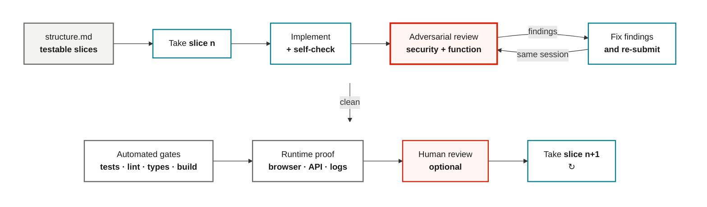

  

    
My current development workflow

    <h1>How I develop with coding agents</h1>
    
How I structure the work, switch models and check what they built.

    
Pasi Huuhka · Zure · 2026

  

  

    
  

<!--
This is a snapshot of what works for me right now. It is not meant to be the
correct way to work. The tools will change again soon enough.
-->

---
nofooter: true
layout: none
class: zsection
---

  
The operating principle

  
The agent can write the code. I still own the decisions.

  
That requires a working mental model of the system.

<!--
"Human in the loop" is too vague for me. I own the intent, the trade-offs and
the decision to accept the work. The harder change is that writing code no
longer builds my understanding automatically. The rest of this workflow exists
to keep that understanding from falling behind.
-->

---
part: Operating model
class: ceremony-slide
---

# I add process when the task earns it

  

    
Small

    <h2>Talk to the coding agent</h2>
    
The desired result and likely change are already clear.

  

  

    
Medium

    <h2>Structure → Implement</h2>
    
I write enough structure to make scope, slices and checks clear.

  

  

    
Large or risky

    <h2>QRSPI</h2>
    
Questions, research and design. Then I usually implement from structure.

  

I do not want maximum ceremony. I want the least structure that gets me to the right result.

Source: <a href="https://www.huuhka.net/research-plan-implement/">Pasi Huuhka, Research - Plan - Implement</a> · <a href="https://docs.humanlayer.com/guide/skills-workflows">HumanLayer workflow guide</a>

<!--
Small tasks should stay small. I add the full flow when the task is messy,
risky or expensive to redo.
-->

---
nofooter: true
layout: none
class: zsection
---

  

    
Part 01

    <h1>One way of working, several harnesses and models</h1>
    
I keep the habits even when I switch the tools underneath.

  

  

    
  

<!--
The tools are replaceable on purpose. For daily work, consistent habits matter
more to me than chasing the theoretically best UI for every model.
-->

---
part: Operating model
---

# I keep the workflow while I switch the tools

  

    Direction
    <strong>Me</strong>
    Intent · decisions · review · acceptance
  

  
↓

  

    Workspace
    <strong>T3 Code</strong>
    The place where I juggle projects and conversations
  

  
↓

  

    
Harness<strong>OpenCode</strong>Custom agents, commands, skills and providers

    
Harness<strong>Codex</strong>Fast implementation and native tool loops

  

  
↓

  

    Model access
    <strong>Foundry · GitHub Copilot · direct subscriptions</strong>
    I use whichever available model fits the work
  

Sources: <a href="https://github.com/pingdotgg/t3code/blob/main/docs/user/install.md">T3 Code documentation</a> · <a href="https://www.huuhka.net/how-i-currently-develop-with-llm-models-early-2026/">How I currently develop with LLM models</a>

<!--
T3 Code is where I work. OpenCode and Codex still run the agents underneath.
The UI does not make those harnesses behave the same way.
-->

---
nofooter: true
layout: none
class: t3-workspace-slide
---

<!--
T3 Code keeps active projects, the agent conversation and browser evidence in
one workspace. OpenCode and Codex still do the underlying agent work.
-->

---
part: Operating model
class: model-routes-slide
---

# I get model access through three routes

<table>
  <thead>
    <tr><th>Route</th><th>Why I use it</th></tr>
  </thead>
  <tbody>
    <tr v-click="1">
      <td>
<strong>Microsoft Foundry</strong>
</td>
      <td>Models hosted by a customer, or models I deploy for my own use</td>
    </tr>
    <tr v-click="2">
      <td>
<strong>GitHub Copilot</strong>
</td>
      <td>My primary route to Anthropic models</td>
    </tr>
    <tr v-click="3">
      <td>
<strong>Direct vendor subscriptions</strong>
</td>
      <td>Subsidized access when direct vendor use is allowed</td>
    </tr>
  </tbody>
</table>

The useful part is that I can change models without rebuilding how I work.

Sources: <a href="https://www.huuhka.net/connecting-opencode-with-microsoft-foundry-models/">Connecting OpenCode with Microsoft Foundry models</a> · <a href="https://opencode.ai/v2/docs/providers">OpenCode provider documentation</a>

<!--
Foundry is especially useful when the model must run in a customer's
environment. I also use my own Foundry deployments.

GitHub Copilot is currently my main route to Anthropic models. Direct vendor
subscriptions can be cost-effective, but only when the project's data and
policy constraints allow them.

This is not a vendor comparison. Availability, pricing and rate limits change.
I want my workflow to survive those changes.
-->

---
part: Operating model
---

# I pick models by task. I do not need one permanent winner

<table>
  <thead>
    <tr><th>Work</th><th>Current default</th></tr>
  </thead>
  <tbody>
    <tr v-click="1"><td>Implementation</td><td><strong>GPT‑5.6 Sol</strong></td></tr>
    <tr v-click="2"><td>Visual work</td><td><strong>Opus-class model</strong> + Impeccable</td></tr>
    <tr v-click="3"><td>Bounded work</td><td>The cheapest capable option</td></tr>
  </tbody>
</table>

Spend expensive reasoning where uncertainty is high.

Sources: <a href="https://developers.openai.com/api/docs/models/gpt-5.6-sol">Official OpenAI GPT‑5.6 Sol model documentation</a> · <a href="https://www.huuhka.net/how-i-currently-develop-with-llm-models-early-2026/">Earlier workflow snapshot</a>

<!--
GPT-5.6 Sol at medium or high reasoning is my current implementation default.
It is fast and capable enough to keep the build-review loop tight.

For visual work I currently prefer an Opus-class model with an explicit design
vocabulary. For bounded or lower-value work, clear instructions and checks
matter more than model prestige.
-->

---
part: Operating model
---

# The model is only one part of the setup

  

    
Workflow state

    <h2><code>dev_workflow</code></h2>
    
Keeps track of phases and marks later files stale when I rewind.

  

  

    
Visual creation

    <h2>Image generation</h2>
    
Makes and edits assets as part of the same implementation loop.

  

  

    
Real application state

    <h2>Browser tools</h2>
    
Give the agent the DOM, console, network, screenshots and interactions.

  

  

    
Reusable judgment

    <h2>Skills</h2>
    
Add task-specific instructions when I need them.

  

Source: <a href="https://www.huuhka.net/browser-verification-for-coding-agents-chrome-devtools-mcp-vs-agent-browser/">Browser verification for coding agents</a>

<!--
The model matters, but the surrounding tools decide what it can inspect, change
and verify.
-->

---
nofooter: true
layout: none
class: zsection
---

  

    
Part 02

    <h1>For large work, I use QRSPI</h1>
    
Usually structure goes straight to implementation. I add a separate plan only when it buys me something.

  

  

    
  

<!--
QRSPI is still useful shorthand. My current version puts more into spec and
structure, so I often skip the old separate plan step.
-->

---
part: QRSPI
class: phase-slide
---

# My current QRSPI flow usually skips the separate plan

  
Q<strong>Questions</strong><small>Bound the investigation</small>

  
→

  
R<strong>Research</strong><small>Map the current state</small>

  
→

  
S<strong>Spec / design</strong><small>Choose the desired state</small>

  
→

  
↳<strong>Structure</strong><small>Create testable slices</small>

  
→

  
I<strong>Implement</strong><small>Execute and verify</small>

  questions.mdresearch.mddesign.mdstructure.mdcode + evidence

  Optional / legacy P
  <strong>I add a detailed plan only when <code>structure.md</code> is not enough to implement safely.</strong>

Source: <a href="https://docs.humanlayer.com/explanation/workflow-phases">HumanLayer, How workflow phases fit together</a>

<!--
The letters matter less than the handoffs. My dev tool supports both routes.
Usually it goes from structure to implementation. A separate plan still works.
-->

---
part: QRSPI
class: questions-slide
---

# I separate questions the agent can answer from decisions only I can make

The agent should investigate

- Current behavior and code paths
- Existing patterns, tests and constraints
- Assumptions that evidence can settle

I should decide

- Product promise and acceptable trade-offs
- Scope and explicit exclusions
- Evidence needed to ship

Agents find facts. I make product decisions.

<!--
The agent should answer questions about existing behavior, patterns, tests and
constraints by reading the repository or documentation. It should not bounce
those questions back to me.

I still decide the product promise, acceptable trade-offs, scope and what proof
is enough. Those decisions cannot be discovered from the repository.
-->

---
part: QRSPI
---

# Research tells the next agent where to look

  
01<strong>Relevant files</strong><small>Precise locations</small>

  
→

  
02<strong>Current flow</strong><small>What really happens</small>

  
→

  
03<strong>Constraints</strong><small>Patterns and prior decisions</small>

  
→

  
04<strong>Unknowns</strong><small>What evidence cannot settle</small>

A map for the next agent, not a redesign.

Sources: <a href="https://www.huuhka.net/research-plan-implement/">Research - Plan - Implement</a> · <a href="https://www.huuhka.net/primary-vs-subagents-in-llm-harnesses/">Primary vs subagents</a>

<!--
Research records precise file locations, how the current flow works, patterns
worth following, prior decisions and unresolved questions.

It should not fix the issue, choose the future architecture, paste entire files
into the handoff or pretend uncertainty has disappeared. I want the smallest
map that lets the next agent read the right code.
-->

---
part: QRSPI
---

# I pressure-test the spec before it becomes code

  

    <code>/grill-me</code>
    <strong>Challenge assumptions, terminology and scope</strong>
  

  

    <code>/grill-with-docs</code>
    <strong>Record settled vocabulary and durable decisions</strong>
  

The first version should not survive unchanged.

Sources: <a href="https://www.aihero.dev/skills-grill-me">Matt Pocock, grill-me</a> · <a href="https://www.aihero.dev/skills-grill-with-docs">grill-with-docs</a>

<!--
The design still states current and desired behavior, explicit exclusions,
options, recommendations, unresolved decisions, rejected alternatives and
risks. That belongs in the artifact and in my explanation, not as a wall of
text on the slide.

I do not agree with every recommendation. I use these skills to expose vague
terms and assumptions before they settle into the structure and then the code.
-->

---
nofooter: true
layout: none
class: image-only-slide
---

<!--
This is what grilling looks like in practice. The agent is not merely producing
a cleaner version of my first idea. It spots that "owner" hides several
different responsibilities, asks whether the model is sufficient and proposes
a concrete default.

The useful part is the disagreement. I want vague terms and convenient
assumptions challenged before they settle into the structure and then the code.
-->

---
part: QRSPI
class: slice-grid-slide
---

# I split the structure into slices I can run and check

  

    01
    <h2>Thin path</h2>
    
One observable behavior

    <small>Run it.</small>
  

  

    02
    <h2>Real behavior</h2>
    
Real data and rules

    <small>Test it.</small>
  

  

    03
    <h2>Hardening</h2>
    
Failure and operating paths

    <small>Try to break it.</small>
  

A slice crosses layers and ends in evidence.

Source: <a href="https://docs.humanlayer.com/explanation/workflow-phases">HumanLayer workflow phases</a>

<!--
Database, service, API and UI are not useful slices by themselves. They can
leave me with a pile of code and nothing I can check end to end.

The thin path connects the minimum layers required for one observable result.
The next slice replaces scaffolding with real data and rules. Hardening adds
failure states, observability and operational edges.
-->

---
part: QRSPI
class: structure-example-slide
---

# The structure is the implementation handoff

<StructureExample />

<!--
This is an illustrative structure outline using the exact format my OpenCode
structure agent produces.

First, establish the approved direction. Then point to existing patterns with
exact file paths. Each phase states what it proves, the files it changes, how
we validate it and what deliberately stays outside the boundary.

The important part is not the markdown template. It is that an implementer can
take one phase without rereading the entire design discussion or inventing the
scope. The file remains short enough that I can review it before coding starts.
-->

---
nofooter: true
layout: none
class: zsection
---

  
The hard part

  
Keep a working mental model of the codebase.

  
Agents make that harder.

<!--
This may be the most important point in the talk. Good software work depends on
a useful mental model: where responsibilities live, how data moves, which
assumptions hold and what a change might disturb.

Writing code used to build that model almost by accident. When an agent writes
most of the code, I lose that source of understanding. It is now easy to accept
plausible changes faster than I can absorb the system they create.

Research and structure help me understand the system before implementation.
Grilling forces unclear terms, hidden assumptions and unresolved decisions into
the open. Small slices and review help me update my mental model as the code
changes. I do not need to read every line, but I need to understand how the code
fits together and how the system behaves.

None of this is perfect. A document can be wrong. A review can miss something.
I can believe I understand a system when I do not. The process reduces that
risk. It does not remove it.
-->

---
nofooter: true
layout: none
class: zsection
---

  

    
Part 03

    <h1>Implementation happens in small slices, with checks and a second opinion</h1>
    
The model can make local decisions. It cannot quietly redesign the task.

  

  

    
  

<!--
Model speed matters here. Most of the open-ended thinking should already have
happened in research, design and structure.
-->

---
part: Execution
class: slice-evidence-loop-slide
---

# Every slice runs the same build, review and evidence loop

<MermaidSteps :steps="[
  { at: 0, nodes: ['P', 'S', 'B'], focusNodes: ['S'], edges: ['P->S', 'S->B'] },
  { at: 1, nodes: ['R'], focusNodes: ['R'], edges: ['B->R'] },
  { at: 2, nodes: ['F'], focusNodes: ['F', 'R'], edges: ['R->F', 'F->R'] },
  { at: 3, nodes: ['A', 'V'], focusNodes: ['A', 'V'], edges: ['BUILD->PROVE', 'A->V'] },
  { at: 4, nodes: ['H', 'N'], focusNodes: ['H', 'N'], edges: ['V->H', 'H->N'] },
]" />

<!--
Start from the approved structure or plan document and take one testable slice.
The builder implements it and self-checks before handing it to a separate
adversary. The adversary checks both functionality and security: the diff, edge
cases, tests, runtime behaviour and anything the builder quietly omitted.

When it finds problems, the builder fixes them and sends the work back to the
same review session. That matters because the reviewer retains the original
claims, its earlier findings and the evidence it asked for. They continue until
the reviewer has no findings left. Review is a loop, not a handoff.

A clean review is not the end. The automated gates still have to pass: tests,
linters, type checks and the build. Then validate the running behaviour through
the browser, API, logs or whatever interface makes the result observable.
Failures go back into the same fix-and-review loop.

Human review is shown as optional because I do sometimes skip it for low-risk
work. I have also been bitten by doing that. That is life, but it should be a
conscious trade-off rather than an assumption that the evidence is infallible.

Once the slice is accepted, take slice n+1 and repeat. The unit of progress is a
verified slice, not a large batch of generated code.

I want a separate reviewer looking for holes, not the builder defending code it
just wrote. I normally read the work after this loop, with the critique and
evidence telling me where to focus.
-->

---
part: Execution
class: ui-loop-slide
---

# For UI work, the browser is part of the loop

  
01<strong>Give direction</strong><small>Product intent, references and constraints</small>

  
→

  
02<strong>Generate</strong><small>Opus + Impeccable + image generation</small>

  
→

  
03<strong>Observe</strong><small>Rendered UI, DOM, console and network</small>

  
→

  
04<strong>Challenge</strong><small>Responsive states, errors and interaction edges</small>

Code is a claim. The running interface is evidence.

Sources: <a href="https://impeccable.style/docs/impeccable/">Impeccable documentation</a> · <a href="https://www.huuhka.net/browser-verification-for-coding-agents-chrome-devtools-mcp-vs-agent-browser/">Browser verification for coding agents</a>

<!--
Give the agent product intent, references and constraints. It can generate with
an Opus-class model, Impeccable and image tools, but the browser must close the
loop.

I inspect the rendered UI, DOM, console and network. Then I challenge responsive
states, errors and interaction edges. Plausible-looking component code is not
proof that the interface works.
-->

---
part: Execution
class: impeccable-slide
---

# Impeccable gives the agent verbs for visual work

  

    
What it adds

    
A design vocabulary the agent can act on.

    

      <code>/critique</code>
      <code>/polish</code>
      <code>/distill</code>
      <code>/typeset</code>
      <code>/audit</code>
    

    

      One tool, not the recipe
      
Your mileage may vary.

    

  

  <figure class="impeccable-shot">
    
    <figcaption>Impeccable homepage, captured 5 Sep 2026.</figcaption>
  </figure>

Source: <a href="https://impeccable.style/">Impeccable</a> · <a href="https://impeccable.style/docs/impeccable/">Command documentation</a>

<!--
Impeccable is one installable skill for creating, evaluating, refining and
hardening interfaces. It loads product and design context, names the kind of
intervention and checks common AI-generated UI defaults.

I currently reach for it because the specific verbs make the conversation more
useful. It does not replace taste, product direction or browser verification.
Other skills, models or a good prompt may fit another stack better.
-->

---
part: Execution
class: structure-example-slide impeccable-skill-slide
---

# The main skill routes visual work into focused playbooks

<ImpeccableSkillExample />

<!--
The main skill is not one giant prompt telling the model how to make everything
beautiful. It first loads product and design context, chooses the mode for the
surface, and routes the request to a narrower playbook.

Walk through the setup, the distinction between refinement and redesign, the
four surface modes, and the command table. The command names are useful because
they make the requested intervention explicit. The linked playbooks hold the
detailed workflow and checks.

This is still one implementation of the idea. The useful pattern is routing a
broad request into focused instructions with project context and a bounded
verification pass.
-->

---
part: Execution
---

# I rarely parallelize inside one project. I do juggle several projects

  

    Inside one project
    <strong>Sequential slices by default</strong>
    <small>Shared code and browser state make coordination expensive.</small>
  

  

    Across projects
    <strong>Parallel work</strong>
    <small>Each project keeps its own artifacts, evidence and mental model.</small>
  

Concurrency helps. A swarm is not a workflow by itself.

<!--
Inside one repository I prefer a coherent sequential slice. I parallelize only
genuinely independent work because shared files, browser state and hidden
dependencies make coordination expensive.

Across projects, parallelism works better. One agent can wait on tests while
another project advances. Each thread still needs its own structure, evidence
and mental model so I can return without reconstructing everything.
-->

---
nofooter: true
layout: none
class: zsection
---

  

    
Part 04

    <h1>The next thing I want to improve is the harness</h1>
    
When I repeat the same review comment, I want the repo to enforce it.

  

  

    
  

<!--
This is the part I have not fully implemented yet. I want the repository to
catch more mistakes automatically before I spend time reviewing them.
-->

---
part: Harness engineering
class: harness-slide
---

# Every repeated correction should tighten the repository

  

    01
    <strong>Point to the truth</strong>
    <small><code>AGENTS.md</code>, focused docs and approved artifacts</small>
  

  
→

  

    02
    <strong>Run the work</strong>
    <small>Implementation against explicit project commands</small>
  

  
→

  

    03
    <strong>Fail usefully</strong>
    <small>Tests, linters and browser checks explain the violation</small>
  

  
→

  

    04
    <strong>Keep the lesson</strong>
    <small>Turn repeated review feedback into a repository rule</small>
  

Better guardrails, not an autonomous software factory.

Source: <a href="https://openai.com/index/harness-engineering/">OpenAI harness engineering</a>

<!--
Give the agent a short map to focused documentation, approved structures,
plans, decision records and exact project commands. Do not bury everything in
one enormous instruction file.

The part I want from harness engineering is mechanical enforcement. If I keep
correcting architecture, naming, dependency direction or a user-visible
invariant, the repository should produce an actionable failure next time.

I am adopting repository-local sources of truth, progressive disclosure,
executable verification and cleanup of recurring failure patterns. I am not
assuming that more agents always help, human review should disappear, long
autonomous runs fit every codebase or a confident completion message is proof.

The OpenAI example depends heavily on how the repository is structured and
tooled. That caveat matters. I want better guardrails, not an autonomous
software factory.
-->

---
part: Takeaways
class: takeaways-slide
---

# The parts I expect to keep

  
01<strong>Own the decisions</strong><small>Intent, trade-offs and acceptance stay with me.</small>

  
02<strong>Understand the system</strong><small>Know how the code fits together and how the system behaves.</small>

  
03<strong>Verify each slice</strong><small>Use an adversary, automated gates and runtime evidence.</small>

  
04<strong>Encode repetition</strong><small>Turn recurring feedback into repository checks.</small>

<!--
T3 Code, OpenCode, Codex and the models will change. I expect these habits to
stick around for longer.

Understanding the system means maintaining a mental model of the codebase and
its functionality. Where do responsibilities live? How does data move? What
happens when a user takes an action, and what can fail?

I might not read every line of code. I still need enough understanding to judge
a proposed change, spot a wrong assumption and know which details to inspect.
-->

---
nofooter: true
layout: none
class: zend
---

  
The takeaway

  
The agent can write the code. I still need to understand the system.

  
A working mental model, without reading every line.

<!--
Writing the code used to build part of my mental model almost automatically.
When the agent writes most of it, I need to build and maintain that model on
purpose.

That means understanding the codebase's structure and the system's behavior.
I should be able to explain how a feature works, which parts it depends on and
what a change could affect. Reading selected code, asking questions and checking
runtime behavior all help me test that understanding. Reading every line is not
the goal.

The tools will change. The responsibility does not. I own the decisions,
challenge the result, inspect the evidence and decide whether the work is done.
-->

---
part: Appendix
class: dense references-slide
---

# References and further reading

**My workflow notes**

<a href="https://www.huuhka.net/how-i-currently-develop-with-llm-models-early-2026/">How I currently develop with LLM models</a> · <a href="https://www.huuhka.net/research-plan-implement/">Research - Plan - Implement</a> · <a href="https://www.huuhka.net/primary-vs-subagents-in-llm-harnesses/">Primary vs subagents in LLM harnesses</a>

<a href="https://www.huuhka.net/browser-verification-for-coding-agents-chrome-devtools-mcp-vs-agent-browser/">Browser verification for coding agents</a> · <a href="https://www.huuhka.net/connecting-opencode-with-microsoft-foundry-models/">Connecting OpenCode with Microsoft Foundry models</a>

**Workflows and tools**

<a href="https://docs.humanlayer.com/explanation/workflow-phases">HumanLayer workflow phases</a> · <a href="https://github.com/pingdotgg/t3code/blob/main/docs/user/install.md">T3 Code documentation</a> · <a href="https://opencode.ai/v2/docs/providers">OpenCode providers</a>

<a href="https://www.aihero.dev/skills-grill-me">Matt Pocock: grill-me</a> · <a href="https://www.aihero.dev/skills-grill-with-docs">grill-with-docs</a> · <a href="https://impeccable.style/docs/impeccable/">Impeccable</a>

**Models and harness engineering**

<a href="https://developers.openai.com/api/docs/models/gpt-5.6-sol">Official OpenAI GPT‑5.6 Sol documentation</a> · <a href="https://openai.com/index/harness-engineering/">OpenAI harness engineering</a>

<!--
Keep this available after the talk. These are starting points, not endorsements
of every claim or every workflow default in the linked material.
-->
